## 표준화 

## ERD PK

  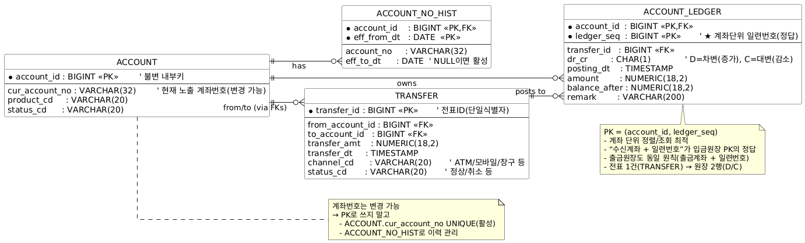

## ERD 모델링

  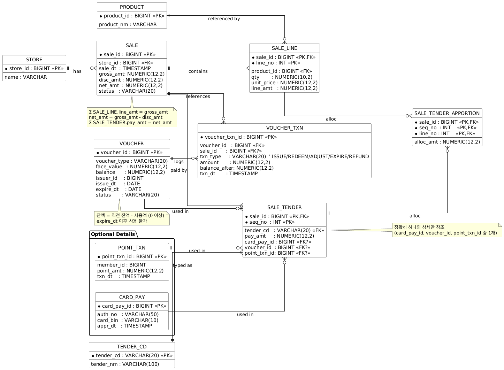

## 반정규화(De-normalization) 개념 및 전략
  - 개념 요약
    - 정규형 유지 + 조회 성능/비용 최적화를 위해 반복되는 고비용 조인 결과를 미리 펼쳐 저장(lookup flatten)하거나 집계값을 선계산(precompute)하는 기법
    - 장점: 조인 제거/축소 → 지연↓, 비용↓, 단순쿼리화
    - 단점: 중복↑, 갱신 복잡도↑(정합성 관리 필요)
  - 언제 쓰나
    - 대시보드/검색 API에서 n-way 조인 다빈도 + 엄격한 SLA(지연 한자리 ms~수십 ms)
    - 차원 테이블이 저변경(SCD/코드성)이고 참조 속성 적음
    - 카디널리티/조인 팬아웃으로 풀스캔·해시조인 비용이 큰 경우
    - 동일 패턴 질의가 반복되고 캐시 적중률이 낮음
    - 스토리지 비용 < 쿼리 비용인 환경(서버리스/쿼리당 과금 등)
  - 반정규화 전략 Top 6
    - Lookup Flatten: 자주 조인하는 차원 속성(이름/카테고리/코드명) 복제 컬럼으로 보관
    - Precomputed Aggregates: 일/시간/분 단위 집계 테이블(rollup, snapshot)
    - Materialized View(MV): 조인·집계 결과를 **MV+리프레시(주기/증분)**로 유지
    - Wide Table/JSON 컬럼: 읽기 중심 서비스에 속성 펼침(스키마-온-리드 비용 절감)
    - CDC 기반 증분 갱신: 소스 변경 캡처 → 타겟 반정규 테이블 부분 갱신
    - Covering Index 대안(시험 언급용): 완전한 반정규화는 아니지만, 조인 없는 커버링(INCLUDE/INVISIBLE 컬럼) > INCLUDE/INVISIBLE/생성열을 활용한 Covering Index는 정규형을 유지하면서도 테이블 접근을 제거해 조회 지연과 비용을 대폭 절감하는 반정규화의 실무적 대안 

    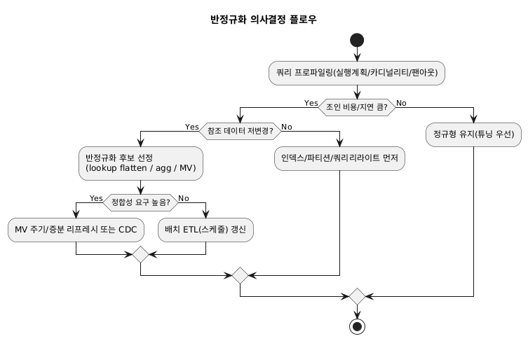

## 이력관리 비교
  | 구분                   | **선분이력 구조 (Lineage/Period)**             | **SCD Type 2 (Slowly Changing Dimension)**           |
  | -------------------- | ---------------------------------------- | ---------------------------------------------------- |
  | **주요 목적**            | **기간 기반 이력 관리** (언제부터\~언제까지 유효했는가?)      | 변경 발생 시 **이전 값 보존 + 새 행 추가**                         |
  | **키(PK) 설계**         | `업무키(Business Key) + 유효시작일(VALID_FROM)`  | **대체키(Surrogate Key)** 주로 사용, 비즈니스 키 + 버전/플래그        |
  | **기간 컬럼**            | `VALID_FROM`, `VALID_TO` (NULL=현재)       | 보통 `START_DATE`, `END_DATE`, `IS_CURRENT` 컬럼         |
  | **구간 무겹침 제약**        | 중요! (CHECK/Trigger로 보장)                  | 보통 **버전 번호**나 `IS_CURRENT` 컬럼으로만 관리                  |
  | **현재 행 조회**          | `VALID_TO IS NULL`                       | `IS_CURRENT = 'Y'`                                   |
  | **Point-in-time 조회** | 날짜 비교(`BETWEEN VALID_FROM AND VALID_TO`) | 날짜 또는 버전 번호 기반 필터링                                   |
  | **갱신 방식**            | 기존 행 `VALID_TO` 갱신 후 **새 행 INSERT**      | 기존 행 `IS_CURRENT=N`, 새 행 `IS_CURRENT=Y` INSERT       |
  | **장점**               | - 구간 단위 정확 관리<br>- 회계/보험/계약 등 기간 로직 최적   | - 단순 구조<br>- BI/DW 툴 친화적<br>- surrogate key join 최적화 |
  | **단점**               | - PK/인덱스 복잡<br>- 구간 겹침 관리 필요             | - 기간 연산 지원 약함<br>- Point-in-time 조회 성능 낮을 수 있음       |
  | **사용 사례**            | 계약이력, 인사 배치 이력, 보험 상품 변경                 | 고객 주소 변경, 상품 카테고리 이력, 마스터 데이터 변경                     |

## 데이터품질 정의
  | 영역                     | 설명                       | 예시                  |
  | ---------------------- | ------------------------ | ------------------- |
  | **정합성 (Consistency)**  | 서로 다른 시스템·컬럼 간 데이터 값이 일치 | 고객ID, 계약ID 매핑 검증    |
  | **유효성 (Validity)**     | 정의된 도메인/형식/규칙에 맞는 값      | 생년월일이 YYYY-MM-DD 포맷 |
  | **완전성 (Completeness)** | 필수 항목 누락 없이 채워져 있음       | 주민등록번호 NULL 여부      |
  | **중복성 (Uniqueness)**   | 동일 엔티티 중복 입력 방지          | 동일 고객 두 번 등록 방지     |
  | **정확성 (Accuracy)**     | 실제 현실 세계의 참값과 일치         | 주소/전화번호 최신화         |
  | **적시성 (Timeliness)**   | 최신 정보로 업데이트 여부           | 배송 상태 갱신 시간         |

## CTQ (Critical to Quality) 정의
  ```yaml
  고객 요구: 고객 정보가 정확해야 한다
    └─ CTQ: 고객 주소 정확성
        ├─ Metric: 주소 오타율 ≤ 0.5%
        ├─ Metric: 우편번호-주소 정합성 오류율 ≤ 0.1%
    └─ CTQ: 고객 연락처 유효성
        ├─ Metric: 전화번호 정규식 미준수율 ≤ 0.2%
        ├─ Metric: 이메일 반송률 ≤ 1%
  ``` 

## RDBMS 성능 관련 주요 파라미터
  | DB         | 메모리 핵심                      | 병렬/플래너                      | WAL/로그·체크포인트                        | 특기사항                     |
  | ---------- | --------------------------- | --------------------------- | ----------------------------------- | ------------------------ |
  | Oracle     | SGA/PGA, Cache/Shared Pool  | Parallel Degree/Policy      | Redo/Log Buffer                     | NLS는 성능 무관               |
  | MSSQL      | max server memory           | MAXDOP / cost threshold     | TempDB 파일, 파일 성장                    | Query Store, 언어 설정 무관    |
  | PostgreSQL | shared\_buffers / work\_mem | random\_page/seq\_page cost | max\_wal\_size / checkpoint\_\*     | autovacuum, lc\_\* 무관    |
  | MySQL      | innodb\_buffer\_pool\_\*    | (플래너 자동)                    | innodb\_log\_file\_size / flush\_\* | character\_set/lc\_\* 무관 |

## 캐시 DB 활용 방안
  1. 자주 조회되지만 자주 변하지 않는 데이터
    - 예: 상품 정보(상품명, 카테고리, 가격), 코드 테이블(지역 코드, 국가 코드)
    - 변동이 적고 조회 빈도가 높아 캐싱 효과가 크다.
  2. 비즈니스적으로 Hot한 데이터 (핫 데이터)
    - 예: 실시간 인기 상품 랭킹, 자주 쓰이는 게시글/댓글 Top N, 세션 정보
    - 짧은 TTL(Time To Live) 기반으로 유지하면 DB 부하 완화 가능.
  3. 공통적으로 여러 서비스에서 반복 참조하는 데이터 (공통 Cache)
    - 예: 권한/역할 매핑, 환율, 설정값, 공통 마스터 데이터
    - 여러 서비스가 동일하게 참조 → Cache hit율 높음.

  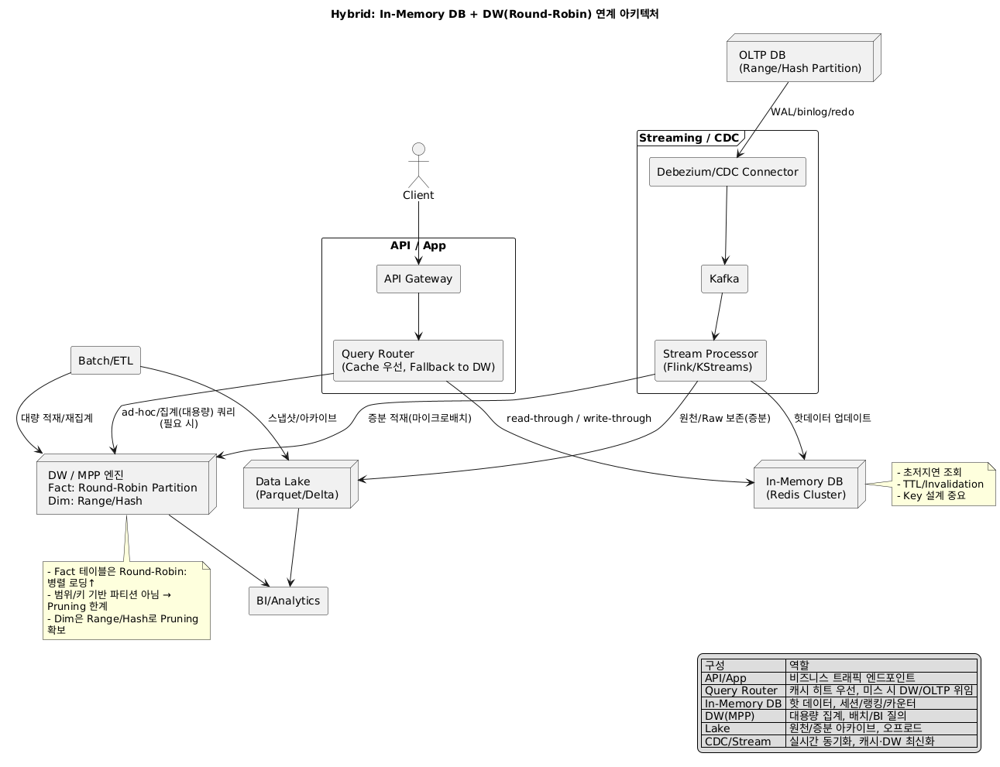
  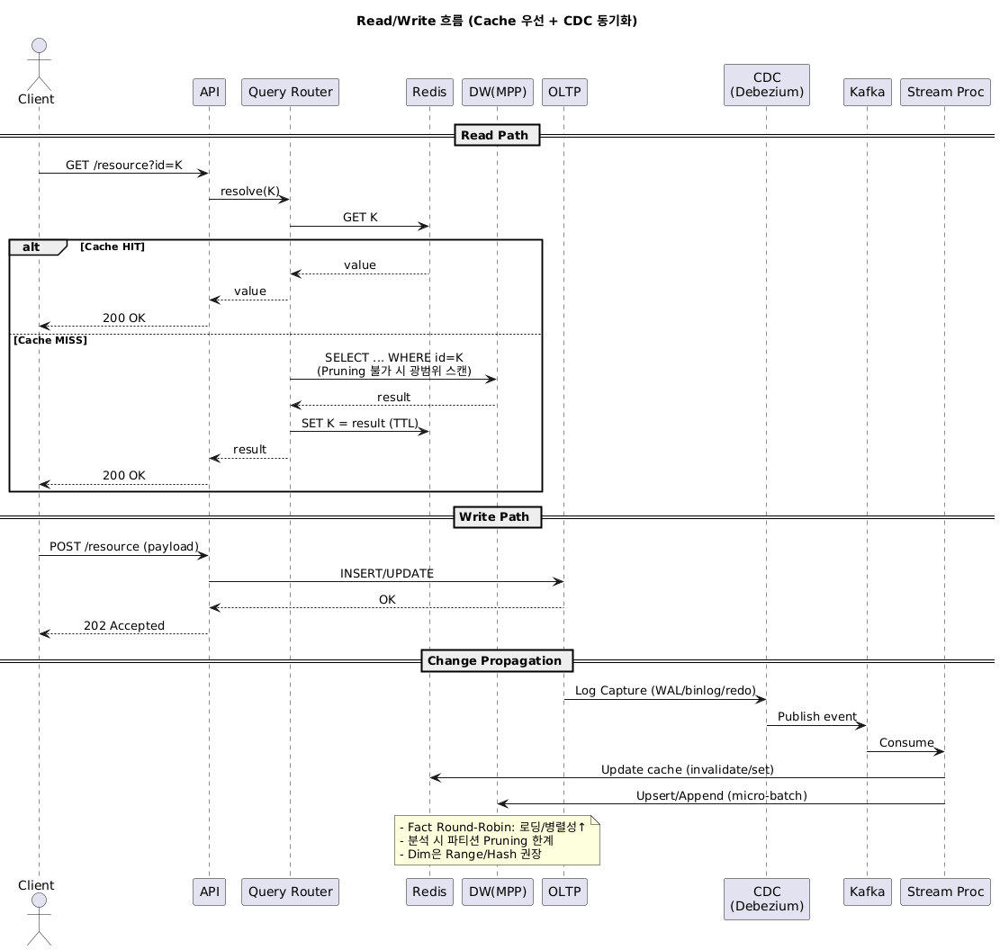

## AI 학습용 데이터 저장 설계

  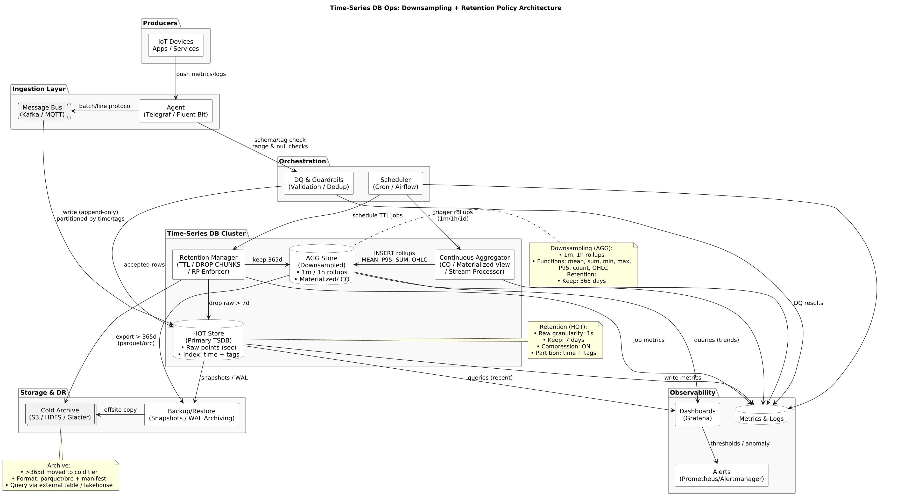

## 실행계획 명령
  | DBMS           | 실행계획 확인 명령                                                             | 실제 수행/분석 옵션                                                  | 비고                                                                   |
  | -------------- | ---------------------------------------------------------------------- | ------------------------------------------------------------ | -------------------------------------------------------------------- |
  | **Oracle**     | `EXPLAIN PLAN FOR <SQL>`<br>`SELECT * FROM TABLE(DBMS_XPLAN.DISPLAY);` | `AUTOTRACE` (SQL\*Plus)<br>`V$SQL_PLAN`                      | 기본 `EXPLAIN PLAN`은 **실제 실행 안 함**. `AUTOTRACE`, `TRACE` 해야 실제 실행통계 확인 |
  | **PostgreSQL** | `EXPLAIN <SQL>`                                                        | `EXPLAIN ANALYZE <SQL>`                                      | `EXPLAIN`은 추정 계획만, `ANALYZE` 붙여야 실제 실행 및 row/time 확인                 |
  | **MySQL**      | `EXPLAIN <SQL>`<br>`DESCRIBE <SQL>`                                    | `EXPLAIN ANALYZE <SQL>` (8.0 이상)                             | 5.x/초기버전은 단순 플랜 추정치, 8.0부터는 실제 실행통계 포함 가능                            |
  | **SQL Server** | `SET SHOWPLAN_ALL ON;`<br>`SET SHOWPLAN_XML ON;`                       | `SET STATISTICS PROFILE ON;`<br>`SET STATISTICS IO/TIME ON;` | SSMS에서 “실행계획 보기(Estimated/Actual Execution Plan)” 구분                 |
  
## 실행계획분석
  | 연산자                       | 의미                          | 성능 포인트                       |
  | ------------------------- | --------------------------- | ---------------------------- |
  | **TABLE SCAN / SEQ SCAN** | 전체 테이블 순차 읽기                | 인덱스 미사용 → 성능 저하 위험           |
  | **INDEX SCAN / SEEK**     | 인덱스를 이용해 부분 범위 스캔           | 조건절 컬럼에 인덱스 필요               |
  | **INDEX RANGE SCAN**      | 범위 조건 (`BETWEEN`, `<`, `>`) | 선두 컬럼 사용 여부 중요               |
  | **INDEX FULL SCAN**       | 인덱스 전체 스캔                   | 조건 맞지 않거나 ORDER BY 최적화용      |
  | **NESTED LOOP JOIN**      | 작은 데이터 + 인덱스 적합             | 대량 데이터 시 느려짐                 |
  | **MERGE JOIN**            | 두 집합이 정렬된 상태                | Sort 비용 ↑ 가능                 |
  | **HASH JOIN**             | 대용량 조인에 효율적                 | Hash 영역 메모리 부족 시 Temp I/O 발생 |
  | **SORT / AGGREGATE**      | 정렬, 그룹핑 연산                  | Temp 사용 여부 확인                |
  | **FILTER**                | 조건절 필터링                     | 불필요한 필터는 제거 필요               |
  
  | 스캔 방식                    | 동작 원리                                   | 주요 사용 조건                                                        | 장점                        | 단점                   | 실행계획 키워드               |
  | ------------------------ | --------------------------------------- | --------------------------------------------------------------- | ------------------------- | -------------------- | ---------------------- |
  | **INDEX UNIQUE SCAN**    | 인덱스 키 값이 **정확히 1건** 매칭될 때, 인덱스만 접근      | `WHERE pk_col = 100` (PK, Unique 인덱스)                           | 가장 빠름, 결과가 1건             | = 조건이 아닌 경우 불가       | `INDEX UNIQUE SCAN`    |
  | **INDEX RANGE SCAN**     | 인덱스의 **범위 조건** 만족하는 부분만 스캔              | `WHERE col BETWEEN 10 AND 100`<br>`WHERE col LIKE 'A%'`         | 조건절 범위 탐색 효율적             | 범위 넓으면 비효율 발생        | `INDEX RANGE SCAN`     |
  | **INDEX FULL SCAN**      | 인덱스 전체를 순차적으로 읽음                        | - `ORDER BY` 최적화 (정렬 생략)<br>- 인덱스만으로 SELECT 가능 (Covering Index) | 테이블 FULL SCAN보다 효율적일 수 있음 | 불필요하게 인덱스 전체 읽을 수 있음 | `INDEX FULL SCAN`      |
  | **INDEX FAST FULL SCAN** | 인덱스 전체를 **병렬/랜덤 I/O** 로 빠르게 읽음 (정렬 불보장) | - COUNT(\*) 수행<br>- 인덱스 컬럼만 SELECT 시                            | 병렬 처리로 빠름                 | 정렬 불가능 → ORDER BY 불가 | `INDEX FAST FULL SCAN` |
  | **TABLE FULL SCAN**      | 테이블 전체를 읽음 (인덱스 무시)                     | - 인덱스 없음<br>- 대량 데이터가 조건절에 맞음<br>- 옵티마이저 판단상 유리                 | 소량 데이터시 비효율               | 대용량 Table I/O 부담 큼   | `TABLE ACCESS FULL`    |
  
  | 조인 방식                | 특징                       | 사용 적합 상황            |
  | -------------------- | ------------------------ | ------------------- |
  | **Nested Loop Join** | 한쪽 작은 집합 반복 + 다른쪽 인덱스 탐색 | 작은 데이터 조인           |
  | **Hash Join**        | 해시 테이블 생성 후 매칭           | 대용량 조인, 조인 키 인덱스 없음 |
  | **Merge Join**       | 두 집합 정렬 후 병합             | 대량 데이터 + 정렬 가능 시 효율 |
  
## 실행계획 해석 절차
  1. 접근 경로(Access Path) 확인 > Table Full Scan? Index Range Scan?
  2. 조인 방식(Join Method) 확인 > Nested Loop / Hash Join / Merge Join 선택 이유
  3. 조인 순서(Join Order) 확인 > 작은 집합부터 조인되는지?
  4. 비용/카디널리티(Cost / Rows) 확인 > 예측 행수와 실제 행수 차이 → 통계 불일치 가능
  5. 부하 연산 확인 > Sort, Group By, DISTINCT, Window Function 등
  - SQL성능분석/개선방안, 인덱스튜닝시 주의사항(IN절, 결합인덱스 등)
  
## SQL 성능 분석 및 개선 방안
  1. 실행계획 분석
    - EXPLAIN / EXPLAIN ANALYZE, AUTOTRACE, STATISTICS PROFILE 등으로 실행계획 확인
    - Table Full Scan 발생 여부 확인
    - 조인 순서, 조인 방식(Nested Loop/Hash/Merge) 검토
    - 카디널리티(예상 vs 실제 row 수 차이) → 통계 갱신 필요 여부
  2. SQL 개선 기법
    - 필요한 컬럼만 SELECT → 불필요한 I/O 줄이기
    - 불필요한 DISTINCT, ORDER BY, GROUP BY 제거
    - 조인 조건 최적화 (불필요한 CROSS JOIN 방지)
    - WHERE 조건절 → 함수/연산자 사용 자제 (ex. WHERE TO_CHAR(col) = '2025-08' → 인덱스 무시됨)
  3. 통계정보 최신화 (ANALYZE, DBMS_STATS)
    - 물리적 튜닝
    - 인덱스 생성/재구성
    - 파티셔닝 (대용량 테이블 범위조회 최적화)
    - 리라이팅(Query Rewrite) (서브쿼리 → 조인, IN → EXISTS 등)
  
## 인덱스 튜닝 시 주의사항
  - IN 절
    - IN 조건은 내부적으로 OR 조건과 유사하게 처리 → 옵티마이저가 여러 인덱스를 활용하지 못하는 경우 있음
    - 대량 값이 들어가면 Full Scan이 더 효율적일 수 있음
    - 대안
      - IN 대신 EXISTS 사용 (특히 상관 서브쿼리)
      - 값이 많으면 임시 테이블(Temp Table) 조인 방식 고려
  - 결합 인덱스(Composite Index)
    - 결합 인덱스는 선두 컬럼부터 순서대로만 효율적 사용 가능
    - 예: (col1, col2, col3) 인덱스가 있을 때
      - WHERE col1=… → 인덱스 사용
      - WHERE col1=… AND col2=… → 인덱스 사용
      - WHER  E col2=… 단독 → 선두 컬럼 col1 없으면 인덱스 효율 ↓
    - 카디널리티 높은 컬럼을 앞쪽에 배치하는 것이 일반적
    - ORDER BY, GROUP BY 컬럼 순서와 일치 시 정렬 생략 가능
  - 주의해야 할 패턴
    - WHERE function(col) = '값' → 인덱스 무효화 (함수 적용 금지)
    - LIKE '%ABC' → 선두 % 패턴은 인덱스 무효화
    - 중복/불필요 인덱스 남발 → DML 성능 저하 (INSERT/UPDATE/DELETE 시 부하 증가)
    - 너무 많은 IN 조건 (예: col IN (1,2,…10000)) → 옵티마이저가 Index Range Scan 대신 Full Scan 선택
  
    | 구분         | IN                  | EXISTS                        |
    | ---------- | ------------------- | ----------------------------- |
    | 비교 방식      | 서브쿼리 결과 전체를 모아놓고 비교 | 행마다 조건 충족 여부를 즉시 확인           |
    | 서브쿼리 결과 크기 | 작은 경우 적합            | 큰 경우 유리                       |
    | 중복 제거      | 필요 (DISTINCT 수행)    | 필요 없음                         |
    | 최적화 포인트    | 외부 쿼리 테이블 작을 때 유리   | 외부 테이블이 크더라도 내부 조건 매칭이 빠르면 유리 |
    | 대표 용도      | 소규모 목록 비교           | **상관 서브쿼리** (row-by-row 확인)   |
  
  ## 대기 이벤트
  
  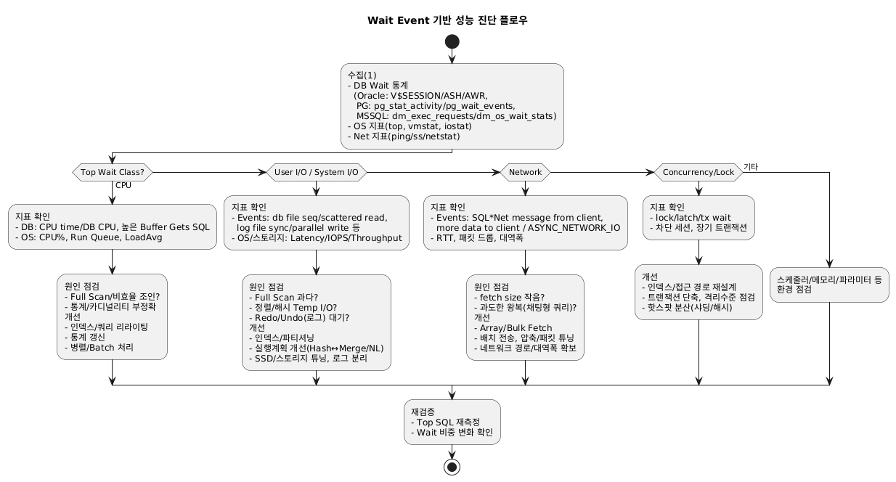
  
  ## 현행DB 오브젝트, 트랜잭션 분석 기반 용량 산정
    - 산정 개요 (What & How)
      - 정적 용량(Structure): 테이블/인덱스/LOB/파티션/메타/시스템 영역
      - 동적 용량(Workload): 트랜잭션/Redo(로그)/WAL/Temp/Sort/증분 성장
      - 증가율: 일/주/월 신규행, 평균 행 크기, 인덱스 팩터, LOB 평균 크기
      - 여유율(Headroom): 운영 SLA에 따른 버퍼(예: 30~50%) + 장애 시 리빌드/리커버리 여유
      - 핵심 공식(예)
        하루 데이터 증가량(GB) ≈ 신규행수 × (평균행크기 + 인덱스오버헤드 + LOB평균) / 1024³
        월 예상 증가량(GB) ≈ 하루 증가량 × 30 × (성수기 보정계수)
        로그/아카이브 증가량(GB/일) ≈ (트랜잭션당 평균 로그바이트 × TPS × 86,400) / 1024³
        필요 스토리지(12개월) ≈ {현재사용량 + (월증가량 × 12)} × (여유율)
    
    - 필수 지표 (수집 체크리스트)
      - 오브젝트 크기: 테이블/인덱스/LOB/파티션별 사이즈, 행수, 평균행크기
      - 액티비티: TPS, 커밋/롤백, 배치 피크, 성수기 스파이크
      - 로그/아카이브: Redo/WAL/트랜잭션 로그 생성량(일/시간)
      - Temp/Sort: 정렬/해시/집계 시 임시공간 사용량
      - 백업/DR: 백업셋/아카이브 보존정책에 따른 저장 필요분
      - 여유공간: 테이블스페이스/파일그룹/디스크 풀의 사용률·성장성
    
    - 바로 쓰는 수집 SQL
      + Oracle
      ```sql
      -- 테이블/인덱스/LOB 사이즈 (세그먼트 기준)
      SELECT owner, segment_type, segment_name, SUM(bytes)/1024/1024 MB
      FROM dba_segments
      GROUP BY owner, segment_type, segment_name
      ORDER BY MB DESC;
      -- 테이블별 행수(통계 기반)와 평균 행 크기 추정
      SELECT owner, table_name, num_rows,
            avg_row_len, blocks, bytes/1024/1024 MB
      FROM dba_tables
      WHERE owner NOT IN ('SYS','SYSTEM')
      ORDER BY MB DESC;
      -- REDO/아카이브(일 로그 생성량 근사)
      SELECT name, value
      FROM v$sysstat
      WHERE name IN ('redo size','redo writes');
      -- Temp 사용 상위 세션 (스냅샷 기간 관측 권장)
      SELECT * FROM v$tempseg_usage;
      -- TPS 근사(스냅샷): 커밋/롤백 증가량 / 관측초
      SELECT (SELECT value FROM v$sysstat WHERE name='user commits')
          + (SELECT value FROM v$sysstat WHERE name='user rollbacks') AS total_trx
      FROM dual;
      ```
      
      + PostgreSQL
      ```sql
      -- 오브젝트 사이즈
      SELECT n.nspname AS schema, c.relname AS object, c.relkind,
            pg_total_relation_size(c.oid) AS bytes,
            pg_relation_size(c.oid) AS tbl_bytes,
            pg_indexes_size(c.oid)  AS idx_bytes,
            pg_total_relation_size(c.reltoastrelid) AS toast_bytes
      FROM pg_class c
      JOIN pg_namespace n ON n.oid=c.relnamespace
      WHERE c.relkind IN ('r','m','p')  -- table, matview, partitioned table
      ORDER BY bytes DESC;
      -- 행수 추정(통계)
      SELECT schemaname, relname, n_live_tup AS approx_rows
      FROM pg_stat_user_tables
      ORDER BY approx_rows DESC;
      -- TPS/커밋·롤백, 시간당 WAL 생성량
      SELECT datname, xact_commit, xact_rollback, blks_read, blks_hit
      FROM pg_stat_database;
      -- WAL 크기(바이트) 누계: pg_current_wal_lsn() 차이로 기간당 생성량 산출
      SELECT pg_wal_lsn_diff(pg_current_wal_lsn(), '0/0') AS wal_bytes_total;
      ```

      + MySQL / MariaDB
      ```sql
      -- 테이블/인덱스 사이즈
      SELECT table_schema, table_name,
            data_length, index_length, (data_length+index_length) AS total_bytes
      FROM information_schema.tables
      WHERE table_schema NOT IN ('mysql','performance_schema','sys','information_schema')
      ORDER BY total_bytes DESC;
      -- InnoDB 상세 (행수 추정: 테이블 통계 참고)
      SHOW TABLE STATUS;
      -- TPS/커밋/롤백, 로그 생성량 근거 (버전별)
      SHOW GLOBAL STATUS LIKE 'Com_commit';
      SHOW GLOBAL STATUS LIKE 'Com_rollback';
      SHOW ENGINE INNODB STATUS;  -- redo/LSN, history list 관측
      ```
    
      + SQL Server
      ```sql
      -- 테이블별 데이터/인덱스/LOB 사이즈
      SELECT
        s.name AS schema_name, t.name AS table_name,
        SUM(a.total_pages)*8/1024.0 AS total_MB,
        SUM(a.used_pages)*8/1024.0 AS used_MB,
        SUM(a.data_pages)*8/1024.0 AS data_MB
      FROM sys.tables t
      JOIN sys.indexes i ON t.object_id=i.object_id
      JOIN sys.partitions p ON i.object_id=p.object_id AND i.index_id=p.index_id
      JOIN sys.allocation_units a ON p.partition_id=a.container_id
      JOIN sys.schemas s ON t.schema_id=s.schema_id
      GROUP BY s.name, t.name
      ORDER BY total_MB DESC;
      -- 행수
      SELECT s.name AS schema_name, t.name AS table_name, SUM(p.rows) AS rows
      FROM sys.tables t
      JOIN sys.schemas s ON t.schema_id=s.schema_id
      JOIN sys.partitions p ON t.object_id=p.object_id AND p.index_id IN (0,1)
      GROUP BY s.name, t.name
      ORDER BY rows DESC;
      -- 트랜잭션/로그 사용량
      SELECT * FROM sys.dm_tran_database_transactions;
      SELECT * FROM sys.dm_db_log_space_usage;  -- 로그 사용률
      ```
    
    - 산정 절차 (Step-by-step)
      - 현행 스냅샷(7~14일)
        - 위 쿼리 주기 실행(예: 5~15분 간격) → 피크/평균/최소 확보
        - WAL/Redo, Temp, 백업/아카이브 생성량 “하루” 기준으로 집계
      - 정적 용량 합산
        - 테이블 + 인덱스 + LOB + 파티션 + (SYSTEM/메타)
        - 압축/블록 크기, fillfactor(예: PG 테이블 100%가 아님) 반영
      - 동적 성장 추정
        - 신규행/일 × (평균행크기 + 인덱스오버헤드 + LOB평균)
        - 로그/WAL 생성량(GB/일), Temp 피크(GB/일) → 보수적 반영
      - 보존정책 반영
        - 아카이브/백업 보존기간 × 일 생성량 → 별도 저장 필요량
      - 12~18개월 용량 계획
        - 월증가량 × 12~18 + 현재사용량
        - 여유율(운영 30~50% + 재빌드/리커버리 버퍼)
      - 시나리오 테스트
        - 성수기 ×1.5~3.0 배, 신규 기능 런칭, 마이그레이션/리인덱스 이벤트
    
    - 계산 예시 (간단 수치 샘플)
      - 현재 사용량: 2.0 TB
      - 평균 증가: 데이터 20 GB/일, 로그 10 GB/일, 아카이브 보존 14일
      - 월 증가량: 20 GB × 30 = 600 GB
      - 12개월 필요 데이터: 2.0 TB + 0.6 TB × 12 = 9.2 TB
      - 아카이브 보존: 10 GB × 14 = 140 GB
      - 여유율 40%: (9.2 TB + 0.14 TB) × 1.4 ≈ 13.1 TB
      - 권장 14~16 TB (디스크 풀/증설 단위 고려)
    
    - 리포트/시트 구성(권장 컬럼)
      - schema | object | type(table/index/lob) | rows | avg_row_len | data_bytes | index_bytes | toast/lob_bytes | total_bytes | daily_new_rows | est_daily_growth_bytes | notes
    
    - 운영 팁
      - 통계 최신화 후 측정 (오차 ↓)
      - 대용량 LOB: 평균 크기·압축·외부 스토리지 여부 확인
      - 인덱스 리빌드/파편화 이벤트를 용량 가드레일에 포함
      - 파티셔닝: 오래된 파티션 압축/아카이브 전략으로 증분 억제
      - 백업/DR: 증분 백업률·압축률·카탈로그/메타 저장분 반영

  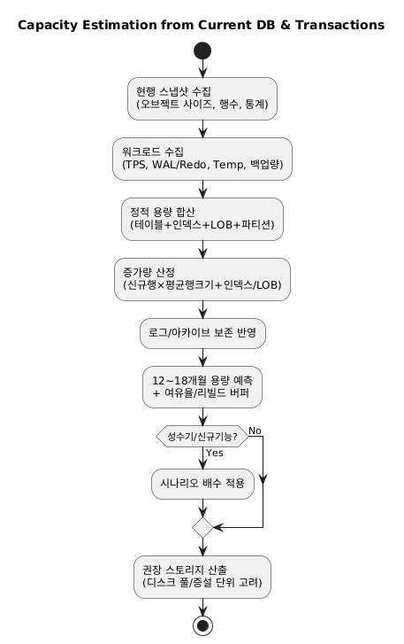

## 인덱스·파티셔닝·백업 전략
  - 인덱스 전략
    - 공통 원칙 (세 DB 공통)
      - 고선택도(카디널리티↑) 컬럼, 조인·WHERE·정렬·그룹 기준에 우선 적용
      - 복합 인덱스는 접두(leading) 컬럼 설계를 명확히(쿼리 패턴 기준)
      - 빈번한 갱신 컬럼·저선택도 컬럼(예: Y/N)은 주의(Oracle Bitmap 제외)
      - 커버링(필요 컬럼을 인덱스만으로 충족)과 통계 최신화로 Plan 안정성 확보
    - PostgreSQL
      - 종류: B‑tree(기본), GIN(다중값/전문검색/JSONB), GiST(범위/공간), BRIN(대용량·칼럼 정렬성 활용), Hash(특정 용도), Partial/Expression, INCLUDE(커버링)
      - 팁: 부분 인덱스(Partial)로 쓰기부하↓, BRIN으로 시계열 대테이블 스캔 최소화
      - 예시
      ```sql
      -- 커버링 + 조건 최적화
      CREATE INDEX ix_orders_date_status ON orders(order_date, status) INCLUDE (amount);
      -- 부분 인덱스(취소 제외)
      CREATE INDEX ix_orders_active ON orders(id) WHERE status <> 'CANCELLED';
      -- JSONB 검색(GIN)
      CREATE INDEX ix_doc_tags_gin ON docs USING GIN (tags jsonb_path_ops);
      ```
    - MySQL (InnoDB)
      - 종류: B‑tree(PK/세컨더리), FULLTEXT, SPATIAL, Functional Index(8.0+), Invisible Index
      - 팁: Leftmost Rule(복합 인덱스 접두 컬럼 일치) 준수, 보조 PK로 AUTO_INCREMENT PK 단일 권장, 과도한 세컨더리 인덱스는 쓰기 지연 유발
      - 예시
      ```sql
      -- 함수 기반 인덱스(8.0+)
      CREATE INDEX ix_user_email_lc ON users ((LOWER(email)));
      -- 보이지 않는 인덱스로 안전 제거 검증
      ALTER TABLE orders ALTER INDEX ix_old INVISIBLE;
      ```
    - Oracle
      - 종류: B‑tree(대부분), Bitmap(저카디널리티/분석), Function‑Based, Reverse Key(순차 PK 핫스팟 완화), Partitioned Index(LOCAL/GLOBAL), Invisible Index, Index Compression
      - 팁: DML 많은 OLTP는 Bitmap 지양, 대규모 조회·집계엔 유효. Global vs Local 명확히(파티션 전략과 함께)
      - 예시
      ```sql
      -- 함수 기반 + 가상칼럼
      ALTER TABLE USERS ADD (EMAIL_LC GENERATED ALWAYS AS (LOWER(EMAIL)));
      CREATE INDEX IX_USERS_EMAIL_LC ON USERS(EMAIL_LC);
      -- Reverse Key: 시퀀스 핫스팟 완화
      CREATE INDEX IX_ORDERS_PK_REV ON ORDERS(ORDER_ID) REVERSE;
      ```
  
  - 파티셔닝 전략
    - 공통 선택 기준
      - 시계열 Range(일/월 기준) 기본값, 핫·콜드 분리/아카이브 용이
      - 균등 분포가 어려우면 Hash/Key로 균형화, 다차원은 Composite
      - 파티션 프루닝이 쿼리 패턴과 맞물리도록 파티션 키 = 필터 컬럼
    - PostgreSQL (Declarative)
      - 방식: Range / List / Hash, 서브파티션 가능, 인덱스는 파티션별(Local)만(글로벌 인덱스 미지원)
      - 운영: ATTACH/DETACH로 롤링 윈도우 관리, BRIN과 궁합 좋음(시계열 대용량)
      - 예시
      ```sql
      CREATE TABLE sales (
        id bigserial, sale_date date, region text, amount numeric
      ) PARTITION BY RANGE (sale_date);
      CREATE TABLE sales_2025_08 PARTITION OF sales
        FOR VALUES FROM ('2025-08-01') TO ('2025-09-01');
      ```
    - MySQL (InnoDB)
      - 방식: RANGE / LIST / HASH / KEY, 서브파티션 지원, 인덱스는 파티션 로컬
      - 제약: 글로벌 세컨더리 인덱스 없음(쿼리 설계로 보완), 파티션 키가 인덱스 접두에 포함되도록 설계
      - 예시
      ```sql
      CREATE TABLE orders (
        id bigint primary key,
        order_date date,
        status varchar(20), amount decimal(12,2),
        KEY ix_date_status (order_date, status)
      ) PARTITION BY RANGE (TO_DAYS(order_date)) (
        PARTITION p202508 VALUES LESS THAN (TO_DAYS('2025-09-01'))
      );
      ```
    - Oracle (Enterprise Partitioning)
      - 방식: Range / List / Hash / Interval, Composite(Range-Hash, Range-List), 참조 파티셔닝(Reference) 지원
      - 인덱스: LOCAL / GLOBAL 모두 가능(운영 유연성↑), 파티션 교체(Exchange), 온라인 리빌드 성숙
      - 예시
      ```sql
      CREATE TABLE SALES (
        ID NUMBER, SALE_DT DATE, REGION VARCHAR2(20), AMOUNT NUMBER
      ) PARTITION BY RANGE (SALE_DT) INTERVAL (NUMTOYMINTERVAL(1,'MONTH'))
      ( PARTITION P202508 VALUES LESS THAN (DATE '2025-09-01') );
      -- Local partitioned index
      CREATE INDEX IX_SALES_DT_LOC ON SALES(SALE_DT) LOCAL;
      ```
  
  - 백업·복구 전략 (RPO/RTO 중심)
    -  공통 설계
      - 초기Full + 주기Incremental + 트랜잭션로그 아카이브(PITR)
      - 백업무결성검증(restore test), 암호화, 보존정책, 오프사이트/클라우드 복제
      - 대규모는 스냅샷(스토리지 레벨) + 논리백업(스키마이식) 병행
    - Oracle
      - 도구: RMAN(물리 Full/Level 0·1 증분, 블록체인지 추적), Data Pump(expdp/impdp, 논리)
      - ARCHIVELOG + RMAN + FRA로 PITR, 대규모 DR은 Data Guard
      - 예시(개념):
      ```bash
      -- RMAN 증분 + 카탈로그
      RMAN> BACKUP INCREMENTAL LEVEL 0 DATABASE PLUS ARCHIVELOG;
      RMAN> BACKUP INCREMENTAL LEVEL 1 DATABASE;
      -- 복구: SET UNTIL TIME ...; RESTORE ...; RECOVER ...;
      ```
    - PostgreSQL
      - 도구: pg_dump/pg_dumpall(논리), pg_basebackup(물리), 아카이브 모드+WAL로 PITR
      - 운영형: pgBackRest / Barman(증분·병렬·압축·보존)
      - 예시(개념):
      ```bash
      # 물리 베이스백업 + WAL 보관
      pg_basebackup -h primary -D /backup/base -X stream -C -S bkp_slot
      # 복구(PITR): recovery.signal + restore_command + target_time
      ```
    - MySQL
      - 도구: mysqldump(논리), MySQL Enterprise Backup / Percona XtraBackup(물리, Hot)
      - Binary Log 기반 PITR, GTID 권장
      - 예시(개념):
      ```bash
      # 물리 증분(XtraBackup)
      xtrabackup --backup --target-dir=/bkp/full
      xtrabackup --backup --target-dir=/bkp/inc1 --incremental-basedir=/bkp/full
      # 복구 후 binlog 적용으로 PITR
      mysqlbinlog --start-datetime="2025-08-15 00:00:00" binlog.000123 | mysql
      ```

    | DBMS       | 물리 백업                        | 논리 백업                  | PITR 지원        | 운영 도구/특징               |
    | ---------- | ---------------------------- | ---------------------- | -------------- | ---------------------- |
    | Oracle     | RMAN Full/증분                 | Data Pump(expdp/impdp) | ARCHIVELOG 기반  | Data Guard, FRA        |
    | PostgreSQL | pg_basebackup + WAL         | pg\_dump/pg\_dumpall   | WAL Archive 기반 | pgBackRest(증분/병렬/압축/보존정책 + WAL 관리 + PITR), Barman     |
    | MySQL      | XtraBackup/Enterprise Backup | mysqldump              | Binlog + GTID  | Hot Backup 지원          |
    | SQL Server | Full/Differential/T-Log      | BCP, SSMS Export       | T-Log 기반       | AlwaysOn/AG, Filegroup |
    
    + PG: 주 1회 Full + 일일 Diff + 시간단위 Inc (pgBackRest), WAL 아카이브, 보존정책 관리
    + MySQL: 주 1회 Full(XtraBackup) + 일일 Incremental + binlog 보관, GTID
    + Oracle: RMAN Full/증분 + ARCHIVELOG + (옵션) Data Guard + FRA
    + MSSQL: Full(주간) + Diff(일일) + T-Log(15~30분), 정기 복구 리허설
    
    ### Oracle Data Guard, FRA
    | 항목     | **Data Guard**                              | **FRA**                               |
    | ------ | ------------------------------------------- | ------------------------------------- |
    | 목적     | DR/고가용성 (Standby 운영)                        | 백업/복구 스토리지 통합 관리                      |
    | 방식     | Primary→Standby Redo 전송                     | RMAN·Archived Log·Flashback 저장        |
    | 적용 범위  | 멀티 서버(Primary + Standby)                    | 단일 DB 인스턴스 스토리지                       |
    | 장점     | 장애 시 Failover/Switchover                    | 백업 관리 자동화, Flashback 지원               |
    | 시험 포인트 | 보호 모드 (Protection/Availability/Performance) | `db_recovery_file_dest`, Flashback DB |
    
    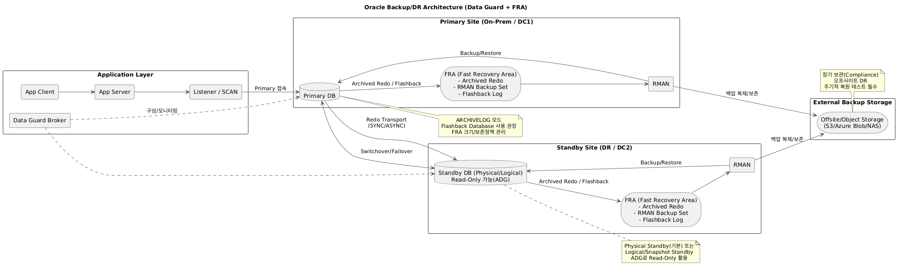
    
    ### PostgreSQL
    | 구분              | **pgBackRest**                         | **Barman**                 | **pg\_basebackup**               |
    | --------------- | -------------------------------------- | -------------------------- | -------------------------------- |
    | **백업 방식**       | 물리 (Full / Differential / Incremental) | 물리 (Full + WAL 기반 증분)      | 물리 (Full only)                   |
    | **증분 백업**       | 지원 (Diff/Inc, 블록 단위)                   | 지원 (WAL 기반)                | 미지원 (항상 Full)                    |
    | **병렬 처리**       | 지원 (멀티스레드 백업/복구/압축)                    | 일부 지원 (rsync 멀티 프로세스)      | 미지원                              |
    | **압축/암호화**      | 지원 (lz4, zstd, gzip / GPG 암호화)         | 지원 (gzip/bzip2, 일부 암호화)    | 미지원                              |
    | **WAL 관리**      | 자체 WAL 아카이브 관리, 보존 정책 지원               | WAL 아카이브/스트리밍 관리 중심        | 단순 아카이브 (별도 archive\_command 필요) |
    | **PITR (시점복구)** | 지원 (WAL 자동 적용)                         | 지원 (WAL 기반 복구)             | 지원 (WAL과 조합 시)                   |
    | **보존 정책**       | Full/Diff/Inc 세트 단위 자동 관리              | Retention Policy 제공        | 없음 (운영자 직접 관리)                   |
    | **저장소**         | 로컬/NFS/오브젝트 스토리지(S3, Azure Blob 등)     | 로컬/원격 서버 중심                | 로컬 디렉토리만                         |
    | **운영 난이도**      | 중간 (설정 다소 복잡, 안정적)                     | 중간 (전용 서버/아키텍처 필요)         | 낮음 (간단하지만 기능 한계)                 |
    | **대표 활용**       | 대규모 운영환경(수 TB) / 엔터프라이즈 백업 표준          | 원격 DR센터 백업, WAL 스트리밍 중심    | 단일 서버 기본 백업, PoC/소규모 환경          |
    | **장점**          | 엔터프라이즈급 기능, 병렬/증분/압축 최강                | WAL 관리/DR에 특화, 원격 보관 강점    | 기본 내장, 설정 단순                     |
    | **단점**          | 설정 복잡, 초기 러닝커브                         | 기능 제한, 확장성 pgBackRest보다 낮음 | 증분/병렬 없음, 대용량 비효율                |
    
    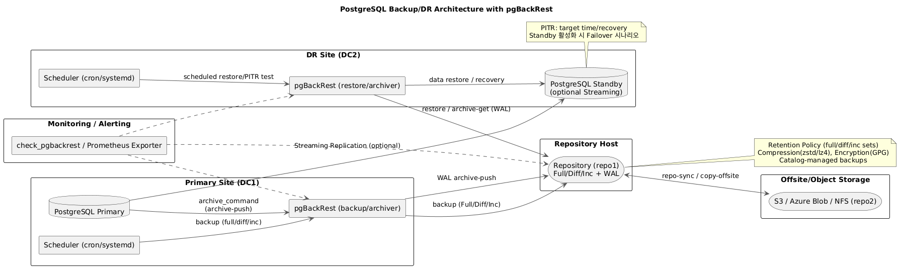
    
    ### MySQL
    | 항목         | **Percona XtraBackup** | **MySQL Enterprise Backup (MEB)** |
    | ---------- | ---------------------- | --------------------------------- |
    | 라이선스       | 오픈소스(무료)               | 상용(Enterprise Edition 구독 필요)      |
    | Hot Backup | ✅ InnoDB 지원            | ✅ InnoDB + MyISAM 등 엔진 지원         |
    | 증분/차등      | 지원                     | 지원                                |
    | 압축/암호화     | 지원(lz4/zstd/gzip, GPG) | 지원(내장)                            |
    | 병렬 처리      | 지원                     | 지원                                |
    | PITR       | Binlog과 연계             | Binlog과 연계                        |
    | 지원 대상      | InnoDB 중심              | InnoDB + MyISAM + 기타 엔진           |
    | 관리 편의      | CLI 기반, 스크립트 자동화       | GUI·Oracle Enterprise 관리 툴 연계     |
    | 비용         | 무료                     | 유료                                |
    
    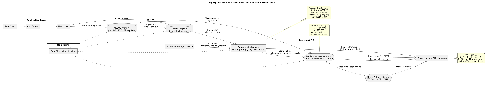
    
    ### SQL Server
    | 항목     | AlwaysOn AG                      | Filegroup Backup                     |
    | ------ | -------------------------------- | ------------------------------------ |
    | 목적     | 고가용성 + DR                        | 대용량 DB 효율적 백업/복구                     |
    | 단위     | 데이터베이스 단위                        | Filegroup 단위                         |
    | 모드     | Sync (HA), Async (DR)            | Full / Partial Restore               |
    | 장점     | 무중단 Failover, Secondary 읽기 부하 분산 | 빠른 복구, 불필요 재백업 최소화                   |
    | 시험 포인트 | 자동 Failover, Secondary 백업        | Partial Restore, Read-Only Filegroup |
    
    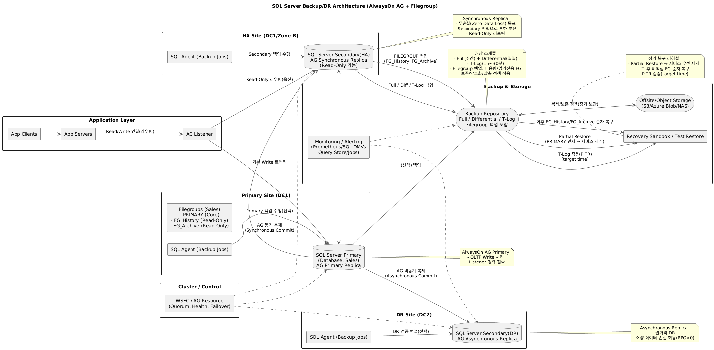
    
    - pg_dump 방식과 restore 방식등 다르다.
    - 각 RDBMS별 백업/복구툴, Command에 대해서 기본적인 접근, 숙지, 검색가능하게 
    - 백업과 복구도구(RMAN, pgdump, Backup/Restore 등)
    - pg_dump/pg_restore, RMAN, mysqldump: DB백업 및 복구 도구
    - PostgreSQL, MySQL, Oracle 등의 인덱스, 파티셔닝, 백업전략 비교

  - 조합 가이드(상황별 처방)
    - 시계열 대용량(로그/거래)
      - PG: Range 파티션 + BRIN(스캔 최소화) + pgBackRest + WAL PITR
      - MySQL: Range/KEY 파티션 + 읽기복제 + XtraBackup + binlog PITR
      - Oracle: Interval Range + Local Index + RMAN 증분 + Data Guard
    - 쓰기많고 조회패턴 명확한 OLTP
      - 인덱스는 최소/정확, 복합은 접두 정렬 맞추기
      - 읽기 확장: read replica(또는 Active Data Guard) + 캐시(예: Redis)
    - 스키마 이식·선택적 마이그레이션
      - 논리백업(pg_dump, mysqldump, DataPump) + CDC이행(변경분적용)

## 트랜잭션 격리 수준(Isolation Level) 개요
  | 격리수준                 | Dirty | Non-repeatable | Phantom | 비고                                |
  | -------------------- | ----- | -------------- | ------- | --------------------------------- |
  | **READ UNCOMMITTED** | 허용    | 허용             | 허용      | Oracle 미지원(비권장)                   |
  | **READ COMMITTED**   | 차단    | 허용             | 허용      | **기본값: Oracle/PG/SQL Server**(전통) |
  | **REPEATABLE READ**  | 차단    | 차단             | 가능      | **기본값: MySQL(InnoDB)**            |
  | **SERIALIZABLE**     | 차단    | 차단             | 차단      | 가장 엄격(직렬화)                        |
  | **SNAPSHOT**(DB옵션)   | 차단    | 차단             | 차단      | MVCC 스냅샷 기반, 시스템마다 명칭/동작 상이       |

  + Dirty Read: 커밋 안 된 값을 읽음
  + Non-repeatable Read: 같은 행을 두 번 읽을 때 값이 달라짐(중간 커밋 반영)
  + Phantom Read: 같은 조건을 두 번 조회할 때 “행의 수”가 달라짐(삽입/삭제로 유령행 발생)
  + Lost Update: 서로의 갱신이 덮어씌워짐
  + Write Skew: 개별 행 제약은 만족하지만, 조합 제약이 깨지는 스냅샷 계열 특유의 이상

  ``` sql
  -- 1) 기본: READ COMMITTED (문 단위 스냅샷)
  SELECT COUNT(*) FROM t;          -- 예: 100
  -- 다른 세션이 INSERT COMMIT
  SELECT COUNT(*) FROM t;          -- 101 (문 사이 최신 커밋 보임)

  -- 2) 트랜잭션 스냅샷
  SET TRANSACTION ISOLATION LEVEL SERIALIZABLE;
  SELECT COUNT(*) FROM t;          -- 100
  -- 다른 세션 INSERT COMMIT
  SELECT COUNT(*) FROM t;          -- 여전히 100 (트랜잭션 시점 고정)
  COMMIT;
  ```

## 프로젝트 단계별 통계정보 정책 수립 전략
  - 프로젝트에서 통계정보는 설계 → 개발/테스트 → 통합 테스트 → 운영의 단계별로 수립·관리한다.
    - 설계: 데이터특성·조회패턴·성능요구사항 기반 통계정보수집·갱신주기, 수집방식(자동/수동), 파티션·인덱스설계 연계한 정책수립
    - 개발/단위테스트: 샘플데이터 이용해 초기통계정보 수집하여 실행계획검증과 성능튜닝 수행 
    - 통합테스트: 운영데이터 규모와 유사한 데이터셋으로 통계정보 재수집, 실제쿼리부하에 따른 옵티마이저 동작 검증하여 통계정보확정
    - 운영이행전: 통계정보 최신상태 갱신하여 쿼리계획안정성 확보, 
    - 운영이행후: 자동통계갱신(Auto Statistics)과 주기적 수동수집 병행하여 성능저하 예방 
  - 정책에는 수집시점·방법·대상테이블·샘플링비율·파티션별 통계수집여부 등을 명시해 일관성 유지

  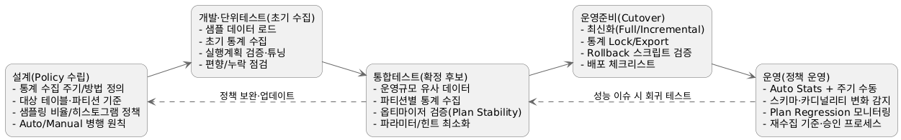

## 온프레미스에서 Azure로의 단계적 마이그레이션 전략
  1. Azure Migrate로 서버·DB·애플리케이션 종속성 분석/전환우선순위 도출 
  2. DB이행은 Azure DMS|GoldenGate|pglogical과 같은 CDC를 사용해 다운타임 최소화 
  3. 대용량 배치는 Azure Data Factory로 초기 적재, 변경분은 CDC(Kafka + Debezium)로 스트리밍 복제
  4. 아키텍처설계 시 공통데이터는 단일 중앙DB로 모으고, 서비스별전용데이터는 개별인스턴스 분리하여 Azure에서 분산구조로 배치. 데이터 파티셔닝은 날짜·업무키 기반 Range 또는 Hash 파티션을 적용 읽기성능 최적화
  3. EAI는 온프레미스 ESB|API Gateway <> Azure API Management 연계, Hybrid 환경에서 서비스 호출 가능
  6. 데이터 복제 방식은
    - 동기 복제: 강한 일관성, 지연 증가 가능
    - 비동기 복제: 성능 우수, eventual consistency 허용
    - CDC 복제: Binlog/WAL/Redo 기반 실시간 변경전송, 월단위 스냅샷/백업은 Blob Storage/ADLS로 보관해 재해 복구 지원
  7. 마이그레이션 절차 예시:
    1. 자산 분석(Azure Migrate) > 2. 신규 Azure 환경 구성(VNet, Subnet, Peering) > 3. 초기 데이터 적재(ADF) > 4. 실시간 변경 복제(DMS, GoldenGate, Kafka CDC) > 5. 점진적 서비스 전환(Read → Write) > 6. 최종 스위치오버
  
  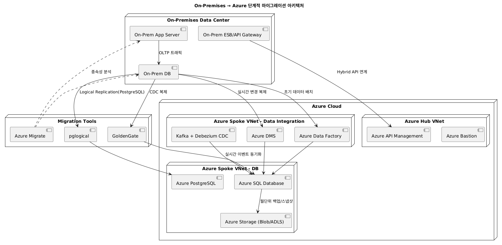

## 데이터베이스 오브젝트 분석, 복제구성, DB서버 부하분산 방안
  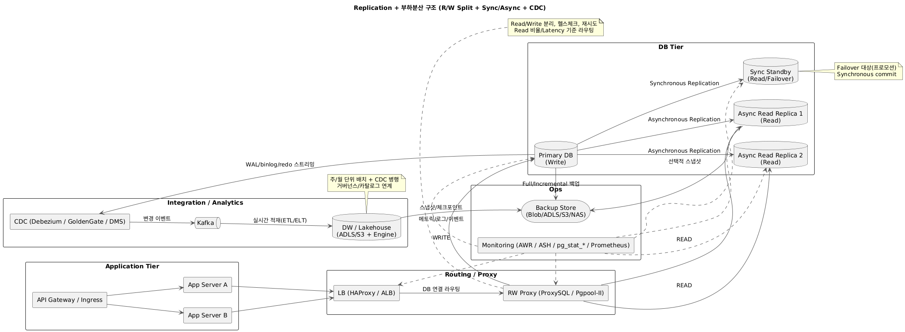


## 데이터베이스 모니터링 및 성능 점검 전략
  - 데이터베이스 모니터링은 운영 안정성 확보와 성능 저하 사전 예방을 위해 주기별로 관찰 지표를 구분한다.
  - 일 단위 필수 모니터링 지표
    - CPU 사용률, 메모리 사용률, 디스크 I/O 대기율
    - 장애·오류 로그 발생 건수
    - 주요 테이블 Lock 발생 빈도
    - 장애 상황 조기 탐지 목적의 알람성 지표 위주
  -  일 단위 모니터링 불필요/선택 지표 (필요 시에만 점검)
    - 장기 쿼리 실행 계획 변화
    - 전체 인덱스 사용률 및 미사용 인덱스 목록
    - 전체 테이블/파티션별 통계정보 변경 내역 → 빈번히 변하지 않으므로 주 단위나 장애 발생 시 분석
  - 주 단위/정기 점검 지표
    - AWR(Oracle) / pg_stat_statements(PostgreSQL)를 통한 Top SQL 분석
    - 실행계획 안정성(Plan Stability) 및 통계정보 최신화 여부
    - I/O Wait Event 상위 항목 분석(DB 부하 패턴)
    - 커넥션수 추이, 트랜잭션 처리량(TPS/QPS) 비교
    - 인덱스 조각화, 테이블 파티션 밸런스
  - 점검 방법
    - Oracle: AWR/ASH 리포트, V$ 뷰, OEM 대시보드
    - PostgreSQL: pg_stat_statements, pg_stat_activity, auto_explain
    - 부하상황별 모니터링:
      - CPU 부하시 → SQL실행시간·병렬처리수 확인
      - I/O 부하시 → Wait Event·스토리지 IOPS 확인
      - 메모리 부하시 → Buffer Cache Hit Ratio, Temp Usage 분석

## 1.21. Azure VPN/ExpressRoute, Vnet, App Service, AKS, Azure SQL 등 계층적 구성 설명
  - 데이터복제, 서버분산, App/Web/DB 계층 Azure 서비스 맵핑
  - Azure Vnet/Subnet: 네트워크논리분할, 보안설정
  - Azure App Service/AKS: 웹앱/마이크로서비스 호스팅
  - Azure SQL/PostgreSQL/Blob Storage: 주요 저장소 역할 및 특성
  - Azure Database Migration Service: 온프레미스 DB를 Azure로 마이그레이션하는 도구
  - [사용자] -> [VPN/ExpressRoute] -> [AzureVnet] -> [AppService/AKS] -> [AzureSQL/CosmosDB] -> [BlobStorage/Redis/LogAnalytics]
  
## AI기반 데이터 모델링(백터DB등)
### Chunking
### Embedding(DenseVector생성)
### VectorDB

## Monolithic 아키텍처에서 Micro Service 아키텍처로 분산시에 데이터 복제, 연동 방안
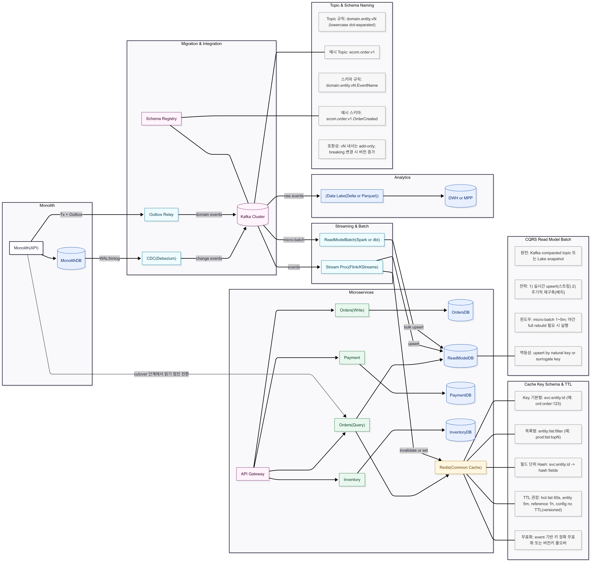

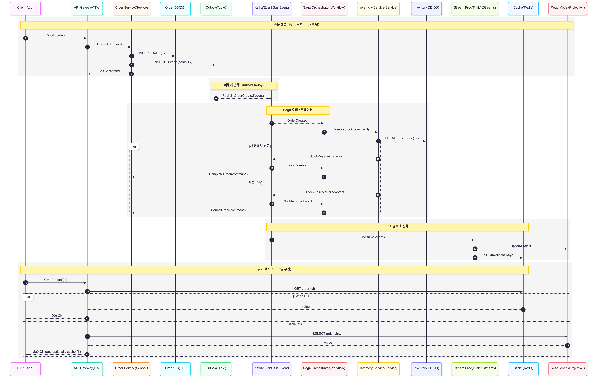

## 보안 및 암호화 설계
  - AES256 등 필수암호화는 '개인정보보호법'기준에 따라 적용
  - 조건절에서 성능 이슈 발생시 대체키 설계 고려
  - 단방향 암호화된 비밀번호는 복호화 불가, 분실시 재설정 방식 권장
  - DB 계정 보안 등 업무상 고려해야 할 사항
  - DB 암호화에 대한 개념, 암호화된 컬럼의 performance 개선에 대한 방법론
  - |데이터보호|단방향암호화/AES|복호화불가암호화 또는 양방향암호화|
  - 자주사용하지 않는 개인정보 마스킹. 항목이 아닌 것들이 좀 들어가는 있어서 좀 헷갈림.
  - DB계정보안 및 테스트환경 구성에 대한 실무적 고려사항
  - 자주 사용되지 않는 고객정보 보관 및 암호화/마스킹 방안
  - DB계정분리
  - DB암호화 정책
  - TDE/Always Encrypted: DB단위/컬럼단위 암호화기법
  - RBAC: 역할 기반 접근 제어로 DB 계정 보안 강화
  - Key Vault: 암호화키 및 보안정보 중앙관리

## 고객요구사항 기반 DB분석 및 개선
  - 요구사항 분석 템플릿: 요구사항정의서를 만드는 것이다. 구조적으로는 뭐가 필요하고 성능적으로 뭐가 필요하고 현재 문제가 뭐고 해결하려면 뭐가 필요하다.예시를 2개는 준다. 지문에 있는 것을 따와야하고 생각을 너무 적으면 안된다. 그 밑에 적혀있는 것은 객관식 하나하나의 문제다.
  - 요구사항정의서를 작성할 수 있어야합니다. 
  - 아키텍처 구조 및 성능 관점에서 현재의 문제점과 개선방안을 도출할 수 있어야 합니다.
  - SQL작성가이드에서는 기존의 SQL 목록과 튜닝가이드 목록을 제시한다. 
  - 성능테스트결과서에서는 XXX 가 나온다. 대충 보았을때는 다 맞는 것 같은데 다 꼬아져있다. 중상으로 가기때문에. 문제가 다 꼬아져있다.

  ### 요구사항 정의서 예시
  | 분류     | 요구사항명                  | 요구사항내용                                 | 해결/개선방안                              | 반영 산출물          |
  | ------ | ---------------------- | -------------------------------------- | ------------------------------------ | --------------- |
  | **구조** | 파티션 설계 최적화  | 대용량 로그 테이블에서 전체 스캔 발생, 조회 성능 저하 | 날짜 기반 파티셔닝(연·월·일) 적용, 파티션 프루닝 활용     | 논리 ERD, 파티션 설계서 |
  | **구조** | 금칙어 정비                 | 기존 시스템 변경 없이 속성명에 포함된 ‘직원번호’ 식별자 제거 필요 | 금칙어 ‘직원번호’ 제거, 표준용어 ‘직원’으로 대체        | 용어 표준 변경 정의서    |
  | **구조** | 선분이력 설계 검토             | 종료일시를 PK에 포함할 경우 기간 중복 발생 가능           | 종료일시는 일반 속성으로 분리, PK는 ‘코드 + 시작일’ 구성  | 이력 테이블 설계서      |
  | **성능** | SQL 병목 제거   | 특정 SQL의 실행 지연(10초 이상)           | 인덱스 신규 설계, 파티션 조건 추가, SQL 리팩토링       | SQL 성능 분석 보고서   |
  | **성능** | 실행 계획 분석(EXPLAIN)      | SQL의 실제 실행 계획 확인 필요                    | `EXPLAIN ANALYZE` 활용하여 병목 구간 분석 및 개선 | 실행 계획 비교 리포트    |
  | **운영** | Oracle → PostgreSQL 전환 | Timestamp 등 데이터 타입 차이로 인한 변환 이슈        | 호환 가능한 데이터 타입 매핑, 스키마 변환 자동화 도구 활용   | 마이그레이션 매뉴얼      |
  | **운영** | DB 분산 및 경량화 | 모든 업무 데이터가 통합 DB에 집중되어 운영 부하 가중 | 업무·지역 단위 DB 분리, 공통 DB + API 참조 구조 도입 | 분산 DB 아키텍처 설계서  |
  | **보안** | 암호화 정책 개선   | 암호화 컬럼 조건절 사용 시 성능 저하           | 대체키 설계, 마스킹 뷰 활용                     | 암호화 정책 설계서      |
  | **보안** | 비밀번호 정책                | 복호화 불가한 안전한 암호화 필요                     | SHA-256 단방향 암호화 적용, 비밀번호 재설정 절차 안내   | 비밀번호 정책 가이드     |
  | **백업** | 백업 공간 확보    | 월 1회 점검으로 백업 중 임시 테이블스페이스 부족 가능 | 자동 확장 정책 수립, 수시 모니터링                 | 백업 운영 매뉴얼       |


[ DATA Engineering ] 데이터 엔지니어링 관련 KICE 학습 참조
# 데이터 아키텍처 및 엔지니어링 전략
ㅇLakehouse, data fabric, data mesh 개념 설명
ㅇFact Table과 다중 계층 테이블 찾기
ㅇBusiness META, technical  META 구분하기
ㅇRAG. KAFKA 개념 정확히 알고 있어야 하며, 설명 중 잘못된 부분을 확인 할 수 있어야 함. 
ㅇ데이터 프로파일링
ㅇ데이터 스토어 특징 비교표 : RDB, key-value(JSON형식), Hadoop, Object Storage
ㅇ데이터 관리 사례 기반 주제 
   - 파티셔닝 방법으로 맞는 것 (파티셔닝 컬럼 찾기)
   - SQL문장 완성하기
   - 코드 보고 고객 요구사항 정리하기 (마케팅 자료 추출, ㅇ월-ㅇ월 자료..)
## ✅ 데이터 모델링 및 ELT 프로세스
### 1. 데이터 모델링 프로세스
- **요구사항 분석 → 개념 모델(CDM) → 논리 모델(LDM) → 물리 모델(PDM)** 순
- 개념 모델: 비즈니스 용어 기반 ERD
- 논리 모델: 정규화, 제약조건 명시
- 물리 모델: DBMS 종속적 구현
### 2. ELT 과정
- Extract → Load → Transform
- 대용량 병렬 처리에 유리
- Snowflake, BigQuery 같은 클라우드 DWH에 적합
---
## ✅ 데이터 레이크하우스 및 DW 구조 비교
### Lakehouse 특징
- ACID 트랜잭션 + 오픈 포맷 (Parquet 등)
- 분석 및 머신러닝 통합
- DW의 정형성과 DL의 유연성 결합
### 비교 요약
| 항목 | DW | Data Lake | Lakehouse |
|------|----|-----------|-----------|
| 스키마 | Schema-on-write | Schema-on-read | Hybrid |
| 활용 | 정형 분석 | 비정형 저장 | 분석 + ML 통합 |
| 성능 | 고속 쿼리 | 유연성 중심 | 최적화된 쿼리 + 확장성 |
---
## ✅ 개인정보 보호법 기반 설계 평가
- `개인정보의 안전성 확보조치 기준`을 기준으로 암호화 대상 판단
- 주요 항목:
  - 주민등록번호, 계좌번호 등은 필수 암호화
  - 저장 시 AES256, 전송 시 TLS 등 적용 권장
- 설계 평가 시, DB 컬럼 단위 암호화 정책 수립 필요
---
## ✅ 데이터 적재 설계 (테이블 유형별)
| 테이블 유형 | 적재 방식 |
|-------------|-----------|
| 마스터 테이블 | 전체 적재 or 갱신일 기준 증분 |
| 이력 테이블 | CDC 기반 증분 적재 |
| 트랜잭션 테이블 | 일별 분할 적재 or 파티션 병렬 |
---
## ✅ 고객 디멘전 연결 모델링
### 유형별 이력 관리 모델
1. Type 1: 덮어쓰기
2. Type 2: 이력 유지 (시작/종료일, 버전 관리)
3. Type 3: 한 개 이전 값만 저장
### 선택 시 고려사항
- 고객 속성 변화 추적 필요 시 Type 2 적용
- 대체키 필요 (Surrogate Key)
---
## ✅ 다양한 데이터 스토어 구조
| 유형 | 설명 | 예시 |
|------|------|------|
| 컬럼지향 (Columnar) | 읽기 최적화 | Parquet, ORC, ClickHouse |
| 키-값 저장소 | 빠른 조회 | Redis, RocksDB |
| HDFS/Hadoop 기반 | 분산 처리 | Hive, HBase |
| 객체 스토리지 | 저비용 대용량 | S3, GCS |
---
## ✅ OLAP 및 다차원 모델
- 팩트 테이블: 이벤트 중심 (매출, 주문 등)
- 디멘전 테이블: 고객, 제품, 시간 등
- 계층 구조 예: 시간(년-월-일), 지역(국가-도-시)
---
## ✅ 데이터 거버넌스 기반 품질 진단 전략
- 품질 진단 지표: 정확성, 유일성, 정합성, 최신성
- 대응 전략:
  - 단일 변경: 빠르나 리스크 큼
  - 병행 운영: 안정성 확보
  - 메타 중심 매핑: 유연성과 확장성
---
## ✅ RTT 지연 시 영향도
- RTT 0.2초 이상: 타이핑 반응 저하
- RTT 0.4초 이상: 마우스 드래그 지연
- ETL 설계, IDE 사용, BI 도구 성능에 부정적 영향
---
## ✅ 데이터 중복 점검 SQL
```sql
SELECT pk_col1, pk_col2, COUNT(*)
FROM target_table
GROUP BY pk_col1, pk_col2
HAVING COUNT(*) > 1;
```
- NULL 여부, 형식 일관성 점검 포함 필요
---
## ✅ 문제 해결 방안 제안 및 선택
- 상황: 30개 ETL, 10개 리포트에서 표준 불일치
- 방안:
  1. 전면 교체 – 리스크 큼
  2. 병행 운영 – 안정적이지만 이중 관리
  3. **메타데이터 기반 매핑 (선택)**
### 선택 이유:
1. 리스크 최소화 (운영 영향 적음)
2. 빠른 적용 가능 (ETL 변경 없음)
3. 향후 확장에 유리 (유지보수 간편)

## 1.1. 보험대출 관련 
  - 대출담보가 있는데 복합단어로 쓸수있냐는 문제임. 표준단어 정답
  - 데이터의 표준화, 표준단어, 표준용어 부분의 기초 학습이 필요함.
## 1.2. 계좌번호중 어떤 계좌번호를 PK로 잡을 것이냐 ? 어떤 것을 일련번호로 잡을 것이냐 ?
  - ERD 그림을 주어지고 테이블에 빈칸에 맞는 것을 넣으시오 이런 문제임.
  - 계좌번호 왔다갔다 어떤 계좌번호 pk? 수신계좌 pk + 일련번호
  - ERD 를 보고 PK 가 적절한지를 판단할 수 있어야함.
  
## 1.3. 한글만 알면 풀수있는 문제가 하나있다.
  - 모델링 정비를 권장한다. xx가 말이 안되서 답. 너무 쉬워서 말을 안한 것임.
## 1.4. 편의점 상품결제방식 복합결제 상품권
  - 상품권을 가지고 우리가 갔을 때 한번에 결제할 수 있냐 ? 복합, 분할결제할 수 있냐?를 ERD 로 설계, 다대다를 다대1로 바꾸고 하는 것.
  - 모델링에서는 다대다 관계 및 L Shape 등 뻔하게 잘못된 대표적인 설계를 어떻게 풀어야하는지 접근할 수 있어야함. - 예 : 다대다 - relation table, 이력테이블 // L shape - 정규화
  
## 1.5. 반정규화 조인
  - 조인 참조할때 반정규화를 찾아나가는 것
  - 반정규화의 개념과 활용, 어떨때 필요한지 인지 필요 
  - 반정규화 전략
  
  ### 반정규화(De-normalization) 개념 및 전략
  1) 개념 요약 (핵심 키워드)
    - 정규형 유지 + 조회 성능/비용 최적화를 위해 반복되는 고비용 조인 결과를 미리 펼쳐 저장(lookup flatten)하거나 집계값을 선계산(precompute)하는 기법
    장점: 조인 제거/축소 → 지연↓, 비용↓, 단순쿼리화
    단점: 중복↑, 갱신 복잡도↑(정합성 관리 필요)
  2) 언제 쓰나 (시험 포인트)
    - 대시보드/검색 API에서 n-way 조인 다빈도 + 엄격한 SLA(지연 한자리 ms~수십 ms)
    - 차원 테이블이 저변경(SCD/코드성)이고 참조 속성 적음
    - 카디널리티/조인 팬아웃으로 풀스캔·해시조인 비용이 큰 경우
    - 동일 패턴 질의가 반복되고 캐시 적중률이 낮음
    - 스토리지 비용 < 쿼리 비용인 환경(서버리스/쿼리당 과금 등)
  3) 반정규화 전략 Top 6
    - Lookup Flatten: 자주 조인하는 차원 속성(이름/카테고리/코드명) 복제 컬럼으로 보관
    - Precomputed Aggregates: 일/시간/분 단위 집계 테이블(rollup, snapshot)
    - Materialized View(MV): 조인·집계 결과를 MV+리프레시(주기/증분)로 유지
    - Wide Table/JSON 컬럼: 읽기 중심 서비스에 속성 펼침(스키마-온-리드 비용 절감)
    - CDC 기반 증분 갱신: 소스 변경 캡처 → 타겟 반정규 테이블 부분 갱신
    - Covering Index 대안(시험 언급용): 완전한 반정규화는 아니지만, 조인 없는 커버링(INCLUDE/INVISIBLE 컬럼) > INCLUDE/INVISIBLE/생성열을 활용한 Covering Index는 정규형을 유지하면서도 테이블 접근을 제거해 조회 지연과 비용을 대폭 절감하는 반정규화의 실무적 대안 
    
## 1.6. 1차 주관식 ERD parent pk 컬럼 참조 테이블에서 속성들이 옵션에서 필수로 바뀜. 5개의 속성을 테이블에 추가해야하는데 들어갈 후보. 개당 1점.
  - 기존 ERD 분석하여 신규 요건 수용 가능하도록 신규 엔티티 및 필요 속성 추가하여 재설계
## 1.7. |이력관리|선분이력구조설계|유효시작일/종료일기반 변경이력 관리방식
  ### 이력 관리 방식 비교
  | 구분                   | 선분이력 구조 (Lineage/Period)             | SCD Type 2 (Slowly Changing Dimension)           |
  | -------------------- | ---------------------------------------- | ---------------------------------------------------- |
  | 주요 목적            | 기간 기반 이력 관리 (언제부터\~언제까지 유효했는가?)      | 변경 발생 시 이전 값 보존 + 새 행 추가                         |
  | 키(PK) 설계         | `업무키(Business Key) + 유효시작일(VALID_FROM)`  | 대체키(Surrogate Key) 주로 사용, 비즈니스 키 + 버전/플래그        |
  | 기간 컬럼            | `VALID_FROM`, `VALID_TO` (NULL=현재)       | 보통 `START_DATE`, `END_DATE`, `IS_CURRENT` 컬럼         |
  | 구간 무겹침 제약        | 중요! (CHECK/Trigger로 보장)                  | 보통 버전 번호나 `IS_CURRENT` 컬럼으로만 관리                  |
  | 현재 행 조회          | `VALID_TO IS NULL`                       | `IS_CURRENT = 'Y'`                                   |
  | Point-in-time 조회 | 날짜 비교(`BETWEEN VALID_FROM AND VALID_TO`) | 날짜 또는 버전 번호 기반 필터링                                   |
  | 갱신 방식            | 기존 행 `VALID_TO` 갱신 후 새 행 INSERT      | 기존 행 `IS_CURRENT=N`, 새 행 `IS_CURRENT=Y` INSERT       |
  | 장점               | - 구간 단위 정확 관리<br>- 회계/보험/계약 등 기간 로직 최적   | - 단순 구조<br>- BI/DW 툴 친화적<br>- surrogate key join 최적화 |
  | 단점               | - PK/인덱스 복잡<br>- 구간 겹침 관리 필요             | - 기간 연산 지원 약함<br>- Point-in-time 조회 성능 낮을 수 있음       |
  | 사용 사례            | 계약이력, 인사 배치 이력, 보험 상품 변경                 | 고객 주소 변경, 상품 카테고리 이력, 마스터 데이터 변경                     |
## 1.8. 데이터품질에서 불가능?
   - 데이터 품질 솔루션에서 지원하지앟는 항목이 나온다.
   - 데이터 품질관련한 솔루션의 기능, 효과, 역할에 대한 학습 
   - 데이터품질솔루션의 영역별 활용 목적
  ### 데이터 품질 영역별 정의
  | 영역                     | 설명                       | 예시                  |
  | ---------------------- | ------------------------ | ------------------- |
  | 정합성 (Consistency)  | 서로 다른 시스템·컬럼 간 데이터 값이 일치 | 고객ID, 계약ID 매핑 검증    |
  | 유효성 (Validity)     | 정의된 도메인/형식/규칙에 맞는 값      | 생년월일이 YYYY-MM-DD 포맷 |
  | 완전성 (Completeness) | 필수 항목 누락 없이 채워져 있음       | 주민등록번호 NULL 여부      |
  | 중복성 (Uniqueness)   | 동일 엔티티 중복 입력 방지          | 동일 고객 두 번 등록 방지     |
  | 정확성 (Accuracy)     | 실제 현실 세계의 참값과 일치         | 주소/전화번호 최신화         |
  | 적시성 (Timeliness)   | 최신 정보로 업데이트 여부           | 배송 상태 갱신 시간         |
## 1.9. CTQ 에 대한 것이 공부해야한다.
  - CTQ, DQI 관련사항
  - CTQ, DQI, Data Profiling, Business Rule 정의 개념
  
  ### CTQ (Critical to Quality) 정의
  ```yaml
  고객 요구: 고객 정보가 정확해야 한다
    └─ CTQ: 고객 주소 정확성
        ├─ Metric: 주소 오타율 ≤ 0.5%
        ├─ Metric: 우편번호-주소 정합성 오류율 ≤ 0.1%
    └─ CTQ: 고객 연락처 유효성
        ├─ Metric: 전화번호 정규식 미준수율 ≤ 0.2%
        ├─ Metric: 이메일 반송률 ≤ 1%
  ``` 
## 1.10. 성능 수정 파라미터 관련 선택 in 오라클, Msql, PostgreSQL, mssql
  - 성능에 대한 비교인데 Oracle에 성능을 수정하는 파라메터. mysql에서 성능을 수행하는 파라메터는 뭐다. mssql은 뭐를 건드린다. 그중에 성능과 관련이 없는 파라메터다. langset 이 성능과 상관없다.
  - 각 RDBMS별로 성능에 대판 Parameter 등을 기본적으로 접근 
  - Oracle, SQL Server, PostgreSQL, MySQL 등
  
  ### RDBMS 성능 관련 주요 파라미터
  | DB         | 메모리 핵심                      | 병렬/플래너                      | WAL/로그·체크포인트                        | 특기사항                     |
  | ---------- | --------------------------- | --------------------------- | ----------------------------------- | ------------------------ |
  | Oracle     | SGA/PGA, Cache/Shared Pool  | Parallel Degree/Policy      | Redo/Log Buffer                     | NLS는 성능 무관               |
  | MSSQL      | max server memory           | MAXDOP / cost threshold     | TempDB 파일, 파일 성장                    | Query Store, 언어 설정 무관    |
  | PostgreSQL | shared\_buffers / work\_mem | random\_page/seq\_page cost | max\_wal\_size / checkpoint\_\*     | autovacuum, lc\_\* 무관    |
  | MySQL      | innodb\_buffer\_pool\_\*    | (플래너 자동)                    | innodb\_log\_file\_size / flush\_\* | character\_set/lc\_\* 무관 |
## 1.11. cache db 메모리 로드 대상 컬럼
  - cache db redis를 사용해서 kafka가 나오는데 vector db / dw 영역이 나옴
  - Redis Cache 활용성능개선 방안
  - RDBMS의 성능제한을 Cache DB(Redis)를 활용해 개선할 때 CacheDB를 어떻게 활용해서 개선하는지, 개념과 이해가 필요
  - DB가 느려서 cache db 에 넣을 수 있는 값이 어떤 값이야. 이런 문구중에 캐시DB에 넣을 것이 가장 적합한 것인가 ? 답이 2개3개로 보일 수 있지만. 가장 올바른 것은 ? 공통 cache.
    ### 캐시 DB 활용 방안
    1. 자주 조회되지만 자주 변하지 않는 데이터
      - 예: 상품 정보(상품명, 카테고리, 가격), 코드 테이블(지역 코드, 국가 코드)
      - 변동이 적고 조회 빈도가 높아 캐싱 효과가 크다.
    2. 비즈니스적으로 Hot한 데이터 (핫 데이터)
      - 예: 실시간 인기 상품 랭킹, 자주 쓰이는 게시글/댓글 Top N, 세션 정보
      - 짧은 TTL(Time To Live) 기반으로 유지하면 DB 부하 완화 가능.
    3. 공통적으로 여러 서비스에서 반복 참조하는 데이터 (공통 Cache)
      - 예: 권한/역할 매핑, 환율, 설정값, 공통 마스터 데이터
      - 여러 서비스가 동일하게 참조 → Cache hit율 높음.
  - 라운드로빈 파티션 테이블의 한계 및 인메모리DB와의 연계 검토
    
    
  - Redis cache 팜구성: 조회성능향상
## 1.12. 백업관련된 것할때 dump 등 dbms 별 백업방식이 명령어가 있다.
  ### 백업전략이 DBMS 별로 다르다.  
  | DBMS       | 물리 백업                        | 논리 백업                  | PITR 지원        | 운영 도구/특징               |
  | ---------- | ---------------------------- | ---------------------- | -------------- | ---------------------- |
  | Oracle     | RMAN Full/증분                 | Data Pump(expdp/impdp) | ARCHIVELOG 기반  | Data Guard, FRA        |
  | PostgreSQL | pg_basebackup + WAL         | pg\_dump/pg\_dumpall   | WAL Archive 기반 | pgBackRest(증분/병렬/압축/보존정책 + WAL 관리 + PITR), Barman     |
  | MySQL      | XtraBackup/Enterprise Backup | mysqldump              | Binlog + GTID  | Hot Backup 지원          |
  | SQL Server | Full/Differential/T-Log      | BCP, SSMS Export       | T-Log 기반       | AlwaysOn/AG, Filegroup |
  
  + PG: 주 1회 Full + 일일 Diff + 시간단위 Inc (pgBackRest), WAL 아카이브, 보존정책 관리
  + MySQL: 주 1회 Full(XtraBackup) + 일일 Incremental + binlog 보관, GTID
  + Oracle: RMAN Full/증분 + ARCHIVELOG + (옵션) Data Guard + FRA
  + MSSQL: Full(주간) + Diff(일일) + T-Log(15~30분), 정기 복구 리허설
  #### Oracle
  | 항목     | Data Guard                              | FRA                               |
  | ------ | ------------------------------------------- | ------------------------------------- |
  | 목적     | DR/고가용성 (Standby 운영)                        | 백업/복구 스토리지 통합 관리                      |
  | 방식     | Primary→Standby Redo 전송                     | RMAN·Archived Log·Flashback 저장        |
  | 적용 범위  | 멀티 서버(Primary + Standby)                    | 단일 DB 인스턴스 스토리지                       |
  | 장점     | 장애 시 Failover/Switchover                    | 백업 관리 자동화, Flashback 지원               |
  | 시험 포인트 | 보호 모드 (Protection/Availability/Performance) | `db_recovery_file_dest`, Flashback DB |
  
  #### PostgreSQL
  | 구분              | pgBackRest                         | Barman                 | pg\_basebackup               |
  | --------------- | -------------------------------------- | -------------------------- | -------------------------------- |
  | 백업 방식       | 물리 (Full / Differential / Incremental) | 물리 (Full + WAL 기반 증분)      | 물리 (Full only)                   |
  | 증분 백업       | 지원 (Diff/Inc, 블록 단위)                   | 지원 (WAL 기반)                | 미지원 (항상 Full)                    |
  | 병렬 처리       | 지원 (멀티스레드 백업/복구/압축)                    | 일부 지원 (rsync 멀티 프로세스)      | 미지원                              |
  | 압축/암호화      | 지원 (lz4, zstd, gzip / GPG 암호화)         | 지원 (gzip/bzip2, 일부 암호화)    | 미지원                              |
  | WAL 관리      | 자체 WAL 아카이브 관리, 보존 정책 지원               | WAL 아카이브/스트리밍 관리 중심        | 단순 아카이브 (별도 archive\_command 필요) |
  | PITR (시점복구) | 지원 (WAL 자동 적용)                         | 지원 (WAL 기반 복구)             | 지원 (WAL과 조합 시)                   |
  | 보존 정책       | Full/Diff/Inc 세트 단위 자동 관리              | Retention Policy 제공        | 없음 (운영자 직접 관리)                   |
  | 저장소         | 로컬/NFS/오브젝트 스토리지(S3, Azure Blob 등)     | 로컬/원격 서버 중심                | 로컬 디렉토리만                         |
  | 운영 난이도      | 중간 (설정 다소 복잡, 안정적)                     | 중간 (전용 서버/아키텍처 필요)         | 낮음 (간단하지만 기능 한계)                 |
  | 대표 활용       | 대규모 운영환경(수 TB) / 엔터프라이즈 백업 표준          | 원격 DR센터 백업, WAL 스트리밍 중심    | 단일 서버 기본 백업, PoC/소규모 환경          |
  | 장점          | 엔터프라이즈급 기능, 병렬/증분/압축 최강                | WAL 관리/DR에 특화, 원격 보관 강점    | 기본 내장, 설정 단순                     |
  | 단점          | 설정 복잡, 초기 러닝커브                         | 기능 제한, 확장성 pgBackRest보다 낮음 | 증분/병렬 없음, 대용량 비효율                |
  
  #### MySQL
  | 항목         | Percona XtraBackup | MySQL Enterprise Backup (MEB) |
  | ---------- | ---------------------- | --------------------------------- |
  | 라이선스       | 오픈소스(무료)               | 상용(Enterprise Edition 구독 필요)      |
  | Hot Backup | InnoDB 지원            | InnoDB + MyISAM 등 엔진 지원         |
  | 증분/차등      | 지원                     | 지원                                |
  | 압축/암호화     | 지원(lz4/zstd/gzip, GPG) | 지원(내장)                            |
  | 병렬 처리      | 지원                     | 지원                                |
  | PITR       | Binlog과 연계             | Binlog과 연계                        |
  | 지원 대상      | InnoDB 중심              | InnoDB + MyISAM + 기타 엔진           |
  | 관리 편의      | CLI 기반, 스크립트 자동화       | GUI·Oracle Enterprise 관리 툴 연계     |
  | 비용         | 무료                     | 유료                                |
  
  #### SQL Server
  | 항목     | AlwaysOn AG                      | Filegroup Backup                     |
  | ------ | -------------------------------- | ------------------------------------ |
  | 목적     | 고가용성 + DR                        | 대용량 DB 효율적 백업/복구                     |
  | 단위     | 데이터베이스 단위                        | Filegroup 단위                         |
  | 모드     | Sync (HA), Async (DR)            | Full / Partial Restore               |
  | 장점     | 무중단 Failover, Secondary 읽기 부하 분산 | 빠른 복구, 불필요 재백업 최소화                   |
  | 시험 포인트 | 자동 Failover, Secondary 백업        | Partial Restore, Read-Only Filegroup |
  
  - pg_dump 방식과 restore 방식등 다르다.
  - 각 RDBMS별 백업/복구툴, Command에 대해서 기본적인 접근, 숙지, 검색가능하게 
  - 백업과 복구도구(RMAN, pgdump, Backup/Restore 등)
  
  
  - pg_dump/pg_restore, RMAN, mysqldump: DB백업 및 복구 도구
  - PostgreSQL, MySQL, Oracle 등의 인덱스, 파티셔닝, 백업전략 비교
    ### DBMS별 인덱스·파티셔닝·백업 전략
    1) 인덱스 전략
      - 공통 원칙 (세 DB 공통)
        - 고선택도(카디널리티↑) 컬럼, 조인·WHERE·정렬·그룹 기준에 우선 적용
        - 복합 인덱스는 접두(leading) 컬럼 설계를 명확히(쿼리 패턴 기준)
        - 빈번한 갱신 컬럼·저선택도 컬럼(예: Y/N)은 주의(Oracle Bitmap 제외)
        - 커버링(필요 컬럼을 인덱스만으로 충족)과 통계 최신화로 Plan 안정성 확보
      - PostgreSQL
        - 종류: B‑tree(기본), GIN(다중값/전문검색/JSONB), GiST(범위/공간), BRIN(대용량·칼럼 정렬성 활용), Hash(특정 용도), Partial/Expression, INCLUDE(커버링)
        - 팁: 부분 인덱스(Partial)로 쓰기부하↓, BRIN으로 시계열 대테이블 스캔 최소화
        - 예시
        ```sql
        -- 커버링 + 조건 최적화
        CREATE INDEX ix_orders_date_status ON orders(order_date, status) INCLUDE (amount);
        -- 부분 인덱스(취소 제외)
        CREATE INDEX ix_orders_active ON orders(id) WHERE status <> 'CANCELLED';
        -- JSONB 검색(GIN)
        CREATE INDEX ix_doc_tags_gin ON docs USING GIN (tags jsonb_path_ops);
        ```
      - MySQL (InnoDB)
        - 종류: B‑tree(PK/세컨더리), FULLTEXT, SPATIAL, Functional Index(8.0+), Invisible Index
        - 팁: Leftmost Rule(복합 인덱스 접두 컬럼 일치) 준수, 보조 PK로 AUTO_INCREMENT PK 단일 권장, 과도한 세컨더리 인덱스는 쓰기 지연 유발
        - 예시
        ```sql
        -- 함수 기반 인덱스(8.0+)
        CREATE INDEX ix_user_email_lc ON users ((LOWER(email)));
        -- 보이지 않는 인덱스로 안전 제거 검증
        ALTER TABLE orders ALTER INDEX ix_old INVISIBLE;
        ```
      - Oracle
        - 종류: B‑tree(대부분), Bitmap(저카디널리티/분석), Function‑Based, Reverse Key(순차 PK 핫스팟 완화), Partitioned Index(LOCAL/GLOBAL), Invisible Index, Index Compression
        - 팁: DML 많은 OLTP는 Bitmap 지양, 대규모 조회·집계엔 유효. Global vs Local 명확히(파티션 전략과 함께)
        - 예시
        ```sql
        -- 함수 기반 + 가상칼럼
        ALTER TABLE USERS ADD (EMAIL_LC GENERATED ALWAYS AS (LOWER(EMAIL)));
        CREATE INDEX IX_USERS_EMAIL_LC ON USERS(EMAIL_LC);
        -- Reverse Key: 시퀀스 핫스팟 완화
        CREATE INDEX IX_ORDERS_PK_REV ON ORDERS(ORDER_ID) REVERSE;
        ```
    2) 파티셔닝 전략
      - 공통 선택 기준
        - 시계열 Range(일/월 기준) 기본값, 핫·콜드 분리/아카이브 용이
        - 균등 분포가 어려우면 Hash/Key로 균형화, 다차원은 Composite
        - 파티션 프루닝이 쿼리 패턴과 맞물리도록 파티션 키 = 필터 컬럼
      - PostgreSQL (Declarative)
        - 방식: Range / List / Hash, 서브파티션 가능, 인덱스는 파티션별(Local)만(글로벌 인덱스 미지원)
        - 운영: ATTACH/DETACH로 롤링 윈도우 관리, BRIN과 궁합 좋음(시계열 대용량)
        - 예시
        ```sql
        CREATE TABLE sales (
          id bigserial, sale_date date, region text, amount numeric
        ) PARTITION BY RANGE (sale_date);
        CREATE TABLE sales_2025_08 PARTITION OF sales
          FOR VALUES FROM ('2025-08-01') TO ('2025-09-01');
        ```
      - MySQL (InnoDB)
        - 방식: RANGE / LIST / HASH / KEY, 서브파티션 지원, 인덱스는 파티션 로컬
        - 제약: 글로벌 세컨더리 인덱스 없음(쿼리 설계로 보완), 파티션 키가 인덱스 접두에 포함되도록 설계
        - 예시
        ```sql
        CREATE TABLE orders (
          id bigint primary key,
          order_date date,
          status varchar(20), amount decimal(12,2),
          KEY ix_date_status (order_date, status)
        ) PARTITION BY RANGE (TO_DAYS(order_date)) (
          PARTITION p202508 VALUES LESS THAN (TO_DAYS('2025-09-01'))
        );
        ```
      - Oracle (Enterprise Partitioning)
        - 방식: Range / List / Hash / Interval, Composite(Range-Hash, Range-List), 참조 파티셔닝(Reference) 지원
        - 인덱스: LOCAL / GLOBAL 모두 가능(운영 유연성↑), 파티션 교체(Exchange), 온라인 리빌드 성숙
        - 예시
        ```sql
        CREATE TABLE SALES (
          ID NUMBER, SALE_DT DATE, REGION VARCHAR2(20), AMOUNT NUMBER
        ) PARTITION BY RANGE (SALE_DT) INTERVAL (NUMTOYMINTERVAL(1,'MONTH'))
        ( PARTITION P202508 VALUES LESS THAN (DATE '2025-09-01') );
        -- Local partitioned index
        CREATE INDEX IX_SALES_DT_LOC ON SALES(SALE_DT) LOCAL;
        ```
    3) 백업·복구 전략 (RPO/RTO 중심)
      -  공통 설계
        - 초기Full + 주기Incremental + 트랜잭션로그 아카이브(PITR)
        - 백업무결성검증(restore test), 암호화, 보존정책, 오프사이트/클라우드 복제
        - 대규모는 스냅샷(스토리지 레벨) + 논리백업(스키마이식) 병행
      - PostgreSQL
        - 도구: pg_dump/pg_dumpall(논리), pg_basebackup(물리), 아카이브 모드+WAL로 PITR
        - 운영형: pgBackRest / Barman(증분·병렬·압축·보존)
        - 예시(개념):
        ```bash
        # 물리 베이스백업 + WAL 보관
        pg_basebackup -h primary -D /backup/base -X stream -C -S bkp_slot
        # 복구(PITR): recovery.signal + restore_command + target_time
        ```
      - MySQL
        - 도구: mysqldump(논리), MySQL Enterprise Backup / Percona XtraBackup(물리, Hot)
        - Binary Log 기반 PITR, GTID 권장
        - 예시(개념):
        ```bash
        # 물리 증분(XtraBackup)
        xtrabackup --backup --target-dir=/bkp/full
        xtrabackup --backup --target-dir=/bkp/inc1 --incremental-basedir=/bkp/full
        # 복구 후 binlog 적용으로 PITR
        mysqlbinlog --start-datetime="2025-08-15 00:00:00" binlog.000123 | mysql
        ```
      - Oracle
        - 도구: RMAN(물리 Full/Level 0·1 증분, 블록체인지 추적), Data Pump(expdp/impdp, 논리)
        - ARCHIVELOG + RMAN + FRA로 PITR, 대규모 DR은 Data Guard
        - 예시(개념):
        ```bash
        -- RMAN 증분 + 카탈로그
        RMAN> BACKUP INCREMENTAL LEVEL 0 DATABASE PLUS ARCHIVELOG;
        RMAN> BACKUP INCREMENTAL LEVEL 1 DATABASE;
        -- 복구: SET UNTIL TIME ...; RESTORE ...; RECOVER ...;
        ```
    4) 조합 가이드(상황별 처방)
      - 시계열 대용량(로그/거래)
        - PG: Range 파티션 + BRIN(스캔 최소화) + pgBackRest + WAL PITR
        - MySQL: Range/KEY 파티션 + 읽기복제 + XtraBackup + binlog PITR
        - Oracle: Interval Range + Local Index + RMAN 증분 + Data Guard
      - 쓰기많고 조회패턴 명확한 OLTP
        - 인덱스는 최소/정확, 복합은 접두 정렬 맞추기
        - 읽기 확장: read replica(또는 Active Data Guard) + 캐시(예: Redis)
      - 스키마 이식·선택적 마이그레이션
        - 논리백업(pg_dump, mysqldump, DataPump) + CDC이행(변경분적용)
## 1.13. DB 들이 많아. RDB LLM 이 많아. 별도 모아. 별도 모아서 분석도구에서 분석해 차세대 AI 분석도구. 이렇게 다양한 RDB, DW 를 하나로 모아서 분석하는 것은 ? 이 용도가 뭐냐 ?
  - onPremise 에서 ~~~ 주관식이다.
  - data virtualization, LS 데이터 아키텍처의 분석기법
  - 온프레미스 rdb 종류, dw, llm 데이터를 차세대 분석 도구 > ms azure 데이터 가상화
  - 다양한 RDMBS나 DW 의 원천데이터를 통합해 모아서 적용하는 기술에 대한 개념적인 접근
  - DW와 DataLake간 통합활용방안: 데이터가상화/Data Federation
## 1.14. vectordb 종류 여러개 중 아닌것 찾기 > 오브젝트 스토리지
  - vectordb 종류중에 vector db 가 아닌 것 ? 뭐는 오브젝트스토리지인데 ? 라는 생각이 들음. 뭐하나는 벡터DB 가 아닌 것이 뻔하게 보임.
  - Azure blob 은 오브젝트 스토리지이지 vector db 가 아니다.
  - AI 가 적혀있는 것은 대부분 vector db 이다. chunking 전략 -> vector db 이다.
  - kafka, 캐시db (key-value db, redis 등). 생각보다 못들어본 DB 가 많아.
  - AI 와 함께 Vector DB 및 그 종류, 간략한 특징에 대해 이해 필요 (Annoy, Mulvus, Weaviate, Chroma 등)
  - Annoy, Mulvus, Weaviate, Chroma 등 Vector DB 에 대한 이해
  - LLM DB 와 Chunking 에 대한 개념 이해 필요
  - Azure Blob Storage 및 벡터DB 활용방안
  - 벡터DB(OpenSearch, Pinecone 등): 임베딩된 벡터 유사도 검색
  - Azure Blob Storage: 대용량 비정형 문서 저장
## 1.15. 문서, pdf, 워드 저장 공간 비정형, 벡터db 그래픽db 저장공간 선택
  - 문서, pdf 등 저장하는 공간이 어디이고, 비정형 데이터를 저장하기 좋은 DB 는 뭐고 저장공간은 무엇이다. grapgh db 를 저장하는 데 가장 좋은 DB 는 무엇인가 ? 
  - 정형 데이터 문서는 파일은 NAS 에 넣고.
  - 비정형 데이터와 정형 데이터별로 저장 및 활용하기 좋은 DBMS 종류 등에 대해 개념 정리
  - AI 학습용 데이터 아키텍처: 문서스토어(NAS), 청크스토어(MongoDB), 벡터스토어(OpenSearch) > 답
  - 문서/청크/벡터 스토어 분리구조: AI 학습용 데이터 저장 설계
  
## 1.16. SQL 들에 대한 설명 실행계획이 맞고 틀리고
  - 오라클소수+Postgres+Mysql+MSSQL, 가장올바른것은(꼬음), 실행계획 괄호 채우기   
  - |DB성능|Explain/Analyze|SQL 실행계획 및 실제수행경로 분석 도구|
  - SQL Plan 에 대해 읽고 이해할 수 있#### 문제 포인트를 볼 수 있어야합니다.
  ### 실행계획 명령
  | DBMS           | 실행계획 확인 명령                                                             | 실제 수행/분석 옵션                                                  | 비고                                                                   |
  | -------------- | ---------------------------------------------------------------------- | ------------------------------------------------------------ | -------------------------------------------------------------------- |
  | Oracle     | `EXPLAIN PLAN FOR <SQL>`<br>`SELECT * FROM TABLE(DBMS_XPLAN.DISPLAY);` | `AUTOTRACE` (SQL\*Plus)<br>`V$SQL_PLAN`                      | 기본 `EXPLAIN PLAN`은 실제 실행 안 함. `AUTOTRACE`, `TRACE` 해야 실제 실행통계 확인 |
  | PostgreSQL | `EXPLAIN <SQL>`                                                        | `EXPLAIN ANALYZE <SQL>`                                      | `EXPLAIN`은 추정 계획만, `ANALYZE` 붙여야 실제 실행 및 row/time 확인                 |
  | MySQL      | `EXPLAIN <SQL>`<br>`DESCRIBE <SQL>`                                    | `EXPLAIN ANALYZE <SQL>` (8.0 이상)                             | 5.x/초기버전은 단순 플랜 추정치, 8.0부터는 실제 실행통계 포함 가능                            |
  | SQL Server | `SET SHOWPLAN_ALL ON;`<br>`SET SHOWPLAN_XML ON;`                       | `SET STATISTICS PROFILE ON;`<br>`SET STATISTICS IO/TIME ON;` | SSMS에서 “실행계획 보기(Estimated/Actual Execution Plan)” 구분                 |
  ### 실행계획분석
  | 연산자                       | 의미                          | 성능 포인트                       |
  | ------------------------- | --------------------------- | ---------------------------- |
  | TABLE SCAN / SEQ SCAN | 전체 테이블 순차 읽기                | 인덱스 미사용 → 성능 저하 위험           |
  | INDEX SCAN / SEEK     | 인덱스를 이용해 부분 범위 스캔           | 조건절 컬럼에 인덱스 필요               |
  | INDEX RANGE SCAN      | 범위 조건 (`BETWEEN`, `<`, `>`) | 선두 컬럼 사용 여부 중요               |
  | INDEX FULL SCAN       | 인덱스 전체 스캔                   | 조건 맞지 않거나 ORDER BY 최적화용      |
  | NESTED LOOP JOIN      | 작은 데이터 + 인덱스 적합             | 대량 데이터 시 느려짐                 |
  | MERGE JOIN            | 두 집합이 정렬된 상태                | Sort 비용 ↑ 가능                 |
  | HASH JOIN             | 대용량 조인에 효율적                 | Hash 영역 메모리 부족 시 Temp I/O 발생 |
  | SORT / AGGREGATE      | 정렬, 그룹핑 연산                  | Temp 사용 여부 확인                |
  | FILTER                | 조건절 필터링                     | 불필요한 필터는 제거 필요               |
  | 스캔 방식                    | 동작 원리                                   | 주요 사용 조건                                                        | 장점                        | 단점                   | 실행계획 키워드               |
  | ------------------------ | --------------------------------------- | --------------------------------------------------------------- | ------------------------- | -------------------- | ---------------------- |
  | INDEX UNIQUE SCAN    | 인덱스 키 값이 정확히 1건 매칭될 때, 인덱스만 접근      | `WHERE pk_col = 100` (PK, Unique 인덱스)                           | 가장 빠름, 결과가 1건             | = 조건이 아닌 경우 불가       | `INDEX UNIQUE SCAN`    |
  | INDEX RANGE SCAN     | 인덱스의 범위 조건 만족하는 부분만 스캔              | `WHERE col BETWEEN 10 AND 100`<br>`WHERE col LIKE 'A%'`         | 조건절 범위 탐색 효율적             | 범위 넓으면 비효율 발생        | `INDEX RANGE SCAN`     |
  | INDEX FULL SCAN      | 인덱스 전체를 순차적으로 읽음                        | - `ORDER BY` 최적화 (정렬 생략)<br>- 인덱스만으로 SELECT 가능 (Covering Index) | 테이블 FULL SCAN보다 효율적일 수 있음 | 불필요하게 인덱스 전체 읽을 수 있음 | `INDEX FULL SCAN`      |
  | INDEX FAST FULL SCAN | 인덱스 전체를 병렬/랜덤 I/O 로 빠르게 읽음 (정렬 불보장) | - COUNT(\*) 수행<br>- 인덱스 컬럼만 SELECT 시                            | 병렬 처리로 빠름                 | 정렬 불가능 → ORDER BY 불가 | `INDEX FAST FULL SCAN` |
  | TABLE FULL SCAN      | 테이블 전체를 읽음 (인덱스 무시)                     | - 인덱스 없음<br>- 대량 데이터가 조건절에 맞음<br>- 옵티마이저 판단상 유리                 | 소량 데이터시 비효율               | 대용량 Table I/O 부담 큼   | `TABLE ACCESS FULL`    |
  | 조인 방식                | 특징                       | 사용 적합 상황            |
  | -------------------- | ------------------------ | ------------------- |
  | Nested Loop Join | 한쪽 작은 집합 반복 + 다른쪽 인덱스 탐색 | 작은 데이터 조인           |
  | Hash Join        | 해시 테이블 생성 후 매칭           | 대용량 조인, 조인 키 인덱스 없음 |
  | Merge Join       | 두 집합 정렬 후 병합             | 대량 데이터 + 정렬 가능 시 효율 |
  ### 실행계획 해석 절차
  1. 접근 경로(Access Path) 확인 > Table Full Scan? Index Range Scan?
  2. 조인 방식(Join Method) 확인 > Nested Loop / Hash Join / Merge Join 선택 이유
  3. 조인 순서(Join Order) 확인 > 작은 집합부터 조인되는지?
  4. 비용/카디널리티(Cost / Rows) 확인 > 예측 행수와 실제 행수 차이 → 통계 불일치 가능
  5. 부하 연산 확인 > Sort, Group By, DISTINCT, Window Function 등
  - SQL성능분석/개선방안, 인덱스튜닝시 주의사항(IN절, 결합인덱스 등)
  ### SQL 성능 분석 및 개선 방안
  1. 실행계획 분석
    - EXPLAIN / EXPLAIN ANALYZE, AUTOTRACE, STATISTICS PROFILE 등으로 실행계획 확인
    - Table Full Scan 발생 여부 확인
    - 조인 순서, 조인 방식(Nested Loop/Hash/Merge) 검토
    - 카디널리티(예상 vs 실제 row 수 차이) → 통계 갱신 필요 여부
  2. SQL 개선 기법
    - 필요한 컬럼만 SELECT → 불필요한 I/O 줄이기
    - 불필요한 DISTINCT, ORDER BY, GROUP BY 제거
    - 조인 조건 최적화 (불필요한 CROSS JOIN 방지)
    - WHERE 조건절 → 함수/연산자 사용 자제 (ex. WHERE TO_CHAR(col) = '2025-08' → 인덱스 무시됨)
  3. 통계정보 최신화 (ANALYZE, DBMS_STATS)
    - 물리적 튜닝
    - 인덱스 생성/재구성
    - 파티셔닝 (대용량 테이블 범위조회 최적화)
    - 리라이팅(Query Rewrite) (서브쿼리 → 조인, IN → EXISTS 등)
  ### 인덱스 튜닝 시 주의사항
  1. IN 절
    - IN 조건은 내부적으로 OR 조건과 유사하게 처리 → 옵티마이저가 여러 인덱스를 활용하지 못하는 경우 있음
    - 대량 값이 들어가면 Full Scan이 더 효율적일 수 있음
    - 대안
      - IN 대신 EXISTS 사용 (특히 상관 서브쿼리)
      - 값이 많으면 임시 테이블(Temp Table) 조인 방식 고려
  2. 결합 인덱스(Composite Index)
    - 결합 인덱스는 선두 컬럼부터 순서대로만 효율적 사용 가능
    - 예: (col1, col2, col3) 인덱스가 있을 때
      - WHERE col1=… → 인덱스 사용
      - WHERE col1=… AND col2=… → 인덱스 사용
      - WHER  E col2=… 단독 → 선두 컬럼 col1 없으면 인덱스 효율 ↓
    - 카디널리티 높은 컬럼을 앞쪽에 배치하는 것이 일반적
    - ORDER BY, GROUP BY 컬럼 순서와 일치 시 정렬 생략 가능
  3. 주의해야 할 패턴
    - WHERE function(col) = '값' → 인덱스 무효화 (함수 적용 금지)
    - LIKE '%ABC' → 선두 % 패턴은 인덱스 무효화
    - 중복/불필요 인덱스 남발 → DML 성능 저하 (INSERT/UPDATE/DELETE 시 부하 증가)
    - 너무 많은 IN 조건 (예: col IN (1,2,…10000)) → 옵티마이저가 Index Range Scan 대신 Full Scan 선택
    | 구분         | IN                  | EXISTS                        |
    | ---------- | ------------------- | ----------------------------- |
    | 비교 방식      | 서브쿼리 결과 전체를 모아놓고 비교 | 행마다 조건 충족 여부를 즉시 확인           |
    | 서브쿼리 결과 크기 | 작은 경우 적합            | 큰 경우 유리                       |
    | 중복 제거      | 필요 (DISTINCT 수행)    | 필요 없음                         |
    | 최적화 포인트    | 외부 쿼리 테이블 작을 때 유리   | 외부 테이블이 크더라도 내부 조건 매칭이 빠르면 유리 |
    | 대표 용도      | 소규모 목록 비교           | 상관 서브쿼리 (row-by-row 확인)   |
  - 대기 이벤트 및 wait 발생 분석시 네트워크/CPU/디스크 진단
  
  - 현행DB 오브젝트, 트랜잭션 분석기반 용량 산정
  ### 현행DB 오브젝트, 트랜잭션 분석 기반 용량 산정
  - 산정 개요 (What & How)
    - 정적 용량(Structure): 테이블/인덱스/LOB/파티션/메타/시스템 영역
    - 동적 용량(Workload): 트랜잭션/Redo(로그)/WAL/Temp/Sort/증분 성장
    - 증가율: 일/주/월 신규행, 평균 행 크기, 인덱스 팩터, LOB 평균 크기
    - 여유율(Headroom): 운영 SLA에 따른 버퍼(예: 30~50%) + 장애 시 리빌드/리커버리 여유
    - 핵심 공식(예)
      하루 데이터 증가량(GB) ≈ 신규행수 × (평균행크기 + 인덱스오버헤드 + LOB평균) / 1024³
      월 예상 증가량(GB) ≈ 하루 증가량 × 30 × (성수기 보정계수)
      로그/아카이브 증가량(GB/일) ≈ (트랜잭션당 평균 로그바이트 × TPS × 86,400) / 1024³
      필요 스토리지(12개월) ≈ {현재사용량 + (월증가량 × 12)} × (여유율)
  
  - 필수 지표 (수집 체크리스트)
    - 오브젝트 크기: 테이블/인덱스/LOB/파티션별 사이즈, 행수, 평균행크기
    - 액티비티: TPS, 커밋/롤백, 배치 피크, 성수기 스파이크
    - 로그/아카이브: Redo/WAL/트랜잭션 로그 생성량(일/시간)
    - Temp/Sort: 정렬/해시/집계 시 임시공간 사용량
    - 백업/DR: 백업셋/아카이브 보존정책에 따른 저장 필요분
    - 여유공간: 테이블스페이스/파일그룹/디스크 풀의 사용률·성장성
  
  - 바로 쓰는 수집 SQL
    + Oracle
    ```sql
    -- 테이블/인덱스/LOB 사이즈 (세그먼트 기준)
    SELECT owner, segment_type, segment_name, SUM(bytes)/1024/1024 MB
    FROM dba_segments
    GROUP BY owner, segment_type, segment_name
    ORDER BY MB DESC;
    -- 테이블별 행수(통계 기반)와 평균 행 크기 추정
    SELECT owner, table_name, num_rows,
          avg_row_len, blocks, bytes/1024/1024 MB
    FROM dba_tables
    WHERE owner NOT IN ('SYS','SYSTEM')
    ORDER BY MB DESC;
    -- REDO/아카이브(일 로그 생성량 근사)
    SELECT name, value
    FROM v$sysstat
    WHERE name IN ('redo size','redo writes');
    -- Temp 사용 상위 세션 (스냅샷 기간 관측 권장)
    SELECT * FROM v$tempseg_usage;
    -- TPS 근사(스냅샷): 커밋/롤백 증가량 / 관측초
    SELECT (SELECT value FROM v$sysstat WHERE name='user commits')
        + (SELECT value FROM v$sysstat WHERE name='user rollbacks') AS total_trx
    FROM dual;
    ```
    
    + PostgreSQL
    ```sql
    -- 오브젝트 사이즈
    SELECT n.nspname AS schema, c.relname AS object, c.relkind,
          pg_total_relation_size(c.oid) AS bytes,
          pg_relation_size(c.oid) AS tbl_bytes,
          pg_indexes_size(c.oid)  AS idx_bytes,
          pg_total_relation_size(c.reltoastrelid) AS toast_bytes
    FROM pg_class c
    JOIN pg_namespace n ON n.oid=c.relnamespace
    WHERE c.relkind IN ('r','m','p')  -- table, matview, partitioned table
    ORDER BY bytes DESC;
    -- 행수 추정(통계)
    SELECT schemaname, relname, n_live_tup AS approx_rows
    FROM pg_stat_user_tables
    ORDER BY approx_rows DESC;
    -- TPS/커밋·롤백, 시간당 WAL 생성량
    SELECT datname, xact_commit, xact_rollback, blks_read, blks_hit
    FROM pg_stat_database;
    -- WAL 크기(바이트) 누계: pg_current_wal_lsn() 차이로 기간당 생성량 산출
    SELECT pg_wal_lsn_diff(pg_current_wal_lsn(), '0/0') AS wal_bytes_total;
    ```
  + MySQL / MariaDB
  ```sql
  -- 테이블/인덱스 사이즈
  SELECT table_schema, table_name,
        data_length, index_length, (data_length+index_length) AS total_bytes
  FROM information_schema.tables
  WHERE table_schema NOT IN ('mysql','performance_schema','sys','information_schema')
  ORDER BY total_bytes DESC;
  -- InnoDB 상세 (행수 추정: 테이블 통계 참고)
  SHOW TABLE STATUS;
  -- TPS/커밋/롤백, 로그 생성량 근거 (버전별)
  SHOW GLOBAL STATUS LIKE 'Com_commit';
  SHOW GLOBAL STATUS LIKE 'Com_rollback';
  SHOW ENGINE INNODB STATUS;  -- redo/LSN, history list 관측
  ```
  
  + SQL Server
  ```sql
  -- 테이블별 데이터/인덱스/LOB 사이즈
  SELECT
    s.name AS schema_name, t.name AS table_name,
    SUM(a.total_pages)*8/1024.0 AS total_MB,
    SUM(a.used_pages)*8/1024.0 AS used_MB,
    SUM(a.data_pages)*8/1024.0 AS data_MB
  FROM sys.tables t
  JOIN sys.indexes i ON t.object_id=i.object_id
  JOIN sys.partitions p ON i.object_id=p.object_id AND i.index_id=p.index_id
  JOIN sys.allocation_units a ON p.partition_id=a.container_id
  JOIN sys.schemas s ON t.schema_id=s.schema_id
  GROUP BY s.name, t.name
  ORDER BY total_MB DESC;
  -- 행수
  SELECT s.name AS schema_name, t.name AS table_name, SUM(p.rows) AS rows
  FROM sys.tables t
  JOIN sys.schemas s ON t.schema_id=s.schema_id
  JOIN sys.partitions p ON t.object_id=p.object_id AND p.index_id IN (0,1)
  GROUP BY s.name, t.name
  ORDER BY rows DESC;
  -- 트랜잭션/로그 사용량
  SELECT * FROM sys.dm_tran_database_transactions;
  SELECT * FROM sys.dm_db_log_space_usage;  -- 로그 사용률
  ```
  
  - 산정 절차 (Step-by-step)
    1. 현행 스냅샷(7~14일)
      - 위 쿼리 주기 실행(예: 5~15분 간격) → 피크/평균/최소 확보
      - WAL/Redo, Temp, 백업/아카이브 생성량 “하루” 기준으로 집계
    2. 정적 용량 합산
      - 테이블 + 인덱스 + LOB + 파티션 + (SYSTEM/메타)
      - 압축/블록 크기, fillfactor(예: PG 테이블 100%가 아님) 반영
    3. 동적 성장 추정
      - 신규행/일 × (평균행크기 + 인덱스오버헤드 + LOB평균)
      - 로그/WAL 생성량(GB/일), Temp 피크(GB/일) → 보수적 반영
    4. 보존정책 반영
      - 아카이브/백업 보존기간 × 일 생성량 → 별도 저장 필요량
    5. 12~18개월 용량 계획
      - 월증가량 × 12~18 + 현재사용량
      - 여유율(운영 30~50% + 재빌드/리커버리 버퍼)
    6. 시나리오 테스트
      - 성수기 ×1.5~3.0 배, 신규 기능 런칭, 마이그레이션/리인덱스 이벤트
  
  - 계산 예시 (간단 수치 샘플)
    - 현재 사용량: 2.0 TB
    - 평균 증가: 데이터 20 GB/일, 로그 10 GB/일, 아카이브 보존 14일
    - 월 증가량: 20 GB × 30 = 600 GB
    - 12개월 필요 데이터: 2.0 TB + 0.6 TB × 12 = 9.2 TB
    - 아카이브 보존: 10 GB × 14 = 140 GB
    - 여유율 40%: (9.2 TB + 0.14 TB) × 1.4 ≈ 13.1 TB
    - 권장 14~16 TB (디스크 풀/증설 단위 고려)
  - 리포트/시트 구성(권장 컬럼)
    - schema | object | type(table/index/lob) | rows | avg_row_len | data_bytes | index_bytes | toast/lob_bytes | total_bytes | daily_new_rows | est_daily_growth_bytes | notes
  - 운영 팁
    - 통계 최신화 후 측정 (오차 ↓)
    - 대용량 LOB: 평균 크기·압축·외부 스토리지 여부 확인
    - 인덱스 리빌드/파편화 이벤트를 용량 가드레일에 포함
    - 파티셔닝: 오래된 파티션 압축/아카이브 전략으로 증분 억제
    - 백업/DR: 증분 백업률·압축률·카탈로그/메타 저장분 반영
  
## 1.17. 트랜잭션 격리 수준(Isolation Level) 과 읽기 일관성(Read Consistency)에 대한 개념
  - Isolation Level 설명 및 오라클의 Read Consistency 구조 이해
  ### 트랜잭션 격리 수준(Isolation Level) 개요
  | 격리수준                 | Dirty | Non-repeatable | Phantom | 비고                                |
  | -------------------- | ----- | -------------- | ------- | --------------------------------- |
  | READ UNCOMMITTED | 허용    | 허용             | 허용      | Oracle 미지원(비권장)                   |
  | READ COMMITTED   | 차단    | 허용             | 허용      | 기본값: Oracle/PG/SQL Server(전통) |
  | REPEATABLE READ  | 차단    | 차단             | 가능      | 기본값: MySQL(InnoDB)            |
  | SERIALIZABLE     | 차단    | 차단             | 차단      | 가장 엄격(직렬화)                        |
  | SNAPSHOT(DB옵션)   | 차단    | 차단             | 차단      | MVCC 스냅샷 기반, 시스템마다 명칭/동작 상이       |
    + Dirty Read: 커밋 안 된 값을 읽음
    + Non-repeatable Read: 같은 행을 두 번 읽을 때 값이 달라짐(중간 커밋 반영)
    + Phantom Read: 같은 조건을 두 번 조회할 때 “행의 수”가 달라짐(삽입/삭제로 유령행 발생)
    + Lost Update: 서로의 갱신이 덮어씌워짐
    + Write Skew: 개별 행 제약은 만족하지만, 조합 제약이 깨지는 스냅샷 계열 특유의 이상
  - DB Isolation 의 종류와 이해
  - Isolation Level: Read Uncommitted -> Serializable 까지의 트랜잭션 격리 수준
  #### 문제 1. Dirty Read
    상황: 트랜잭션 A가 고객 잔액을 100에서 200으로 UPDATE했지만 아직 COMMIT하지 않았다. 트랜잭션 B가 해당 데이터를 조회했더니 200으로 읽었고, 이후 A가 ROLLBACK하였다. 이 현상이 발생할 수 있는 격리 수준은?
    Read Committed
    Repeatable Read
    Read Uncommitted
    Serializable
    정답: 3) Read Uncommitted, 해설: 커밋되지 않은 데이터를 읽을 수 있어 Dirty Read 발생.
  #### 문제 2. Non-repeatable Read
    상황: 트랜잭션 A가 상품 가격을 100으로 조회했다. 다른 트랜잭션 B가 해당 상품 가격을 120으로 UPDATE하고 COMMIT했다. 트랜잭션 A가 다시 조회했더니 120이 나왔다. 이 현상이 발생할 수 있는 격리 수준은?
    Read Uncommitted
    Read Committed
    Repeatable Read
    Serializable
    정답: 2) Read Committed, 해설: 커밋된 최신 데이터만 읽지만, 같은 트랜잭션 내 조회 결과가 달라질 수 있음.
  #### 문제 3. Phantom Read
    상황: 트랜잭션 A가 “주문 금액 ≥ 1,000,000” 조건으로 조회했더니 5건이 나왔다. 트랜잭션 B가 새로운 주문(금액 2,000,000)을 INSERT하고 COMMIT했다.
    트랜잭션 A가 다시 동일 조건으로 조회했더니 6건이 나왔다.
    Phantom Read를 방지할 수 있는 격리 수준은?
    Read Committed
    Repeatable Read
    Serializable
    Read Uncommitted
    정답: 3) Serializable, 해설: 직렬 실행과 동일하게 동작해 Phantom 발생을 차단.
  #### 문제 4. 은행 계좌 이체 시나리오
    상황: 은행 시스템에서 A 계좌에서 100원을 출금하고 B 계좌에 입금하는 로직. Repeatable Read 수준에서 동시에 여러 트랜잭션이 실행되면 어떤 문제가 발생할 수 있는가?
    Dirty Read
    Non-repeatable Read
    Phantom Read
    Deadlock
    정답: 3) Phantom Read, 해설: Repeatable Read에서도 새로운 행 Insert로 인한 Phantom 발생 가능 → 동시 이체 시 불일치 가능.
## 1.18. 프로젝트 단계에서의 통계정보, 정책 수립 전략
  - 통계정보는 설계단계에서 정책수립 -> 개발/테스트시 수집 -> 통합테스트에서 확정
  ### 프로젝트 단계별 통계정보 정책 수립 전략
  - 프로젝트에서 통계정보는 설계 → 개발/테스트 → 통합 테스트 → 운영의 단계별로 수립·관리한다.
    - 설계 단계에서는 데이터특성·조회패턴·성능요구사항을 기반으로 통계정보수집·갱신주기, 수집방식(자동/수동), 파티션·인덱스설계와 연계한 정책을 수립한다.
    - 개발/단위테스트단계에서는 샘플데이터를 이용해 초기통계정보를 수집하여 실행계획검증과 성능튜닝을 수행한다. 
    - 통합테스트단계에서는 운영데이터 규모와 유사한 데이터셋으로 통계정보 재수집하고, 실제쿼리부하에 따른 옵티마이저 동작을 검증하여 통계정보를 확정한다.
    - 운영이행전에는 통계정보를 최신상태로 갱신하여 쿼리계획 안정성을 확보하고, 운영환경에서는 자동 통계 갱신(Auto Statistics)과 주기적 수동수집을 병행하여 성능저하를 예방한다. 
  - 정책에는 수집시점·방법·대상테이블·샘플링비율·파티션별 통계수집여부 등을 명시해 일관성을 유지한다.
  
## 1.19. Azure / Cloud 를 조금씩 옮기고 싶어. 마이그레이션을 할때 필요한 것들과 전략. 성능개선을 어떻게 하고 EAI 를 어떻게 한다. 데이터 동기화 주관식인데.
  - onprem 에서 통으로 1대로 쓰고있고 cloud 에서 분산해서 기법 답이 여러개일 수 있다. 공통은 하나로 모으고 개별은 별도로 띄우고 복제는 서로 어떻게 data sync 할지. cdc, 카프카 월단위.
  - 데이터 복제는 DB 측면에서 알면됨. 데이터 복제하는 방식과 파티셔닝.
  - 대용량 On-Prem to Azure or Cloud DB 이행 전략
  - 온프레미스 -> Azure 마이그레이션 아키텍처 구성안 > 온프레미스에서 Azure 마이그레이션 아키구성에 대해 주관식.
  - Azure Migrate, DMS, Data Factory, pglogical, GoldenGate 등 마이그레이션 도구별 비교
  - 테스트/PoC설계 -> 단계적 마이그레이션 -> 운영전환 계획수립 
  ### 온프레미스에서 Azure로의 단계적 마이그레이션 전략
  - 온프레미스에서 Azure로 단계적 마이그레이션 시, 성능·데이터 일관성·서비스 중단 최소화를 고려하여 점진적 이전 전략을 수립한다.
  - 먼저 Azure Migrate로 서버·DB·애플리케이션 종속성을 분석하고, 전환우선순위를 도출한다. 
  - 데이터베이스 이행은 Azure Database Migration Service(DMS) 또는 GoldenGate, pglogical과 같은 CDC 기반 실시간 동기화 도구를 사용해 다운타임을 최소화한다. 
  - 대용량 배치는 Azure Data Factory로 초기 적재를 수행하고, 변경분은 CDC(Kafka + Debezium)로 스트리밍 복제한다.
  - 아키텍처 설계 시 공통 데이터는 단일 중앙 DB로 모으고, 서비스별 전용 데이터는 개별 인스턴스로 분리하여 Azure에서 MPP·분산 구조로 배치한다. 데이터 파티셔닝은 날짜·업무키 기반 Range 또는 Hash 파티션을 적용하여 읽기 성능을 최적화한다.
  - EAI는 온프레미스 ESB 또는 API Gateway와 Azure API Management를 연계하여 Hybrid 환경에서 서비스 호출을 가능하게 한다.
  - 데이터 복제 방식은
    1. 동기 복제: 강한 일관성, 지연 증가 가능
    2. 비동기 복제: 성능 우수, eventual consistency 허용
    3. CDC 복제: Binlog/WAL/Redo 기반 실시간 변경 전송을 혼합 적용하며, 월 단위 스냅샷 또는 백업은 Blob Storage/ADLS로 보관해 재해 복구를 지원한다.
  - 마이그레이션 절차 예시:
    1. 자산 분석(Azure Migrate)
    2. 신규 Azure 환경 구성(VNet, Subnet, Peering)
    3. 초기 데이터 적재(ADF)
    4. 실시간 변경 복제(DMS, GoldenGate, Kafka CDC)
    5. 점진적 서비스 전환(Read → Write)
    6. 최종 스위치오버
    
## 1.20. 모니터링에서 중요한 지표는 ? 일단위로는 뭘보고 주단위로는 뭘보고 하는데 일단위 모니터링을 할필요가 없는건데 ? 뭐 해도 되고 안해도 되고하는건데 그런게 답이다.
  - DB 부하 상황 별 성능 점검 및 모니터링 방법
  - AWR, pg_stat_statements: DB 성능 모니터링 도구
  ### 데이터베이스 모니터링 및 성능 점검 전략
  - 데이터베이스 모니터링은 운영 안정성 확보와 성능 저하 사전 예방을 위해 주기별로 관찰 지표를 구분한다.
  - 일 단위 필수 모니터링 지표
    - CPU 사용률, 메모리 사용률, 디스크 I/O 대기율
    - 장애·오류 로그 발생 건수
    - 주요 테이블 Lock 발생 빈도
    - 장애 상황 조기 탐지 목적의 알람성 지표 위주
  -  일 단위 모니터링 불필요/선택 지표 (필요 시에만 점검)
    - 장기 쿼리 실행 계획 변화
    - 전체 인덱스 사용률 및 미사용 인덱스 목록
    - 전체 테이블/파티션별 통계정보 변경 내역 → 빈번히 변하지 않으므로 주 단위나 장애 발생 시 분석
  - 주 단위/정기 점검 지표
    - AWR(Oracle) / pg_stat_statements(PostgreSQL)를 통한 Top SQL 분석
    - 실행계획 안정성(Plan Stability) 및 통계정보 최신화 여부
    - I/O Wait Event 상위 항목 분석(DB 부하 패턴)
    - 커넥션수 추이, 트랜잭션 처리량(TPS/QPS) 비교
    - 인덱스 조각화, 테이블 파티션 밸런스
  - 점검 방법
    - Oracle: AWR/ASH 리포트, V$ 뷰, OEM 대시보드
    - PostgreSQL: pg_stat_statements, pg_stat_activity, auto_explain
    - 부하상황별 모니터링:
      - CPU 부하시 → SQL실행시간·병렬처리수 확인
      - I/O 부하시 → Wait Event·스토리지 IOPS 확인
      - 메모리 부하시 → Buffer Cache Hit Ratio, Temp Usage 분석
## 1.21. Azure cloud 깊숙이 안나와. 검색만 잘하면 됨. 마이그레이션 TO-BE 아키텍처 개요.
  - AKS 등 몰라도 되.
  - Azure VPN/ExpressRoute, Vnet, App Service, AKS, Azure SQL 등 계층적 구성 설명
  - 데이터복제, 서버분산, App/Web/DB 계층 Azure 서비스 맵핑
  - Azure Vnet/Subnet: 네트워크논리분할, 보안설정
  - Azure App Service/AKS: 웹앱/마이크로서비스 호스팅
  - Azure SQL/PostgreSQL/Blob Storage: 주요 저장소 역할 및 특성
  - Azure Database Migration Service: 온프레미스 DB를 Azure로 마이그레이션하는 도구
  - [사용자] -> [VPN/ExpressRoute] -> [AzureVnet] -> [AppService/AKS] -> [AzureSQL/CosmosDB] -> [BlobStorage/Redis/LogAnalytics]
## 1.22. 성능개선전략 및 이슈대응
  - HDFS기반 시스템에서 파티션키 누락시 전체디렉토리 접근발생 -> 해결책: SQL에 year/month/day 파티션키 명시
  - 대용량 데이터 파티션설계 시 Range, List 혼합 고려
  - |DB설계|파티셔닝|데이터를 논리적으로 분리하여 성능 향상|
  - 데이터베이스 오브젝트 분석, 복제구성, DB서버 부하분산 방안
  
  - TPS 성능 기준 확보를 위한 Partition 설계 및 Hash 기반 병목 방지
  - Partitioning: 대용량 테이블의 성능 최적화를 위한 수평 분할 방식
  - Composite Index: 여러 컬럼으로 구성된 인덱스 생성 및 컬럼 순서 주의
## 1.23. AI기반 데이터 모델링(백터DB등)
  - |Chunking|문서를 의미 단위어 분리(청킹)|
  - |Embedding|청킹을 벡터화(DenseVector생성)|
  - |VectorDB|벡터를 저장, 유사도 기반 검색 지원|
  - |Metadata|필터링 및 조건 검색용 메타데이터 구성|  
  - Fixed Length: 일정 토큰수로 고정 분할
  - Sliding Window: 중첩 포함하며 일정 간격 이동
  - Semantic Chunking: 문단/제목단위로 의미기반 분리
  - |AI|VectorDB/Chunking|의미단위 청크화 및 벡터 검색|
## 1.24. 분산환경 및 MSA 연동구조
  - kafka기반 CDC 연동 구조(기존Push방식->Pub/Sub방식전환)
  - Redis, SAP HANA, Elasticsearch 인메모리 DB 활용
  - Neo4j는 DW 마트보다는 관계분석/지식적합
  - Nosql DB는 완전성(Consistency) 보장안함 -> Eventual Consistency 기반
  - kafka 에 대한 기초적인 이해
  - |분산처리|Kafka/CDC|실시간로그수집 및 동기화구조|
  - Monolithic 아키텍처에서 Micro Service 아키텍처로 분산시에 데이터 복제, 연동 방안
  - CDC: 변경데이터만 추출하여 복제하는 방식
## 1.25. 보안 및 암호화 설계
  - AES256 등 필수암호화는 '개인정보보호법'기준에 따라 적용
  - 조건절에서 성능 이슈 발생시 대체키 설계 고려
  - 단방향 암호화된 비밀번호는 복호화 불가, 분실시 재설정 방식 권장
  - DB 계정 보안 등 업무상 고려해야 할 사항
  - DB 암호화에 대한 개념, 암호화된 컬럼의 performance 개선에 대한 방법론
  - |데이터보호|단방향암호화/AES|복호화불가암호화 또는 양방향암호화|
  - 자주사용하지 않는 개인정보 마스킹. 항목이 아닌 것들이 좀 들어가는 있어서 좀 헷갈림.

  | 구분                   | 대표 항목                                 | 비고                               |
  | -------------------- | ------------------------------------- | -------------------------------- |
  | ✅ 자주 마스킹 대상 (핵심) | 주민등록번호, 여권번호, 운전면허번호, 외국인등록번호         | 고유식별정보, 법적으로 강제 보호               |
  | ✅ 자주 마스킹 대상          | 휴대전화번호, 집/회사 전화번호                     | 연락처                              |
  | ✅ 자주 마스킹 대상          | 계좌번호, 카드번호, 보험증권번호                    | 금융정보                             |
  | ✅ 자주 마스킹 대상          | 이메일 주소                                | 인증·로그인 식별자                       |
  | ⚠️ 혼동 항목 (가끔 포함)     | 주소(전체), 건강정보, 위치정보                    | 법적 맥락/업종에 따라 달라짐                 |
  | ❌ 자주 사용하지 않는 항목  | IP 주소(일반 로그), MAC 주소, 사번, 부서명, 일반 코드값 | 시험에서 “헷갈리라고” 끼워 넣는 대표 distractor |

  - DB계정보안 및 테스트환경 구성에 대한 실무적 고려사항
    - 자주 사용되지 않는 고객정보 보관 및 암호화/마스킹 방안
    - DB계정분리
    - DB암호화 정책
    - TDE/Always Encrypted: DB단위/컬럼단위 암호화기법
    - RBAC: 역할 기반 접근 제어로 DB 계정 보안 강화
    - Key Vault: 암호화키 및 보안정보 중앙관리
## 1.26. 고객 요구사항 기반 DB 분석 및 개선 > 요구사항, 산출물
  - 요구사항 분석 템플릿: 요구사항정의서를 만드는 것이다. 구조적으로는 뭐가 필요하고 성능적으로 뭐가 필요하고 현재 문제가 뭐고 해결하려면 뭐가 필요하다.예시를 2개는 준다. 지문에 있는 것을 따와야하고 생각을 너무 적으면 안된다. 그 밑에 적혀있는 것은 객관식 하나하나의 문제다.
  - 요구사항정의서를 작성할 수 있어야합니다. 
  - 아키텍처 구조 및 성능 관점에서 현재의 문제점과 개선방안을 도출할 수 있어야 합니다.
  - SQL작성가이드에서는 기존의 SQL 목록과 튜닝가이드 목록을 제시한다. 
  - 성능테스트결과서에서는 XXX 가 나온다. 대충 보았을때는 다 맞는 것 같은데 다 꼬아져있다. 중상으로 가기때문에. 문제가 다 꼬아져있다.
  ### 요구사항 정의서 예시
  | 분류     | 요구사항명                  | 요구사항내용                                 | 해결/개선방안                              | 반영 산출물          |
  | ------ | ---------------------- | -------------------------------------- | ------------------------------------ | --------------- |
  | 구조 | 파티션 설계 최적화  | 대용량 로그 테이블에서 전체 스캔 발생, 조회 성능 저하 | 날짜 기반 파티셔닝(연·월·일) 적용, 파티션 프루닝 활용     | 논리 ERD, 파티션 설계서 |
  | 구조 | 금칙어 정비                 | 기존 시스템 변경 없이 속성명에 포함된 ‘직원번호’ 식별자 제거 필요 | 금칙어 ‘직원번호’ 제거, 표준용어 ‘직원’으로 대체        | 용어 표준 변경 정의서    |
  | 구조 | 선분이력 설계 검토             | 종료일시를 PK에 포함할 경우 기간 중복 발생 가능           | 종료일시는 일반 속성으로 분리, PK는 ‘코드 + 시작일’ 구성  | 이력 테이블 설계서      |
  | 성능 | SQL 병목 제거   | 특정 SQL의 실행 지연(10초 이상)           | 인덱스 신규 설계, 파티션 조건 추가, SQL 리팩토링       | SQL 성능 분석 보고서   |
  | 성능 | 실행 계획 분석(EXPLAIN)      | SQL의 실제 실행 계획 확인 필요                    | `EXPLAIN ANALYZE` 활용하여 병목 구간 분석 및 개선 | 실행 계획 비교 리포트    |
  | 운영 | Oracle → PostgreSQL 전환 | Timestamp 등 데이터 타입 차이로 인한 변환 이슈        | 호환 가능한 데이터 타입 매핑, 스키마 변환 자동화 도구 활용   | 마이그레이션 매뉴얼      |
  | 운영 | DB 분산 및 경량화 | 모든 업무 데이터가 통합 DB에 집중되어 운영 부하 가중 | 업무·지역 단위 DB 분리, 공통 DB + API 참조 구조 도입 | 분산 DB 아키텍처 설계서  |
  | 보안 | 암호화 정책 개선   | 암호화 컬럼 조건절 사용 시 성능 저하           | 대체키 설계, 마스킹 뷰 활용                     | 암호화 정책 설계서      |
  | 보안 | 비밀번호 정책                | 복호화 불가한 안전한 암호화 필요                     | SHA-256 단방향 암호화 적용, 비밀번호 재설정 절차 안내   | 비밀번호 정책 가이드     |
  | 백업 | 백업 공간 확보    | 월 1회 점검으로 백업 중 임시 테이블스페이스 부족 가능 | 자동 확장 정책 수립, 수시 모니터링                 | 백업 운영 매뉴얼       |
## 2.1. 표준용어가 답
## 2.2. 명명규칙 > 표준담당자
  - 명명규칙 등을 표준담당자가 이것을 한다. 왜하지 ? 표준담당자가 ?
## 2.3. 직원번호가 답
  - 직원번호가 목적 ?
## 2.4. 4번째가 답이 그림인데 답이 ㄷ 이야. 
  - 문제가 엄청길어. 1안, 2안 모두가 답인것 같아.
## 2.5. BR Business Rule 로 데이터 툴로 보인다. 컬럼에 constraint 는 AP 에서 하겠다. 
  - 업무담당자가할일이다. dBA 가 하는거 아니다.  
  - 모델링의 BR (Business Rule)에 대한 개념과 실행측면에서의 고려사항
## 2.6. DQI
## 2.7. Oracle 에서 타 DBMS 로 전환하는데 똑같이 데이터를 옮기려고 하는데 오라클에 컬럼타입이 있고 pg 의 컬럼타입이 있는데 똑같이 올렸는데 결과값이 다르다. 컬럼 타입이 달라서 다른데. 각각 차이점에 대해서.
  - 오라클 POSTGRES Timestamp > date
  - 이기종 DBMS 전환시 데이터 컬럼 Type 에 대한 차이 및 이해
## 2.8. 개인정보에서 인덱스 걸려고 하는데 대체키를 만들어서 SQL 튜닝한다. 
  - 보안에서 인덱스를 만들어 데이터를 보호하려고 만들었는데, SQL 튜닝하려고 봤더니 모델링때문에 튜닝이 안되. 어떻게 해 ? 모델을 바꿔야해 ? 구문을 바꿔야해 ?
  - 인덱스 생성시 보안 > 기존 모델링 튜닝 불가 시 대처 방안
## 2.9. neo4j : 그래프DB 관련된 내용. 완전 vector db 설명하는데 갑자기 그래프 DB 가 왜나와 ?
## 2.10. chunking 관련 괄호 채우기
  - LLM DB의 chunking 에 대해서 나왔다. 괄호채우기가 몇개 채우기인데 한개에 몇점. 인터넷 조회를 잘하면 됨. 원래 답은 chunking 인데 문제가 바뀔것이다.
## 2.25. azure 마이그레이션 이관 전략 및 필수 요소
  - 온프레미스 > azure, kafka/cdc/월단위, 일단위모니터링 맞지않는것? 해도되고 안해도되고가 답

# 데이터 엔지니어링 관련 KICE 학습 참조
# 데이터 아키텍처 및 엔지니어링 전략
  - Lakehouse, data fabric, data mesh 개념 설명
  - Fact Table과 다중 계층 테이블 찾기
  - Business META, technical  META 구분하기
  - RAG. KAFKA 개념 정확히 알고 있어야 하며, 설명 중 잘못된 부분을 확인 할 수 있어야 함. 
  - 데이터 프로파일링
  - 데이터 스토어 특징 비교표 : RDB, key-value(JSON형식), Hadoop, Object Storage
  - 데이터 관리 사례 기반 주제 
   - 파티셔닝 방법으로 맞는 것 (파티셔닝 컬럼 찾기)
   - SQL문장 완성하기
   - 코드 보고 고객 요구사항 정리하기 (마케팅 자료 추출,  - 월-  - 월 자료..)
## 데이터 모델링 및 ELT 프로세스
### 1. 데이터 모델링 프로세스
- 요구사항 분석 → 개념 모델(CDM) → 논리 모델(LDM) → 물리 모델(PDM) 순
- 개념 모델: 비즈니스 용어 기반 ERD
- 논리 모델: 정규화, 제약조건 명시
- 물리 모델: DBMS 종속적 구현
### 2. ELT 과정
- Extract → Load → Transform
- 대용량 병렬 처리에 유리
- Snowflake, BigQuery 같은 클라우드 DWH에 적합
---
## 데이터 레이크하우스 및 DW 구조 비교
### Lakehouse 특징
- ACID 트랜잭션 + 오픈 포맷 (Parquet 등)
- 분석 및 머신러닝 통합
- DW의 정형성과 DL의 유연성 결합
### 비교 요약
| 항목 | DW | Data Lake | Lakehouse |
|------|----|-----------|-----------|
| 스키마 | Schema-on-write | Schema-on-read | Hybrid |
| 활용 | 정형 분석 | 비정형 저장 | 분석 + ML 통합 |
| 성능 | 고속 쿼리 | 유연성 중심 | 최적화된 쿼리 + 확장성 |
---
## 개인정보 보호법 기반 설계 평가
- `개인정보의 안전성 확보조치 기준`을 기준으로 암호화 대상 판단
- 주요 항목:
  - 주민등록번호, 계좌번호 등은 필수 암호화
  - 저장 시 AES256, 전송 시 TLS 등 적용 권장
- 설계 평가 시, DB 컬럼 단위 암호화 정책 수립 필요
---
## 데이터 적재 설계 (테이블 유형별)
| 테이블 유형 | 적재 방식 |
|-------------|-----------|
| 마스터 테이블 | 전체 적재 or 갱신일 기준 증분 |
| 이력 테이블 | CDC 기반 증분 적재 |
| 트랜잭션 테이블 | 일별 분할 적재 or 파티션 병렬 |
---
## 고객 디멘전 연결 모델링
### 유형별 이력 관리 모델
1. Type 1: 덮어쓰기
2. Type 2: 이력 유지 (시작/종료일, 버전 관리)
3. Type 3: 한 개 이전 값만 저장
### 선택 시 고려사항
- 고객 속성 변화 추적 필요 시 Type 2 적용
- 대체키 필요 (Surrogate Key)
---
## 다양한 데이터 스토어 구조
| 유형 | 설명 | 예시 |
|------|------|------|
| 컬럼지향 (Columnar) | 읽기 최적화 | Parquet, ORC, ClickHouse |
| 키-값 저장소 | 빠른 조회 | Redis, RocksDB |
| HDFS/Hadoop 기반 | 분산 처리 | Hive, HBase |
| 객체 스토리지 | 저비용 대용량 | S3, GCS |
---
## OLAP 및 다차원 모델
- 팩트 테이블: 이벤트 중심 (매출, 주문 등)
- 디멘전 테이블: 고객, 제품, 시간 등
- 계층 구조 예: 시간(년-월-일), 지역(국가-도-시)
---
## 데이터 거버넌스 기반 품질 진단 전략
- 품질 진단 지표: 정확성, 유일성, 정합성, 최신성
- 대응 전략:
  - 단일 변경: 빠르나 리스크 큼
  - 병행 운영: 안정성 확보
  - 메타 중심 매핑: 유연성과 확장성
---
## RTT 지연 시 영향도
- RTT 0.2초 이상: 타이핑 반응 저하
- RTT 0.4초 이상: 마우스 드래그 지연
- ETL 설계, IDE 사용, BI 도구 성능에 부정적 영향
---
## 데이터 중복 점검 SQL
```sql
SELECT pk_col1, pk_col2, COUNT(*)
FROM target_table
GROUP BY pk_col1, pk_col2
HAVING COUNT(*) > 1;
```
- NULL 여부, 형식 일관성 점검 포함 필요
---
## #### 문제 해결 방안 제안 및 선택
- 상황: 30개 ETL, 10개 리포트에서 표준 불일치 - 방안: 1. 전면 교체 – 리스크 큼
  2. 병행 운영 – 안정적이지만 이중 관리
  3. 메타데이터 기반 매핑 (선택)
### 선택 이유:
1. 리스크 최소화 (운영 영향 적음)
2. 빠른 적용 가능 (ETL 변경 없음)
3. 향후 확장에 유리 (유지보수 간편)

# 문항21과 동일한 구조의 유사 문제들

## 문제 유형: DW DB 배치 작업 성능 개선 (Critical Path 개선)

### 문제1: ETL 배치 작업 성능 개선
DW DB 배치 작업의 critical path를 점검한 결과, 원천 DB의 고객정보 테이블(약 2TB, 일 변경 5,000건 이하)에 대해서 변경된 레코드의 식별이 불가하여 매일 전체 데이터를 로드하는데 4시간 이상이 소요되고 있음을 확인했다. 단기간 내에 적재시간을 개선할 수 있는 가장 효율적인 방법을 선택하시오. [4점]

**예시 시나리오:**
```sql
-- 현재 상황: 전체 데이터 로드 (비효율적)
INSERT INTO dw_customer_info 
SELECT * FROM source_customer_info;  -- 2TB 전체 데이터, 4시간 소요

-- 개선 후: CDC를 통한 변경 데이터만 로드 (효율적)
INSERT INTO dw_customer_info 
SELECT * FROM source_customer_info 
WHERE last_modified_date >= CURRENT_DATE - 1;  -- 변경된 데이터만, 10분 소요
```

**①** 원천 시스템의 응용 프로그램을 전수 검사하고 변경 레코드가 식별될 수 있도록 어플리케이션과 데이터모델을 수정한다(장기간 소요되는 방법)
- 설명: 시스템 전체를 수정해야 하므로 시간이 오래 걸리며, 단기간 내 개선이 어렵습니다.
**②** 원천 DB에서 업무 마감 후 테이블 복제본을 만들고 익일 업무 마감 후 두 테이블의 차집합을 구해 변경 데이터를 식별한다(복잡하고 비효율적인 방법)
- 설명: 데이터 비교로 변경분을 찾을 수 있으나, 작업이 복잡하고 성능이 떨어집니다.
**③** 원천 DB과 타 DB 사이에 기 구성된 CDC에 해당 테이블을 매핑하고 타겟 테이블에 CDC적재일시 컬럼을 추가해서 변경 데이터를 식별한다(가장 효율적인 방법)
- 설명: 이미 구축된 CDC(Change Data Capture) 기능을 활용해 빠르고 효율적으로 변경 데이터를 추출할 수 있습니다.
**④** 동일 시간대에 수행되는 타 배치 작업의 자원 사용량을 줄여 critical path의 배치를 개선한다(근본적 해결책이 아님)
- 설명: 자원 분산으로 일시적 개선은 가능하지만, 변경 데이터 식별 문제의 근본적 해결책은 아닙니다.
**⑤** 레코드 구간별로 처리하는 형태로 ETL을 병렬화하여 전체 데이터에 대한 로드 시간을 개선한다(근본적 해결책이 아님)
- 설명: 병렬처리로 속도는 개선되지만, 변경 데이터만 추출하는 근본적 목적에는 부합하지 않습니다.

**정답: 3**

---

## PostgreSQL 고난위도 문제 (10문항)

### 문제2: PostgreSQL WAL 아카이빙 성능 최적화
PostgreSQL 14 환경에서 WAL 아카이빙 성능이 저하되어 복구 시간이 증가하고 있다. 현재 WAL 세그먼트 크기는 16MB로 설정되어 있고, 아카이빙 지연이 발생하고 있다. 가장 효율적인 해결 방안을 선택하시오. [4점]

**예시 설정:**
```sql
-- 현재 설정 (비효율적)
wal_segment_size = 16MB  -- 작은 세그먼트 크기로 인한 빈번한 아카이빙

-- 개선 설정 (효율적)
wal_segment_size = 64MB  -- 큰 세그먼트 크기로 아카이빙 빈도 감소

-- 아카이빙 성능 확인
SELECT name, setting, unit FROM pg_settings 
WHERE name IN ('wal_segment_size', 'archive_timeout');
```

**①** WAL 세그먼트 크기를 64MB로 증가시켜 아카이빙 빈도를 줄인다(가장 효율적인 방법)
- 설명: WAL 파일 크기를 늘리면 아카이빙 작업 빈도가 줄어들어 성능이 개선됩니다.
**②** archive_command를 병렬 처리하도록 수정하여 아카이빙 속도를 향상시킨다(PostgreSQL WAL 아카이빙은 순차 처리만 지원함)
- 설명: PostgreSQL의 WAL 아카이빙은 병렬 처리가 불가능하므로 효과가 없습니다.
**③** wal_keep_segments를 증가시켜 WAL 세그먼트 보관 기간을 연장한다(아카이빙 성능과는 무관함)
- 설명: WAL 보관 기간만 늘어나며, 아카이빙 성능에는 영향을 주지 않습니다.
**④** archive_timeout을 300초로 설정하여 주기적 아카이빙을 강제한다(지연 방지용이지만 성능 개선은 제한적)
- 설명: 주기적 아카이빙으로 지연은 줄일 수 있으나, 성능 개선 효과는 제한적입니다.
**⑤** max_wal_senders를 증가시켜 WAL 전송 성능을 개선한다(복제 성능과는 무관함)
- 설명: WAL 전송은 복제와 관련이 있으며, 아카이빙 성능과는 직접적 관련이 없습니다.

**정답: 1**

---

### 문제3: PostgreSQL 파티셔닝 전략 최적화
PostgreSQL에서 대용량 테이블(약 1TB)의 파티셔닝 전략을 수립하고 있다. 테이블은 날짜별로 조회가 빈번하며, 월별 파티셔닝을 고려하고 있다. 가장 적절한 파티셔닝 방식을 선택하시오. [4점]

**예시 파티셔닝:**
```sql
-- 월별 RANGE 파티셔닝 예시
CREATE TABLE sales_data (
    id SERIAL,
    sale_date DATE,
    amount DECIMAL(10,2),
    customer_id INTEGER
) PARTITION BY RANGE (sale_date);

-- 월별 파티션 생성
CREATE TABLE sales_data_2024_01 PARTITION OF sales_data
    FOR VALUES FROM ('2024-01-01') TO ('2024-02-01');
CREATE TABLE sales_data_2024_02 PARTITION OF sales_data
    FOR VALUES FROM ('2024-02-01') TO ('2024-03-01');

-- 파티션별 인덱스 생성
CREATE INDEX idx_sales_2024_01 ON sales_data_2024_01 (customer_id);
CREATE INDEX idx_sales_2024_02 ON sales_data_2024_02 (customer_id);

-- 파티션 프루닝 확인
EXPLAIN SELECT * FROM sales_data 
WHERE sale_date BETWEEN '2024-01-01' AND '2024-01-31';
```

**①** RANGE 파티셔닝을 사용하여 월별로 파티션을 생성하고 인덱스를 각 파티션에 개별 생성한다(가장 적절한 방법)
- 설명: 월별로 데이터를 분할하면 날짜별 조회 성능이 크게 향상됩니다.
**②** HASH 파티셔닝을 사용하여 데이터를 균등하게 분산시키고 전체 테이블에 단일 인덱스를 생성한다(날짜별 조회 성능 저하)
- 설명: 균등 분산은 가능하지만, 날짜별 조회에는 비효율적입니다.
**③** LIST 파티셔닝을 사용하여 특정 월을 리스트로 관리하고 파티션별 통계를 수집한다(복잡하고 관리 부담)
- 설명: 관리가 복잡하고, 월별 파티션에 비해 효율성이 떨어집니다.
**④** 파티셔닝 없이 단일 테이블로 유지하고 부분 인덱스를 사용한다(대용량 데이터 처리에 비효율적)
- 설명: 대용량 데이터에서는 파티셔닝이 없으면 성능이 저하됩니다.
**⑤** RANGE 파티셔닝을 사용하되 파티션 키에 함수를 적용하여 성능을 최적화한다(파티션 프루닝 실패 가능성)
- 설명: 파티션 키에 함수를 사용하면 파티션 프루닝이 제대로 동작하지 않을 수 있습니다.

**정답: 1**

---

### 문제4: PostgreSQL 동시성 제어 최적화
PostgreSQL에서 높은 동시성이 요구되는 트랜잭션 처리 시 데드락이 빈번하게 발생하고 있다. 현재 SERIALIZABLE 격리 수준을 사용하고 있으며, 성능 개선이 필요하다. 가장 적절한 해결 방안을 선택하시오. [4점]

**예시 격리 수준 설정:**
```sql
-- 현재 설정 (데드락 빈발)
SET TRANSACTION ISOLATION LEVEL SERIALIZABLE;

-- 개선 설정 (데드락 감소)
SET TRANSACTION ISOLATION LEVEL READ COMMITTED;

-- 격리 수준별 성능 비교
BEGIN;
SET TRANSACTION ISOLATION LEVEL READ COMMITTED;
UPDATE accounts SET balance = balance - 100 WHERE id = 1;
UPDATE accounts SET balance = balance + 100 WHERE id = 2;
COMMIT;

-- 데드락 모니터링
SELECT pid, usename, application_name, state, query 
FROM pg_stat_activity 
WHERE state = 'active';
```

**①** READ COMMITTED 격리 수준으로 변경하여 데드락 발생을 줄인다(가장 적절한 방법)
**②** deadlock_timeout을 0으로 설정하여 데드락을 즉시 감지한다(성능 저하 초래)
**③** max_connections를 증가시켜 동시 접속 수를 늘린다(데드락과는 무관함)
**④** shared_preload_libraries에 pg_stat_statements를 추가하여 쿼리 통계를 수집한다(성능 모니터링용)
**⑤** autovacuum_vacuum_scale_factor를 증가시켜 VACUUM 빈도를 줄인다(데드락과는 무관함)

**정답: 1**

---

### 문제5: PostgreSQL 인덱스 최적화
PostgreSQL에서 복합 인덱스 설계 시 고려사항으로 적절하지 않은 것을 선택하시오. [4점]

**예시 인덱스 설계:**
```sql
-- 테이블 생성
CREATE TABLE orders (
    id SERIAL PRIMARY KEY,
    customer_id INTEGER,
    order_date DATE,
    status VARCHAR(20),
    amount DECIMAL(10,2)
);

-- 좋은 복합 인덱스 예시 (선택도가 낮은 컬럼을 선두에)
CREATE INDEX idx_orders_customer_date ON orders (customer_id, order_date);
-- customer_id는 선택도가 낮고, order_date는 높음

-- 나쁜 복합 인덱스 예시 (선택도가 높은 컬럼을 선두에)
CREATE INDEX idx_orders_date_customer ON orders (order_date, customer_id);
-- order_date는 선택도가 높아 인덱스 효율성이 떨어짐

-- 커버링 인덱스 예시
CREATE INDEX idx_orders_covering ON orders (customer_id, order_date) 
INCLUDE (amount, status);

-- 인덱스 사용률 확인
SELECT schemaname, tablename, indexname, idx_scan, idx_tup_read
FROM pg_stat_user_indexes 
WHERE tablename = 'orders';
```

**①** 자주 사용되는 WHERE 조건의 컬럼을 선두에 배치한다(올바른 고려사항)
**②** ORDER BY나 GROUP BY에 사용되는 컬럼을 인덱스에 포함시킨다(올바른 고려사항)
**③** 선택도가 높은 컬럼을 선두에 배치하여 인덱스 효율성을 높인다(선택도가 낮은 컬럼이 선두에 와야 함)
**④** INCLUDE 절을 사용하여 커버링 인덱스를 구성한다(올바른 고려사항)
**⑤** 부분 인덱스를 사용하여 조건에 맞는 데이터만 인덱싱한다(올바른 고려사항)

**정답: 3**

---

### 문제6: PostgreSQL 백업 및 복구 전략
PostgreSQL에서 24시간 운영되는 시스템의 백업 전략을 수립하고 있다. RPO(Recovery Point Objective)는 1시간, RTO(Recovery Time Objective)는 4시간으로 설정되어 있다. 가장 적절한 백업 방식을 선택하시오. [4점]

**예시 백업 전략:**
```bash
# 1. 전체 백업 (매일)
pg_dump -h localhost -U postgres -d mydb -F c -f /backup/full_$(date +%Y%m%d).dump

# 2. WAL 아카이빙 설정 (postgresql.conf)
archive_mode = on
archive_command = 'cp %p /backup/wal/%f'

# 3. 복구 스크립트 예시
pg_restore -h localhost -U postgres -d mydb /backup/full_20240101.dump
# WAL 파일들을 복구하여 Point-in-Time Recovery 수행

# 4. 백업 검증
pg_restore --list /backup/full_20240101.dump | head -20

# 5. 복구 시간 측정
time pg_restore -h localhost -U postgres -d mydb /backup/full_20240101.dump
```

**①** 매일 전체 백업을 수행하고 WAL 아카이빙을 활성화한다(가장 적절한 방법)
**②** 매주 전체 백업을 수행하고 증분 백업을 매일 수행한다(PostgreSQL은 증분 백업을 지원하지 않음)
**③** 매월 전체 백업을 수행하고 트랜잭션 로그 백업을 매시간 수행한다(RPO 요구사항 미달)
**④** 스냅샷 백업만을 사용하여 빠른 복구를 보장한다(데이터 손실 위험)
**⑤** 클라우드 스토리지 백업만을 사용하여 비용을 절약한다(복구 시간 초과)

**정답: 1**

---

### 문제7: PostgreSQL 성능 튜닝
PostgreSQL에서 메모리 설정 최적화를 위해 다음 중 적절하지 않은 설정을 선택하시오. [4점]

**예시 메모리 설정:**
```sql
-- postgresql.conf 메모리 설정 예시
-- 8GB 시스템 기준

-- 올바른 설정들
shared_buffers = 2GB                    -- 시스템 메모리의 25%
effective_cache_size = 6GB              -- 시스템 메모리의 75%
work_mem = 4MB                          -- 개별 쿼리당 메모리
maintenance_work_mem = 256MB            -- VACUUM, CREATE INDEX용

-- 잘못된 설정 (deprecated)
checkpoint_segments = 32                -- PostgreSQL 9.5 이후 제거됨

-- 현재 설정 확인
SELECT name, setting, unit FROM pg_settings 
WHERE name IN ('shared_buffers', 'effective_cache_size', 'work_mem');

-- 메모리 사용량 모니터링
SELECT 
    ROUND(SUM(CURRENT_NUMBER_OF_BYTES_USED) / 1024 / 1024, 2) AS "Memory Used (MB)"
FROM performance_schema.memory_summary_global_by_event_name;
```

**①** shared_buffers를 시스템 메모리의 25%로 설정한다(올바른 설정)
**②** effective_cache_size를 시스템 메모리의 75%로 설정한다(올바른 설정)
**③** work_mem을 개별 쿼리당 사용 가능한 메모리로 설정한다(올바른 설정)
**④** maintenance_work_mem을 VACUUM, CREATE INDEX 등에 사용할 메모리로 설정한다(올바른 설정)
**⑤** checkpoint_segments를 증가시켜 체크포인트 빈도를 줄인다(PostgreSQL 9.5 이후 deprecated)

**정답: 5**

---

### 문제8: PostgreSQL 확장 기능 활용
PostgreSQL에서 JSON 데이터 처리 성능을 개선하기 위해 적절하지 않은 방법을 선택하시오. [4점]

**예시 JSON 데이터 처리:**
```sql
-- 테이블 생성
CREATE TABLE user_profiles (
    id SERIAL PRIMARY KEY,
    name VARCHAR(100),
    profile JSONB
);

-- 데이터 삽입
INSERT INTO user_profiles (name, profile) VALUES 
('John', '{"age": 30, "city": "Seoul", "skills": ["SQL", "Python"]}'),
('Jane', '{"age": 25, "city": "Busan", "skills": ["Java", "JavaScript"]}');

-- 올바른 인덱스 생성
CREATE INDEX idx_profile_gin ON user_profiles USING GIN (profile);
CREATE INDEX idx_profile_path ON user_profiles USING GIN (profile jsonb_path_ops);

-- 효율적인 쿼리
SELECT name FROM user_profiles WHERE profile @> '{"city": "Seoul"}';
SELECT name FROM user_profiles WHERE profile->>'age' = '30';

-- 잘못된 인덱스 (비효율적)
CREATE INDEX idx_profile_btree ON user_profiles (profile);  -- JSONB에는 B-tree 인덱스 부적합

-- JSON 함수 활용
SELECT 
    name,
    jsonb_extract_path_text(profile, 'age') as age,
    jsonb_array_elements_text(profile->'skills') as skill
FROM user_profiles;
```

**①** JSONB 데이터 타입을 사용하여 인덱싱 성능을 향상시킨다(올바른 방법)
**②** GIN 인덱스를 사용하여 JSON 필드 검색 성능을 개선한다(올바른 방법)
**③** jsonb_path_ops를 사용하여 경로 기반 검색을 최적화한다(올바른 방법)
**④** JSON 함수를 사용하여 데이터 추출 및 변환을 수행한다(올바른 방법)
**⑤** JSON 컬럼에 B-tree 인덱스를 생성하여 전체 컬럼 검색을 최적화한다(JSONB에는 GIN 인덱스가 적합)

**정답: 5**

---

### 문제9: PostgreSQL 복제 구성
PostgreSQL에서 고가용성을 위한 복제 구성 시 적절하지 않은 설정을 선택하시오. [4점]

**예시 복제 설정:**
```sql
-- 마스터 설정 (postgresql.conf)
wal_level = replica
max_wal_senders = 3
synchronous_commit = on
archive_mode = on
archive_command = 'cp %p /backup/wal/%f'

-- 슬레이브 설정 (postgresql.conf)
hot_standby = on
primary_conninfo = 'host=master.example.com port=5432 user=repl password=secret'

-- 복제 상태 확인
SELECT pid, application_name, client_addr, state, sent_lsn, write_lsn, flush_lsn
FROM pg_stat_replication;

-- 잘못된 설정 (복제에 필요)
archive_mode = off  -- WAL 아카이빙이 비활성화되면 복제가 제대로 동작하지 않음

-- 복제 지연 확인
SELECT 
    client_addr,
    state,
    pg_wal_lsn_diff(pg_current_wal_lsn(), sent_lsn) as sent_lag,
    pg_wal_lsn_diff(pg_current_wal_lsn(), write_lsn) as write_lag
FROM pg_stat_replication;
```

**①** synchronous_commit을 on으로 설정하여 동기 복제를 활성화한다(올바른 설정)
**②** max_wal_senders를 복제 연결 수보다 크게 설정한다(올바른 설정)
**③** wal_level을 replica로 설정하여 WAL 로깅을 활성화한다(올바른 설정)
**④** hot_standby를 on으로 설정하여 읽기 전용 복제본을 구성한다(올바른 설정)
**⑤** archive_mode를 off로 설정하여 WAL 아카이빙을 비활성화한다(복제 구성에 필요)

**정답: 5**

---

### 문제10: PostgreSQL 확장성 최적화
PostgreSQL에서 수평적 확장을 위한 방안으로 적절하지 않은 것을 선택하시오. [4점]

**예시 수평적 확장 구성:**
```sql
-- 1. Citus 확장 사용 (샤딩)
CREATE EXTENSION citus;

-- 워커 노드 추가
SELECT citus_add_node('worker1.example.com', 5432);
SELECT citus_add_node('worker2.example.com', 5432);

-- 테이블 분산
SELECT create_distributed_table('orders', 'customer_id');

-- 2. 논리적 복제 (읽기 전용 복제본)
CREATE PUBLICATION pub_orders FOR TABLE orders;
-- 슬레이브에서: CREATE SUBSCRIPTION sub_orders CONNECTION '...' PUBLICATION pub_orders;

-- 3. 파티셔닝
CREATE TABLE orders_partitioned (
    id SERIAL,
    customer_id INTEGER,
    order_date DATE
) PARTITION BY RANGE (order_date);

-- 4. 수직적 확장 (부적절)
-- 단일 인스턴스의 메모리/CPU 증가는 수평적 확장이 아님

-- 분산 쿼리 실행
SELECT customer_id, COUNT(*) 
FROM orders 
WHERE order_date >= '2024-01-01' 
GROUP BY customer_id;
```

**①** Citus 확장을 사용하여 샤딩을 구현한다(올바른 방안)
- 설명: PostgreSQL 기반 분산 데이터베이스로 수평적 확장을 위한 올바른 방안입니다.
**②** PostgreSQL-XL을 사용하여 멀티마스터 구성을 구현한다(올바른 방안)
- 설명: PostgreSQL 기반 멀티마스터 분산 데이터베이스로 수평적 확장 방안입니다.
**③** 논리적 복제를 사용하여 읽기 전용 복제본을 구성한다(올바른 방안)
- 설명: 읽기 부하 분산을 위한 수평적 확장 방안입니다.
**④** 파티셔닝을 사용하여 대용량 테이블을 분할한다(올바른 방안)
- 설명: 대용량 테이블을 여러 파티션으로 분할하여 수평적 확장을 구현합니다.
**⑤** 단일 인스턴스의 메모리와 CPU를 증가시켜 성능을 향상시킨다(수직적 확장)
- 설명: 단일 서버의 성능을 향상시키는 수직적 확장으로, 수평적 확장이 아닙니다.

**정답: 5**

---

### 문제11: PostgreSQL 모니터링 및 진단
PostgreSQL에서 성능 문제 진단을 위한 도구로 적절하지 않은 것을 선택하시오. [4점]

**예시 모니터링 쿼리:**
```sql
-- 1. 쿼리 통계 수집 (pg_stat_statements)
SELECT query, calls, total_time, mean_time, rows
FROM pg_stat_statements 
ORDER BY total_time DESC 
LIMIT 10;

-- 2. 현재 세션 정보 (pg_stat_activity)
SELECT pid, usename, application_name, state, query_start, query
FROM pg_stat_activity 
WHERE state = 'active';

-- 3. 백그라운드 프로세스 상태 (pg_stat_bgwriter)
SELECT * FROM pg_stat_bgwriter;

-- 4. 데이터베이스별 통계 (pg_stat_database)
SELECT datname, xact_commit, xact_rollback, blks_read, blks_hit
FROM pg_stat_database;

-- 5. 잘못된 뷰 (존재하지 않음)
-- SELECT * FROM pg_stat_tables;  -- 이 뷰는 존재하지 않음

-- 올바른 테이블 통계 확인
SELECT schemaname, tablename, seq_scan, idx_scan, n_tup_ins, n_tup_upd
FROM pg_stat_user_tables 
ORDER BY seq_scan DESC;
```

**①** pg_stat_statements를 사용하여 쿼리 통계를 수집한다(올바른 도구)
**②** pg_stat_activity를 사용하여 현재 세션 정보를 확인한다(올바른 도구)
**③** pg_stat_bgwriter를 사용하여 백그라운드 프로세스 상태를 확인한다(올바른 도구)
**④** pg_stat_database를 사용하여 데이터베이스별 통계를 확인한다(올바른 도구)
**⑤** pg_stat_tables를 사용하여 테이블별 통계를 확인한다(존재하지 않는 뷰)
- 설명: pg_stat_tables는 존재하지 않는 뷰입니다. 올바른 뷰는 pg_stat_user_tables입니다.

**정답: 5**

---

## MySQL 고난위도 문제 (10문항)

### 문제12: MySQL InnoDB 스토리지 엔진 최적화
MySQL 8.0에서 InnoDB 스토리지 엔진의 성능 최적화를 위해 적절하지 않은 설정을 선택하시오. [4점]

**예시 InnoDB 설정:**
```sql
-- my.cnf 설정 예시 (8GB 시스템 기준)

-- 올바른 설정들
[mysqld]
innodb_buffer_pool_size = 6G              -- 시스템 메모리의 75%
innodb_log_file_size = 1G                 -- 리두 로그 파일 크기
innodb_flush_log_at_trx_commit = 1        -- ACID 보장
innodb_file_per_table = ON                -- 테이블별 테이블스페이스
innodb_autoinc_lock_mode = 2              -- 성능 최적화 (0은 가장 느림)

-- 설정 확인
SHOW VARIABLES LIKE 'innodb_buffer_pool_size';
SHOW VARIABLES LIKE 'innodb_log_file_size';
SHOW VARIABLES LIKE 'innodb_flush_log_at_trx_commit';

-- 성능 모니터링
SHOW ENGINE INNODB STATUS\G

-- 버퍼 풀 히트율 확인
SELECT 
    ROUND((1 - VARIABLE_VALUE / (
        SELECT VARIABLE_VALUE 
        FROM performance_schema.global_status 
        WHERE VARIABLE_NAME = 'Innodb_buffer_pool_read_requests'
    )) * 100, 2) AS 'Buffer Pool Hit Ratio (%)'
FROM performance_schema.global_status 
WHERE VARIABLE_NAME = 'Innodb_buffer_pool_reads';
```

**①** innodb_buffer_pool_size를 시스템 메모리의 70-80%로 설정한다(올바른 설정)
- 설명: InnoDB의 메인 메모리 영역으로 데이터 캐시 성능을 최적화하는 올바른 설정입니다.
**②** innodb_log_file_size를 1GB로 설정하여 로그 파일 크기를 충분히 확보한다(올바른 설정)
- 설명: 리두 로그 파일 크기를 충분히 확보하여 체크포인트 빈도를 줄이는 올바른 설정입니다.
**③** innodb_flush_log_at_trx_commit을 1로 설정하여 ACID를 보장한다(올바른 설정)
- 설명: 트랜잭션 커밋 시 즉시 디스크에 플러시하여 ACID 속성을 보장하는 올바른 설정입니다.
**④** innodb_file_per_table을 ON으로 설정하여 테이블별 테이블스페이스를 생성한다(올바른 설정)
- 설명: 각 테이블을 별도 파일로 관리하여 공간 회수와 백업/복구에 유리한 설정입니다.
**⑤** innodb_autoinc_lock_mode를 0으로 설정하여 AUTO_INCREMENT 성능을 향상시킨다(2가 더 효율적)
- 설명: 모드 0은 가장 느린 모드로, 성능 향상을 위해서는 모드 2를 사용해야 합니다.

**정답: 5**

---

### 문제13: MySQL 복제 구성 최적화
MySQL에서 반동기 복제(Semi-synchronous Replication) 구성 시 적절하지 않은 설정을 선택하시오. [4점]

**예시 반동기 복제 설정:**
```sql
-- 마스터 설정 (my.cnf)
[mysqld]
rpl_semi_sync_master_enabled = ON
rpl_semi_sync_master_timeout = 10000
rpl_semi_sync_master_wait_for_slave_count = 1
sync_binlog = 1  -- 바이너리 로그 동기화 활성화

-- 슬레이브 설정 (my.cnf)
[mysqld]
rpl_semi_sync_slave_enabled = ON

-- 설정 확인
SHOW VARIABLES LIKE 'rpl_semi_sync%';
SHOW VARIABLES LIKE 'sync_binlog';

-- 복제 상태 확인
SHOW SLAVE STATUS\G

-- 반동기 복제 통계
SHOW STATUS LIKE 'Rpl_semi_sync%';

-- 잘못된 설정 예시
-- sync_binlog = 0  -- 복제 일관성 저하

-- 복제 지연 확인
SELECT 
    MASTER_HOST,
    MASTER_PORT,
    SLAVE_IO_RUNNING,
    SLAVE_SQL_RUNNING,
    SECONDS_BEHIND_MASTER
FROM performance_schema.replication_connection_status;
```

**①** rpl_semi_sync_master_enabled을 ON으로 설정한다(올바른 설정)
- 설명: 마스터에서 반동기 복제 기능을 활성화하는 필수 설정입니다.
**②** rpl_semi_sync_slave_enabled을 ON으로 설정한다(올바른 설정)
- 설명: 슬레이브에서 반동기 복제 기능을 활성화하는 필수 설정입니다.
**③** rpl_semi_sync_master_timeout을 10000ms로 설정한다(올바른 설정)
- 설명: 슬레이브 응답 대기 시간을 10초로 설정하는 적절한 값입니다.
**④** rpl_semi_sync_master_wait_for_slave_count을 1로 설정한다(올바른 설정)
- 설명: 최소 1개의 슬레이브로부터 응답을 받으면 커밋을 진행하는 설정입니다.
**⑤** sync_binlog를 0으로 설정하여 바이너리 로그 동기화를 비활성화한다(복제 일관성 저하)
- 설명: 바이너리 로그 동기화를 비활성화하면 복제 일관성이 저하되어 반동기 복제의 목적에 부합하지 않습니다.

**정답: 5**

---

### 문제14: MySQL 파티셔닝 전략
MySQL에서 대용량 테이블의 파티셔닝 전략으로 적절하지 않은 것을 선택하시오. [4점]

**예시 파티셔닝 전략:**
```sql
-- 테이블 생성
CREATE TABLE sales_data (
    id INT AUTO_INCREMENT PRIMARY KEY,
    sale_date DATE,
    customer_id INT,
    amount DECIMAL(10,2)
) PARTITION BY RANGE (YEAR(sale_date)) (
    PARTITION p2022 VALUES LESS THAN (2023),
    PARTITION p2023 VALUES LESS THAN (2024),
    PARTITION p2024 VALUES LESS THAN (2025),
    PARTITION p_future VALUES LESS THAN MAXVALUE
);

-- HASH 파티셔닝 예시
CREATE TABLE user_data (
    id INT AUTO_INCREMENT PRIMARY KEY,
    user_id INT,
    data VARCHAR(255)
) PARTITION BY HASH(user_id) PARTITIONS 4;

-- LIST 파티셔닝 예시
CREATE TABLE region_data (
    id INT AUTO_INCREMENT PRIMARY KEY,
    region_code CHAR(2),
    data VARCHAR(255)
) PARTITION BY LIST COLUMNS(region_code) (
    PARTITION p_seoul VALUES IN ('SE'),
    PARTITION p_busan VALUES IN ('BS'),
    PARTITION p_other VALUES IN ('DG', 'IC', 'GJ')
);

-- 잘못된 파티셔닝 (함수 사용)
-- PARTITION BY RANGE (YEAR(sale_date) + MONTH(sale_date))  -- 파티션 프루닝 실패

-- 파티션 정보 확인
SELECT 
    TABLE_NAME,
    PARTITION_NAME,
    PARTITION_ORDINAL_POSITION,
    TABLE_ROWS
FROM INFORMATION_SCHEMA.PARTITIONS 
WHERE TABLE_NAME = 'sales_data';
```

**①** RANGE 파티셔닝을 사용하여 날짜별로 파티션을 생성한다(올바른 전략)
- 설명: 날짜별 데이터 분할로 시간 기반 조회 성능을 향상시키는 올바른 전략입니다.
**②** HASH 파티셔닝을 사용하여 데이터를 균등하게 분산시킨다(올바른 전략)
- 설명: 데이터를 균등하게 분산시켜 부하를 분산하는 올바른 전략입니다.
**③** LIST 파티셔닝을 사용하여 특정 값으로 파티션을 구분한다(올바른 전략)
- 설명: 특정 값들을 기준으로 파티션을 구분하는 올바른 전략입니다.
**④** 파티션 키에 함수를 사용하여 복잡한 파티셔닝 로직을 구현한다(파티션 프루닝 실패)
- 설명: 파티션 키에 함수를 사용하면 파티션 프루닝이 제대로 동작하지 않아 성능이 저하됩니다.
**⑤** 파티션별로 개별 인덱스를 생성하여 검색 성능을 최적화한다(올바른 전략)
- 설명: 각 파티션에 최적화된 인덱스를 생성하여 검색 성능을 향상시키는 올바른 전략입니다.

**정답: 4**

---

### 문제15: MySQL 인덱스 최적화
MySQL에서 복합 인덱스 설계 시 고려사항으로 적절하지 않은 것을 선택하시오. [4점]

**예시 인덱스 설계:**
```sql
-- 테이블 생성
CREATE TABLE orders (
    id INT AUTO_INCREMENT PRIMARY KEY,
    customer_id INT,
    order_date DATE,
    status VARCHAR(20),
    amount DECIMAL(10,2)
);

-- 좋은 복합 인덱스 (선택도가 낮은 컬럼을 선두에)
CREATE INDEX idx_orders_customer_date ON orders (customer_id, order_date);
-- customer_id: 선택도 낮음 (고객별로 구분), order_date: 선택도 높음

-- 나쁜 복합 인덱스 (선택도가 높은 컬럼을 선두에)
CREATE INDEX idx_orders_date_customer ON orders (order_date, customer_id);
-- order_date: 선택도 높음 (날짜별로 구분), customer_id: 선택도 낮음

-- 커버링 인덱스 예시
CREATE INDEX idx_orders_covering ON orders (customer_id, order_date, status, amount);

-- 부분 인덱스 예시 (MySQL 8.0+)
CREATE INDEX idx_orders_active ON orders (customer_id, order_date) 
WHERE status = 'active';

-- 인덱스 사용률 확인
SELECT 
    INDEX_NAME,
    CARDINALITY,
    SUB_PART,
    PACKED,
    NULLABLE
FROM INFORMATION_SCHEMA.STATISTICS 
WHERE TABLE_NAME = 'orders';

-- 인덱스 효율성 확인
EXPLAIN SELECT * FROM orders 
WHERE customer_id = 100 AND order_date >= '2024-01-01';
```

**①** 자주 사용되는 WHERE 조건의 컬럼을 선두에 배치한다(올바른 고려사항)
- 설명: 자주 사용되는 조건을 선두에 배치하여 인덱스 효율성을 높이는 올바른 고려사항입니다.
**②** ORDER BY나 GROUP BY에 사용되는 컬럼을 인덱스에 포함시킨다(올바른 고려사항)
- 설명: 정렬과 그룹핑 성능을 향상시키기 위한 올바른 고려사항입니다.
**③** 선택도가 높은 컬럼을 선두에 배치하여 인덱스 효율성을 높인다(선택도가 낮은 컬럼이 선두에 와야 함)
- 설명: 선택도가 낮은 컬럼을 선두에 배치해야 인덱스 효율성이 높아집니다.
**④** 커버링 인덱스를 구성하여 테이블 접근을 최소화한다(올바른 고려사항)
- 설명: 인덱스만으로 쿼리를 완료하여 테이블 접근을 줄이는 올바른 고려사항입니다.
**⑤** 부분 인덱스를 사용하여 조건에 맞는 데이터만 인덱싱한다(올바른 고려사항)
- 설명: 특정 조건에 맞는 데이터만 인덱싱하여 공간을 절약하는 올바른 고려사항입니다.

**정답: 3**

---

### 문제16: MySQL 백업 및 복구 전략
MySQL에서 운영 중인 시스템의 백업 전략으로 적절하지 않은 것을 선택하시오. [4점]

**예시 백업 전략:**
```bash
# 1. 논리적 백업 (mysqldump)
mysqldump -h localhost -u root -p --single-transaction --routines --triggers \
    --all-databases > full_backup_$(date +%Y%m%d).sql

# 2. 병렬 백업 (mysqlpump)
mysqlpump -h localhost -u root -p --parallel-schemas=4 \
    --databases mydb > parallel_backup_$(date +%Y%m%d).sql

# 3. 물리적 백업 (Percona XtraBackup)
xtrabackup --backup --target-dir=/backup/$(date +%Y%m%d) \
    --user=root --password=secret

# 4. 바이너리 로그 백업
mysqlbinlog --start-datetime="2024-01-01 00:00:00" \
    --stop-datetime="2024-01-02 00:00:00" \
    /var/lib/mysql/mysql-bin.000001 > binlog_backup.sql

# 5. 잘못된 전략 (스냅샷만 사용)
# 스냅샷 백업만으로는 데이터 일관성 보장 불가

# 복구 예시
mysql -h localhost -u root -p < full_backup_20240101.sql

# Point-in-Time Recovery
mysqlbinlog --start-position=1234 --stop-position=5678 \
    /var/lib/mysql/mysql-bin.000001 | mysql -u root -p
```

**①** mysqldump를 사용하여 논리적 백업을 수행한다(올바른 방법)
- 설명: SQL 문으로 데이터를 추출하는 논리적 백업의 표준 방법입니다.
**②** mysqlpump를 사용하여 병렬 백업을 수행한다(올바른 방법)
- 설명: 병렬 처리를 통해 백업 속도를 향상시키는 방법입니다.
**③** Percona XtraBackup을 사용하여 물리적 백업을 수행한다(올바른 방법)
- 설명: 파일 시스템 레벨에서 빠른 물리적 백업을 수행하는 방법입니다.
**④** 바이너리 로그를 백업하여 Point-in-Time Recovery를 지원한다(올바른 방법)
- 설명: 특정 시점으로 복구할 수 있도록 지원하는 올바른 방법입니다.
**⑤** 스냅샷 백업만을 사용하여 빠른 복구를 보장한다(데이터 손실 위험)
- 설명: 스냅샷만으로는 데이터 일관성을 보장할 수 없어 데이터 손실 위험이 있습니다.

**정답: 5**

---

### 문제17: MySQL 성능 튜닝
MySQL에서 메모리 설정 최적화를 위해 적절하지 않은 설정을 선택하시오. [4점]

**예시 메모리 설정:**
```sql
-- my.cnf 설정 예시 (8GB 시스템 기준)

-- 올바른 설정들
[mysqld]
innodb_buffer_pool_size = 6G              -- InnoDB 데이터 캐시
key_buffer_size = 256M                    -- MyISAM 인덱스 캐시
tmp_table_size = 64M                      -- 임시 테이블 크기
max_heap_table_size = 64M                 -- 메모리 테이블 크기
sort_buffer_size = 2M                     -- 정렬 버퍼 크기

-- 잘못된 설정 (MySQL 8.0에서 제거됨)
-- query_cache_size = 128M                -- MySQL 8.0에서 제거됨
-- query_cache_type = 1                   -- MySQL 8.0에서 제거됨

-- 설정 확인
SHOW VARIABLES LIKE 'innodb_buffer_pool_size';
SHOW VARIABLES LIKE 'key_buffer_size';
SHOW VARIABLES LIKE 'tmp_table_size';

-- 메모리 사용량 모니터링
SELECT 
    VARIABLE_NAME,
    ROUND(VARIABLE_VALUE / 1024 / 1024, 2) AS 'Size (MB)'
FROM performance_schema.global_variables 
WHERE VARIABLE_NAME IN (
    'innodb_buffer_pool_size',
    'key_buffer_size',
    'tmp_table_size'
);

-- 성능 스키마를 통한 메모리 모니터링
SELECT 
    EVENT_NAME,
    ROUND(SUM(CURRENT_NUMBER_OF_BYTES_USED) / 1024 / 1024, 2) AS 'Memory Used (MB)'
FROM performance_schema.memory_summary_global_by_event_name 
GROUP BY EVENT_NAME 
ORDER BY SUM(CURRENT_NUMBER_OF_BYTES_USED) DESC;
```

**①** innodb_buffer_pool_size를 시스템 메모리의 70-80%로 설정한다(올바른 설정)
- 설명: InnoDB 데이터 캐시를 위한 메모리 설정으로 성능 최적화에 필수입니다.
**②** key_buffer_size를 MyISAM 인덱스 캐시용으로 설정한다(올바른 설정)
- 설명: MyISAM 테이블의 인덱스를 캐시하기 위한 메모리 설정입니다.
**③** query_cache_size를 활성화하여 쿼리 캐시를 활용한다(MySQL 8.0에서 제거됨)
- 설명: MySQL 8.0에서는 query_cache가 제거되어 사용할 수 없습니다.
**④** tmp_table_size와 max_heap_table_size를 임시 테이블용으로 설정한다(올바른 설정)
- 설명: 임시 테이블과 메모리 테이블을 위한 메모리 설정입니다.
**⑤** sort_buffer_size를 정렬 작업용으로 설정한다(올바른 설정)
- 설명: ORDER BY, GROUP BY 등의 정렬 작업을 위한 메모리 설정입니다.

**정답: 3**

---

### 문제18: MySQL 동시성 제어
MySQL에서 높은 동시성이 요구되는 트랜잭션 처리 시 적절하지 않은 설정을 선택하시오. [4점]

**예시 동시성 제어 설정:**
```sql
-- my.cnf 설정 예시

-- 올바른 설정들
[mysqld]
transaction_isolation = READ-COMMITTED     -- 동시성 향상
innodb_lock_wait_timeout = 50             -- 락 대기 시간
innodb_deadlock_detect = ON               -- 데드락 감지
innodb_print_all_deadlocks = ON           -- 데드락 로깅
autocommit = ON                           -- 자동 커밋 (성능 향상)

-- 잘못된 설정 (성능 저하)
-- autocommit = OFF                        -- 모든 트랜잭션을 명시적 관리

-- 설정 확인
SHOW VARIABLES LIKE 'transaction_isolation';
SHOW VARIABLES LIKE 'innodb_lock_wait_timeout';
SHOW VARIABLES LIKE 'autocommit';

-- 동시성 테스트 예시
-- 세션 1
START TRANSACTION;
UPDATE accounts SET balance = balance - 100 WHERE id = 1;
-- 세션 2
START TRANSACTION;
UPDATE accounts SET balance = balance + 100 WHERE id = 2;

-- 데드락 모니터링
SHOW ENGINE INNODB STATUS\G

-- 현재 락 상태 확인
SELECT 
    r.trx_id,
    r.trx_state,
    r.trx_started,
    r.trx_mysql_thread_id,
    r.trx_query
FROM information_schema.innodb_trx r
JOIN information_schema.innodb_locks l ON r.trx_id = l.lock_trx_id;
```

**①** isolation level을 READ-COMMITTED로 설정한다(올바른 설정)
- 설명: 동시성을 높이면서 일관성을 유지하는 적절한 격리 수준입니다.
**②** innodb_lock_wait_timeout을 적절히 설정한다(올바른 설정)
- 설명: 락 대기 시간을 설정하여 데드락 상황을 방지하는 설정입니다.
**③** innodb_deadlock_detect를 ON으로 설정한다(올바른 설정)
- 설명: 데드락을 자동으로 감지하고 해결하는 설정입니다.
**④** innodb_print_all_deadlocks를 ON으로 설정한다(올바른 설정)
- 설명: 모든 데드락 정보를 로그에 기록하여 디버깅에 도움을 주는 설정입니다.
**⑤** autocommit을 OFF로 설정하여 모든 트랜잭션을 명시적으로 관리한다(성능 저하)
- 설명: 모든 트랜잭션을 명시적으로 관리하면 오버헤드가 증가하여 성능이 저하됩니다.

**정답: 5**

---

### 문제19: MySQL 확장 기능 활용
MySQL에서 JSON 데이터 처리 성능을 개선하기 위해 적절하지 않은 방법을 선택하시오. [4점]

**예시 JSON 데이터 처리:**
```sql
-- 테이블 생성
CREATE TABLE user_profiles (
    id INT AUTO_INCREMENT PRIMARY KEY,
    name VARCHAR(100),
    profile JSON
);

-- 데이터 삽입
INSERT INTO user_profiles (name, profile) VALUES 
('John', '{"age": 30, "city": "Seoul", "skills": ["SQL", "Python"]}'),
('Jane', '{"age": 25, "city": "Busan", "skills": ["Java", "JavaScript"]}');

-- 올바른 함수형 인덱스 생성
CREATE INDEX idx_profile_age ON user_profiles ((CAST(JSON_EXTRACT(profile, '$.age') AS UNSIGNED)));
CREATE INDEX idx_profile_city ON user_profiles ((JSON_UNQUOTE(JSON_EXTRACT(profile, '$.city'))));

-- 효율적인 쿼리
SELECT name FROM user_profiles WHERE JSON_EXTRACT(profile, '$.age') = 30;
SELECT name FROM user_profiles WHERE JSON_UNQUOTE(JSON_EXTRACT(profile, '$.city')) = 'Seoul';

-- 잘못된 인덱스 (직접 B-tree 인덱스 생성 불가)
-- CREATE INDEX idx_profile_btree ON user_profiles (profile);  -- 오류 발생

-- JSON 함수 활용
SELECT 
    name,
    JSON_EXTRACT(profile, '$.age') as age,
    JSON_UNQUOTE(JSON_EXTRACT(profile, '$.city')) as city
FROM user_profiles;

-- JSON_TABLE 함수 사용
SELECT 
    u.name,
    j.skill
FROM user_profiles u,
JSON_TABLE(u.profile, '$.skills[*]' COLUMNS (skill VARCHAR(50) PATH '$')) AS j;
```

**①** JSON 컬럼에 함수형 인덱스를 생성한다(올바른 방법)
- 설명: JSON 필드에 대한 검색 성능을 향상시키는 올바른 방법입니다.
**②** JSON_EXTRACT 함수를 사용하여 데이터를 추출한다(올바른 방법)
- 설명: JSON 데이터에서 특정 값을 추출하는 표준 함수입니다.
**③** JSON_TABLE 함수를 사용하여 JSON을 테이블로 변환한다(올바른 방법)
- 설명: JSON 데이터를 관계형 테이블 형태로 변환하는 방법입니다.
**④** JSON_SCHEMA_VALID 함수를 사용하여 데이터 유효성을 검증한다(올바른 방법)
- 설명: JSON 데이터가 스키마를 준수하는지 검증하는 방법입니다.
**⑤** JSON 컬럼에 B-tree 인덱스를 직접 생성한다(JSON 컬럼에는 함수형 인덱스 필요)
- 설명: JSON 컬럼에는 직접 B-tree 인덱스를 생성할 수 없고, 함수형 인덱스가 필요합니다.

**정답: 5**

---

### 문제20: MySQL 모니터링 및 진단
MySQL에서 성능 문제 진단을 위한 도구로 적절하지 않은 것을 선택하시오. [4점]

**예시 모니터링 쿼리:**
```sql
-- 1. Performance Schema 사용
SELECT 
    EVENT_NAME,
    COUNT_STAR,
    SUM_TIMER_WAIT/1000000000 as 'Total Time (s)',
    AVG_TIMER_WAIT/1000000 as 'Avg Time (ms)'
FROM performance_schema.events_waits_summary_global_by_event_name 
WHERE COUNT_STAR > 0 
ORDER BY SUM_TIMER_WAIT DESC 
LIMIT 10;

-- 2. Information Schema 사용
SELECT 
    TABLE_NAME,
    TABLE_ROWS,
    DATA_LENGTH,
    INDEX_LENGTH
FROM information_schema.tables 
WHERE table_schema = 'mydb';

-- 3. 현재 세션 정보
SHOW PROCESSLIST;

-- 4. InnoDB 상태 확인
SHOW ENGINE INNODB STATUS\G

-- 5. 테이블 통계 확인
SHOW TABLE STATUS FROM mydb;

-- 성능 문제 진단 예시
-- 느린 쿼리 찾기
SELECT 
    sql_text,
    exec_count,
    avg_timer_wait/1000000000 as 'Avg Time (s)'
FROM performance_schema.events_statements_summary_by_digest 
WHERE avg_timer_wait > 1000000000  -- 1초 이상
ORDER BY avg_timer_wait DESC;

-- 락 대기 확인
SELECT 
    object_name,
    lock_type,
    lock_duration,
    lock_status
FROM performance_schema.metadata_locks;
```

**①** Performance Schema를 사용하여 성능 통계를 수집한다(올바른 도구)
- 설명: MySQL의 성능 모니터링을 위한 표준 도구로 상세한 성능 정보를 제공합니다.
**②** Information Schema를 사용하여 메타데이터를 조회한다(올바른 도구)
- 설명: 데이터베이스 스키마 정보를 조회하는 표준 도구입니다.
**③** SHOW PROCESSLIST를 사용하여 현재 세션 정보를 확인한다(올바른 도구)
- 설명: 현재 실행 중인 쿼리와 세션 정보를 확인하는 도구입니다.
**④** SHOW ENGINE INNODB STATUS를 사용하여 InnoDB 상태를 확인한다(올바른 도구)
- 설명: InnoDB 스토리지 엔진의 상세한 상태 정보를 확인하는 도구입니다.
**⑤** SHOW TABLE STATUS를 사용하여 테이블 통계를 확인한다(올바른 도구)
- 설명: 테이블의 크기, 행 수, 인덱스 정보 등 통계를 확인하는 도구입니다.

**정답: 5**

---

### 문제21: MySQL 고가용성 구성
MySQL에서 고가용성을 위한 구성으로 적절하지 않은 것을 선택하시오. [4점]

**예시 고가용성 구성:**
```sql
-- 1. MySQL Group Replication 구성
-- my.cnf 설정
[mysqld]
group_replication_group_name = "aaaaaaaa-aaaa-aaaa-aaaa-aaaaaaaaaaaa"
group_replication_start_on_boot = ON
group_replication_local_address = "192.168.1.10:33061"
group_replication_group_seeds = "192.168.1.10:33061,192.168.1.11:33061,192.168.1.12:33061"

-- 그룹 복제 시작
SET GLOBAL group_replication_bootstrap_group = ON;
START GROUP_REPLICATION;
SET GLOBAL group_replication_bootstrap_group = OFF;

-- 2. MySQL InnoDB Cluster 구성
-- MySQL Shell 사용
mysqlsh> dba.createCluster('myCluster', {ipAllowlist: '192.168.1.0/24'})
mysqlsh> cluster.addInstance('root@192.168.1.11:3306')
mysqlsh> cluster.addInstance('root@192.168.1.12:3306')

-- 3. MySQL Router 구성
-- router.conf 설정
[routing:read_write]
bind_address = 0.0.0.0
bind_port = 6446
destinations = metadata-cache://myCluster/default?role=PRIMARY_AND_SECONDARY

-- 4. MySQL Fabric 구성
-- fabric.cfg 설정
[fabric]
address = 192.168.1.10:8080
user = admin
password = secret

-- 5. 잘못된 구성 (단일 인스턴스)
-- 단일 MySQL 인스턴스는 장애 시 서비스 중단 발생

-- 클러스터 상태 확인
mysqlsh> cluster.status()
mysqlsh> cluster.describe()
```

**①** MySQL Group Replication을 사용하여 멀티마스터 구성을 구현한다(올바른 구성)
- 설명: 여러 마스터 노드가 동시에 읽기/쓰기를 처리할 수 있는 고가용성 구성입니다.
**②** MySQL InnoDB Cluster를 사용하여 클러스터 구성을 구현한다(올바른 구성)
- 설명: Group Replication과 MySQL Router를 결합한 완전한 클러스터 솔루션입니다.
**③** MySQL Router를 사용하여 로드 밸런싱을 구현한다(올바른 구성)
- 설명: 클라이언트 요청을 여러 MySQL 인스턴스에 분산시키는 로드 밸런서입니다.
**④** MySQL Fabric을 사용하여 샤딩을 구현한다(올바른 구성)
- 설명: 대용량 데이터를 여러 MySQL 인스턴스에 분산시키는 샤딩 솔루션입니다.
**⑤** 단일 MySQL 인스턴스에 모든 데이터를 저장하여 단순성을 유지한다(고가용성 미보장)
- 설명: 단일 인스턴스는 장애 시 서비스 중단이 발생하여 고가용성을 보장할 수 없습니다.

**정답: 5**

---

## 문제 구조 분석

### 공통 요소:
1. **시나리오**: DW DB 배치 작업의 critical path 성능 문제
2. **문제 상황**: 변경된 레코드 식별 불가로 인한 전체 데이터 로드
3. **데이터 규모**: TB 단위의 대용량 데이터
4. **변경량**: 일일 수천 건 이하의 소량 변경
5. **소요시간**: 1.5~4시간 이상의 긴 처리 시간

### 선택지 패턴:
1. **①**: 원천 시스템 수정 (장기간 소요)
2. **②**: 테이블 복제본 비교 (복잡하고 비효율적)
3. **③**: CDC 활용 (가장 효율적) ← **정답**
4. **④**: 자원 사용량 조정 (근본적 해결책 아님)
5. **⑤**: ETL 병렬화 (근본적 해결책 아님)

### 핵심 포인트:
- **CDC(Change Data Capture)** 기술의 이해
- **단기간 내 개선**이라는 제약 조건
- **기 구성된 CDC** 활용의 효율성
- **변경 데이터 식별**을 위한 CDC 적재일시 컬럼 활용

### PostgreSQL 고난위도 포인트:
- WAL 아카이빙 및 복구 전략
- 파티셔닝 및 인덱스 최적화
- 동시성 제어 및 격리 수준
- 확장 기능 및 복제 구성
- 성능 튜닝 및 모니터링

### MySQL 고난위도 포인트:
- InnoDB 스토리지 엔진 최적화
- 복제 구성 및 고가용성
- 파티셔닝 및 인덱스 전략
- 백업 및 복구 전략
- 성능 튜닝 및 모니터링 


## 2. 데이터베이스 관리 및 성능

### 2.1. 인덱스 및 성능 튜닝

**11. [객관식] 복합 인덱스 설계 기준**
*   **Q:** (PostgreSQL/MySQL) 복합 인덱스 설계 시 컬럼 순서 결정 기준으로 가장 거리가 먼 것은?
    *   ① 자주 사용되는 WHERE 조건절의 등치(=) 비교 컬럼을 선두에 배치한다.
    *   ② ORDER BY나 GROUP BY에 사용되는 컬럼을 인덱스에 포함시킨다.
    *   ③ 선택도(Cardinality)가 높은 컬럼을 무조건 선두에 배치한다.
    *   ④ 커버링 인덱스(Covering Index)가 가능하도록 조회 컬럼을 포함한다.
*   **정답:** ③
*   **해설:** 일반적으로 선택도가 낮은(중복도가 높은) 컬럼을 선두에 배치해야 인덱스의 효율성이 높아집니다. (예: `성별 + 이름` vs `이름 + 성별`) 하지만 쿼리 패턴에 따라 달라질 수 있으므로 절대적인 기준은 아닙니다. 가장 중요한 것은 등치(=) 조건으로 자주 조회되는 컬럼을 앞에 두는 것입니다.

**12. [객관식] 빈번하게 변경되는 컬럼의 인덱스**
*   **Q:** 상태 값처럼 빈번하게 변경(UPDATE)되는 컬럼에 인덱스를 생성할 때 가장 주의해야 할 점은?
    *   ① 인덱스 단편화(Fragmentation) 증가
    *   ② DML(INSERT, UPDATE, DELETE) 시 인덱스 유지보수 비용 증가
    *   ③ 전반적인 쓰기 성능 저하
    *   ④ 모두 해당
*   **정답:** ④
*   **해설:** 컬럼 값 변경 시 인덱스도 함께 수정되어야 하므로, 변경이 잦을수록 단편화, 유지보수 비용, 쓰기 성능 저하 등 여러 부작용이 발생할 수 있습니다.

**13. [객관식] Deprecated 성능 옵션**
*   **Q:** 다음 중 PostgreSQL 또는 MySQL의 최신 버전에서 더 이상 권장하지 않거나 제거된(deprecated/removed) 성능 관련 파라미터는?
    *   ① `checkpoint_segments` (PostgreSQL)
    *   ② `query_cache_size` (MySQL)
    *   ③ 모두 해당
    *   ④ 해당 없음
*   **정답:** ③
*   **해설:** `checkpoint_segments`는 PostgreSQL 9.5부터 `max_wal_size`와 `min_wal_size`로 대체되었고, `query_cache_size`는 MySQL 8.0부터 완전히 제거되었습니다.

**14. [객관식] JSON 컬럼 인덱싱**
*   **Q:** (PostgreSQL/MySQL) JSON 타입의 컬럼에 저장된 특정 키의 값으로 데이터를 조회하고자 할 때, 인덱스 생성 방법으로 부적절한 것은?
    *   ① (PostgreSQL) GIN 인덱스를 사용한다.
    *   ② (MySQL/PostgreSQL) B-tree 인덱스를 해당 컬럼에 직접 생성한다.
    *   ③ (PostgreSQL) `jsonb_path_ops`를 사용한 GIN 인덱스를 생성한다.
    *   ④ (MySQL) 가상 컬럼(Virtual Column)을 생성하고 해당 컬럼에 B-tree 인덱스를 만든다.
*   **정답:** ②
*   **해설:** 일반적인 B-tree 인덱스는 JSON 문서 전체를 인덱싱하므로 내부 키 값을 효율적으로 찾을 수 없습니다. PostgreSQL의 GIN 인덱스나, 특정 경로의 값을 추출하는 함수 기반 인덱스 또는 가상 컬럼을 활용해야 합니다.

### 2.2. 파티셔닝

**15. [객관식] 실시간 로그 파티셔닝 전략**
*   **Q:** 초당 수천 건씩 발생하는 실시간 로그 데이터를 저장하는 테이블의 파티셔닝 전략으로 가장 적합한 것은?
    *   ① 월 단위 RANGE 파티셔닝
    *   ② `user_id` 기준 HASH 파티셔닝
    *   ③ 일 단위 RANGE + `user_id` 기준 HASH 복합 파티셔닝
    *   ④ 파티셔닝 없이 단일 테이블로 관리
*   **정답:** ③
*   **해설:** 시간(일 단위 RANGE)으로 조회 범위를 빠르게 좁히고(Partition Pruning), `user_id`(HASH)로 특정 월 내에서 데이터 분산 및 I/O 병렬 처리를 유도하는 복합 파티셔닝이 가장 효과적입니다.

**16. [객관식] 복합 파티션(Range-Hash)의 장점**
*   **Q:** 대용량 로그 테이블에서 "최근 1개월간 특정 사용자의 활동"을 조회하는 쿼리 성능을 최적화하려면 어떤 파티셔닝 구조가 가장 유리한가?
    *   ① Range 파티셔닝
    *   ② Hash 파티셔닝
    *   ③ Range-Hash 복합 파티셔닝
    *   ④ List 파티셔닝
*   **정답:** ③
*   **해설:** Range 파티션으로 조회 기간(최근 1개월)을 한정하여 스캔 범위를 줄이고, Hash 파티션으로 특정 사용자의 데이터를 빠르게 찾을 수 있어 쿼리 성능과 데이터 관리 효율을 모두 확보할 수 있습니다.

**17. [객관식] 파티션 키에 함수 사용 시 문제점**
*   **Q:** (PostgreSQL/MySQL) 파티션 키 컬럼에 직접 함수를 사용하는 경우(예: `PARTITION BY RANGE (YEAR(created_at))`) 발생할 수 있는 주요 문제점은?
    *   ① 쿼리 조건에 따라 파티션 프루닝(Partition Pruning)이 동작하지 않을 수 있음
    *   ② 인덱스 효율 저하
    *   ③ 관리 복잡성 증가
    *   ④ 모두 해당
*   **정답:** ④
*   **해설:** 파티션 키에 함수를 사용하면 옵티마이저가 쿼리 조건과 파티션 범위를 제대로 매칭하지 못해 프루닝에 실패할 수 있으며, 인덱스 사용에도 제약이 생기는 등 여러 문제를 야기할 수 있습니다. 가상 컬럼(지원 시)을 활용하는 것이 더 나은 대안입니다.

### 2.3. 백업, 복구, 고가용성

**18. [객관식] 24시간 운영 시스템의 백업 전략**
*   **Q:** 24시간 무중단 운영되는 대용량 데이터베이스 시스템의 백업 전략으로 가장 부적절한 것은?
    *   ① 매일 특정 시간에 전체 물리 백업을 수행하고, WAL(PostgreSQL) 또는 바이너리 로그(MySQL)를 지속적으로 아카이빙한다.
    *   ② 증분 백업(Incremental Backup)만 주기적으로 사용한다.
    *   ③ 스토리지 스냅샷(Storage Snapshot) 기능만을 유일한 백업 수단으로 사용한다.
    *   ④ 클라우드 환경의 관리형 백업 서비스를 활용하여 자동화된 백업 및 PITR(Point-in-Time Recovery)을 구성한다.
*   **정답:** ③
*   **해설:** 스토리지 스냅샷은 특정 시점의 디스크 이미지를 빠르게 생성하지만, 데이터베이스 내부의 메모리 버퍼와 디스크 상태가 일치하지 않을 수 있어 데이터 정합성을 보장하기 어렵습니다. 반드시 데이터베이스가 제공하는 백업 모드(예: `BEGIN BACKUP`)와 함께 사용해야 합니다.

**19. [객관식] 데이터베이스 고가용성(HA) 구성**
*   **Q:** (PostgreSQL/MySQL) 데이터베이스의 고가용성(High Availability)을 확보하기 위한 구성 방안으로 부적절한 것은?
    *   ① Active-Active 형태의 멀티 마스터 클러스터 구성
    *   ② 단일 인스턴스에 모든 데이터를 저장하고 하드웨어 스펙을 최대로 높임
    *   ③ Active-Standby 형태의 복제(Replication) 구성과 자동 장애 감지/조치(Failover) 솔루션 도입
    *   ④ 여러 노드에 데이터를 분산 저장하는 샤딩(Sharding) 또는 클러스터링 구성
*   **정답:** ② (사이즈 2배)
*   **해설:** 단일 인스턴스는 아무리 사양이 높아도 하드웨어 장애, OS 장애 등 SPOF(Single Point of Failure) 문제를 해결할 수 없으므로 고가용성 구성으로 볼 수 없습니다.

### 2.4. 데이터베이스별 특징 및 관리

#### Oracle
**20. [객관식] Oracle 인덱스 리빌드가 필요한 상황**
*   **Q:** Oracle 데이터베이스에서 인덱스 리빌드(Rebuild)를 고려해야 하는 가장 대표적인 상황은?
    *   ① B-tree 인덱스의 높이(height)가 4~5 이상으로 깊어진 경우
    *   ② 대량의 데이터 `DELETE` 작업 후 인덱스에 사용되지 않는 공간(logical empty space)이 많아졌을 때
    *   ③ 테이블에 새로운 파티션을 추가했을 때
    *   ④ ①과 ② 모두 해당
*   **정답:** ④
*   **해설:** 인덱스의 단편화가 심해지거나(hot spot 발생) 불필요한 공간이 많아져 비효율이 발생할 때, 또는 인덱스 높이가 과도하게 깊어져 스캔 비용이 증가할 때 리빌드를 고려합니다.

**21. [객관식] Oracle RAC의 Cache Fusion 역할**
*   **Q:** Oracle RAC(Real Application Clusters) 환경에서 여러 노드의 데이터 일관성을 유지하고 성능을 최적화하는 핵심 기술은?
    *   ① 데이터 백업 자동화
    *   ② Cache Fusion을 통한 노드 간 데이터 블록 전송
    *   ③ SQL 튜닝 자동화
    *   ④ 데이터 자동 암호화
*   **정답:** ②
*   **해설:** Cache Fusion은 특정 노드가 요청한 데이터 블록이 다른 노드의 버퍼 캐시에 있을 경우, 디스크를 통하지 않고 프라이빗 네트워크(Interconnect)를 통해 직접 블록을 전송하여 I/O를 최소화하고 데이터 일관성을 보장하는 핵심 기술입니다.

**22. [객관식] Oracle UNDO Tablespace의 목적**
*   **Q:** Oracle에서 `UNDO` 테이블스페이스의 주요 목적이 아닌 것은?
    *   ① 커밋되지 않은 트랜잭션의 롤백(Rollback)
    *   ② 읽기 일관성(Read Consistency) 보장
    *   ③ 인스턴스 복구(Instance Recovery)
    *   ④ 플래시백 쿼리(Flashback Query) 지원
    *   ⑤ 커밋된 데이터의 영구 저장
*   **정답:** ⑤
*   **해설:** `UNDO` 데이터는 트랜잭션이 커밋되면 더 이상 필요 없으며, 재사용을 위해 덮어써집니다. 데이터의 영구 저장은 데이터 파일의 역할입니다.

#### MSSQL
**23. [객관식] MSSQL 트랜잭션 로그 백업의 목적**
*   **Q:** MSSQL에서 전체 또는 차등 백업 외에 트랜잭션 로그 백업을 주기적으로 수행하는 주요 이유가 아닌 것은?
    *   ① 장애 발생 시 특정 시점(Point-in-Time)으로의 복구 지원
    *   ② 비활성 로그 공간을 재사용 가능하게 하여 로그 파일(.ldf)의 비대화 방지
    *   ③ 로그 전달(Log Shipping) 및 Always On 가용성 그룹의 기반 기술로 활용
    *   ④ 데이터베이스 파일(.mdf)의 물리적 크기 압축
*   **정답:** ④
*   **해설:** 트랜잭션 로그 백업은 논리적인 로그를 비우는 역할을 할 뿐, 데이터 파일(.mdf)의 물리적 크기를 직접 줄이지는 않습니다. 파일 압축은 `DBCC SHRINKFILE`과 같은 별도의 명령이 필요합니다.

**24. [객관식] MSSQL 인덱스 조각화 확인**
*   **Q:** MSSQL에서 인덱스의 내부/외부 조각화(단편화) 상태를 확인하기 위해 사용하는 가장 대표적인 DMV(동적 관리 뷰)는?
    *   ① `sys.dm_exec_query_stats`
    *   ② `sys.dm_db_index_physical_stats`
    *   ③ `sys.dm_os_wait_stats`
    *   ④ `sys.dm_io_virtual_file_stats`
*   **정답:** ②
*   **해설:** `sys.dm_db_index_physical_stats` DMV는 인덱스의 페이지 밀도, 조각화 비율 등 물리적 상태에 대한 상세 정보를 제공합니다. (과거 `DBCC SHOWCONTIG`를 대체)

**25. [객관식] MSSQL Always On 가용성 그룹 특징**
*   **Q:** MSSQL의 대표적인 HA/DR 솔루션인 Always On 가용성 그룹(Availability Group)의 특징이 아닌 것은?
    *   ① 주 복제본(Primary Replica)과 하나 이상의 보조 복제본(Secondary Replica)으로 구성
    *   ② 자동 장애 조치(Automatic Failover) 기능 제공
    *   ③ 보조 복제본을 읽기 전용(Read-Only) 쿼리에 활용 가능
    *   ④ 공유 스토리지(Shared Storage)가 반드시 필요함
*   **정답:** ④
*   **해설:** Always On AG는 각 노드가 독립적인 로컬 스토리지를 사용하는 'Shared-Nothing' 아키텍처를 기반으로 합니다. 이는 과거 장애 조치 클러스터링(FCI)과의 가장 큰 차이점 중 하나입니다.

#### PostgreSQL
**26. [객관식] PostgreSQL HOT 업데이트의 장점**
*   **Q:** PostgreSQL에서 HOT(Heap-Only Tuple) 업데이트 최적화가 동작했을 때 얻을 수 있는 가장 큰 장점은?
    *   ① `UPDATE` 작업 시 관련 인덱스(Index)를 수정할 필요가 없어 성능에 유리함
    *   ② 트랜잭션 속도가 항상 저하됨
    *   ③ 테이블 내 데이터 중복이 증가함
    *   ④ 테이블 파티션을 자동으로 분할함
*   **정답:** ①
*   **해설:** HOT는 `UPDATE` 시 인덱스 키 값이 변경되지 않는 경우, 기존 힙(Heap) 페이지 내에 새로운 버전의 튜플을 생성하고 인덱스 포인터는 그대로 두는 최적화입니다. 불필요한 인덱스 I/O를 줄여 쓰기 성능을 향상시킵니다.

**27. [객관식] PostgreSQL Autovacuum의 기능**
*   **Q:** PostgreSQL의 `autovacuum` 프로세스가 수행하는 주요 기능이 아닌 것은?
    *   ① `UPDATE`나 `DELETE`로 인해 발생한 데드 튜플(Dead Tuple) 정리
    *   ② 쿼리 최적화를 위한 테이블 통계 정보(Statistics) 갱신
    *   ③ 트랜잭션 ID 랩어라운드(TXID Wraparound) 방지
    *   ④ 사용률이 낮은 인덱스를 자동으로 삭제
*   **정답:** ④
*   **해설:** `autovacuum`은 테이블과 인덱스를 분석하고 정리(Vacuum)하여 최적의 상태를 유지하지만, 인덱스를 자동으로 생성하거나 삭제하지는 않습니다.

**28. [객관식] PostgreSQL 논리적 복제(Logical Replication) 특징**
*   **Q:** PostgreSQL의 논리적 복제(Logical Replication)가 물리적 복제(Physical/Streaming Replication)와 비교했을 때 가지는 특징으로 올바른 것은?
    *   ① 데이터베이스 클러스터 전체를 동일하게 복제한다.
    *   ② DDL(Data Definition Language) 변경 사항을 자동으로 복제한다.
    *   ③ 특정 테이블이나 특정 행(Row)만 선택적으로 복제할 수 있다.
    *   ④ WAL(Write-Ahead Logging) 파일을 직접 복사하여 전송한다.
*   **정답:** ③
*   **해설:** 논리적 복제는 WAL 레코드를 논리적인 변경사항(행 단위의 INSERT, UPDATE, DELETE)으로 디코딩하여 전달하므로, 데이터베이스 버전이나 플랫폼이 다른 환경으로도 특정 객체만 유연하게 복제할 수 있습니다.

#### MySQL
**29. [객관식] MySQL InnoDB 스토리지 엔진 특징**
*   **Q:** MySQL의 기본 스토리지 엔진인 InnoDB의 특징으로 볼 수 없는 것은?
    *   ① 트랜잭션(Transaction)과 ACID 속성 지원
    *   ② 외래 키(Foreign Key) 제약조건 지원
    *   ③ MVCC(Multi-Version Concurrency Control)를 통한 높은 동시성 처리
    *   ④ 테이블 레벨 락(Table-level Lock) 사용
*   **정답:** ④
*   **해설:** InnoDB는 동시성을 높이기 위해 행 레벨 락(Row-level Lock)을 기본으로 사용합니다. 테이블 레벨 락은 주로 MyISAM 스토리지 엔진의 특징입니다.

**30. [객관식] MySQL 복제 지연(Replication Lag) 원인**
*   **Q:** MySQL 복제(Replication) 환경에서 슬레이브(Replica) 서버가 마스터(Source) 서버의 데이터를 따라잡지 못하고 지연되는(lag) 현상의 일반적인 원인으로 보기 어려운 것은?
    *   ① 마스터와 슬레이브 간의 네트워크 지연
    *   ② 슬레이브 서버의 하드웨어 성능(CPU, Disk I/O) 부족
    *   ③ 슬레이브 서버에서 실행되는 무거운 읽기 쿼리 또는 백업 작업
    *   ④ 마스터 서버의 CPU 사용률이 매우 높음
*   **정답:** ④
*   **해설:** 마스터 서버의 부하는 바이너리 로그 생성에 영향을 줄 수는 있지만, 슬레이브 지연의 직접적인 원인은 아닙니다. 슬레이브 지연은 주로 슬레이브 서버 자체의 문제(네트워크, I/O, 다른 작업과의 경합 등)로 인해 발생합니다.

**31. [객관식] MySQL Slow Query Log 활용**
*   **Q:** MySQL의 `slow_query_log`를 활성화하여 얻는 정보와 그 주된 활용 목적으로 거리가 먼 것은?
    *   ① 설정된 시간(`long_query_time`) 이상 소요된 쿼리 탐지
    *   ② 인덱스를 제대로 사용하지 않는 쿼리 분석
    *   ③ 특정 사용자의 데이터 접근 내역을 추적하는 보안 감사
    *   ④ 성능 병목 구간을 유발하는 쿼리 튜닝의 기초 자료로 활용
*   **정답:** ③
*   **해설:** `slow_query_log`는 성능 분석을 위한 도구입니다. 사용자 접근 제어 및 추적과 같은 보안 감사는 일반적으로 Audit Plugin이나 General Log를 통해 수행합니다.

---

### **2. 데이터베이스 영역 (8문항)**

#### **문항 8** [객관식, 4점] - 출제확률: 95%
**Q.** Oracle에서 Bitmap Index가 가장 적합한 사용 조건은?
① 범위 검색  
② 카디널리티가 높은 값  
③ 변경 빈도 높은 테이블  
④ 카디널리티 낮은 값  

**✅ 정답**: ④ 카디널리티 낮은 값  
**📘 해설**: 성별, 지역 등 값이 몇 개 안 되는 컬럼에 효과적이며, AND 연산 시에도 유리합니다.

---

#### **문항 9** [단답형, 3점] - 출제확률: 92%
**Q.** DBMS 성능 튜닝 시 'Redo log switch 빈도'가 높은 경우 필요한 조치는?

**✅ 정답**: Redo log 크기 증가  
**📘 해설**: Redo log가 작으면 switch가 자주 발생하여 성능 저하 및 Archive 병목을 초래합니다.

---

#### **문항 10** [객관식, 4점] - 출제확률: 90%
**Q.** 대용량 테이블에서 인덱스를 통한 접근보다 Full Scan이 더 빠를 수 있는 이유는?
① 옵티마이저 오류  
② 바인딩 변수 사용  
③ 높은 카디널리티  
④ 낮은 선택도  

**✅ 정답**: ④ 낮은 선택도  
**📘 해설**: 선택도가 낮으면 인덱스를 통해 많은 Row ID를 찾게 되어 Full Scan이 오히려 효율적입니다.

---

#### **문항 11** [객관식, 4점] - 출제확률: 88%
**Q.** 다음 중 RAC 환경에서 각 노드 간 블록 충돌을 방지하는 구성요소는?
① TAF  
② LMS  
③ ARCn  
④ RFS  

**✅ 정답**: ② LMS  
**📘 해설**: LMS는 Lock Management Services로 Cache Fusion에서 블록 동기화를 담당합니다.

---

#### **문항 12** [객관식, 3점] - 출제확률: 85%
**Q.** PostgreSQL에서 JSON 데이터를 효율적으로 처리하기 위해 사용하는 데이터 타입은?
① JSON_RAW  
② XML  
③ JSONB  
④ LONGTEXT  

**✅ 정답**: ③ JSONB  
**📘 해설**: JSONB는 바이너리 형태로 인덱싱 가능하며, 구조 분석과 쿼리 속도가 우수합니다.

---

#### **문항 13** [객관식, 4점] - 출제확률: 82%
**Q.** Oracle에서 커서 캐시 누수가 발생할 때 원인이 되는 구성 요소는?
① PGA  
② Hard Parse  
③ LOB Segment  
④ Temp Tablespace  

**✅ 정답**: ② Hard Parse  
**📘 해설**: 커서 재사용이 불가하면 매번 하드 파싱이 발생하고, 커서 수 증가로 메모리 고갈을 초래합니다.

---

#### **문항 14** [단답형, 3점] - 출제확률: 80%
**Q.** RAC 환경에서 VIP가 장애 노드에서 다른 노드로 이동하지 않는 경우, 가장 먼저 점검할 요소는?

**✅ 정답**: CRS 상태  
**📘 해설**: CRS가 VIP 리소스를 관리하므로, VIP Failover가 작동하지 않으면 CRS 상태를 먼저 점검해야 합니다.

---

#### **문항 15** [객관식, 4점] - 출제확률: 78%
**Q.** SQL Plan Baseline의 주 목적은?
① 쿼리 캐싱  
② 실행 계획의 안정성 확보  
③ 통계 정보 갱신  
④ 인덱스 최적화  

**✅ 정답**: ② 실행 계획의 안정성 확보  
**📘 해설**: 통계 변경 등 외부 요인으로 실행계획이 바뀌는 것을 방지하고, 예측 가능한 성능을 유지합니다.

---

### 4. 데이터 이관 시 데이터 타입 변환 이슈
**문항:**  
원천 시스템의 Oracle DB 테이블들을 MySQL DB에 동일한 구조로 생성하고 데이터를 이관하려 한다. 단, 문자열의 길이는 변경없이 유지한다. 데이터 이관 시 문제가 되는 것을 고르시오.  
① VARCHAR2(30) → varchar(30)  
② DATE → datetime  
③ NUMBER → numeric(22)  
④ VARCHAR2(1) → varchar(1)  
⑤ NOT NULL → not null  
**정답:** ③  
**해설:**  
Oracle의 NUMBER 타입은 소수점 제한이 없으나, MySQL의 NUMERIC(22)는 소수점 이하 데이터가 절삭될 수 있다. DOUBLE 타입을 사용해야 데이터 손실이 없다.
---
### 5. DB 암호화 및 접근제어 적용 시 고려사항
**문항:**  
DB 데이터 암호화를 적용하고 접근제어를 구성하고 있다. 적절하지 않은 것을 고르시오.  
① 암호화된 컬럼들을 위한 별도의 도메인을 정의했다  
② 주민등록번호, 전화번호 등 기관이 요구하는 항목들을 암호화대상으로 정의했다  
③ 암호화된 주민등록번호 컬럼의 처음 7자리 검색 기능에 대한 성능을 보장하기 위해 별도의 컬럼으로 반정규화했다  
④ 응용프로그램 소스 수정을 최소화하도록 API 방식으로 데이터를 암호화했다  
⑤ DB접근제어 솔루션을 적용해 비인가자에 대한 접근을 차단하고 인가자의 데이터 오남용에 대한 모니터링 체계를 구성했다  
**정답:** ④  
**해설:**  
API 방식 암호화는 암호화 대상 데이터와 관련된 모든 소스 영역의 수정이 필요하다. 소스 수정 최소화와는 거리가 있다.
---
### 6. Oracle RAC 환경에서 DB 복제 및 기동
**문항:**  
전환 서버에 raw device 기반의 운영 DB(Oracle 2 Node RAC )의 백업본과 BCV 볼륨의 DB를 모두 기동하고자 한다. 백업본 DB에 대해서 처리해야 할 사항으로 틀린 것을 고르시오.  
① OS 수준에서 백업본 스토리지의 lv 명 변경안을 합의하고 잘 변경되었음을 확인한다  
② 설정 파일에서 control_files 설정을 변경한다  
③ mount 상태에서 변경된 데이터파일명을 DB에 적용한다  
④ nid 유틸리티를 사용해서 데이터베이스 명을 변경한다  
⑤ xtts 유틸리티를 사용해서 1 Node 인스턴스로 구성을 변경한다  
**정답:** ⑤  
**해설:**  
xtts 유틸리티는 RAC 인스턴스의 노드 구성 변경과 관계 없다.
---